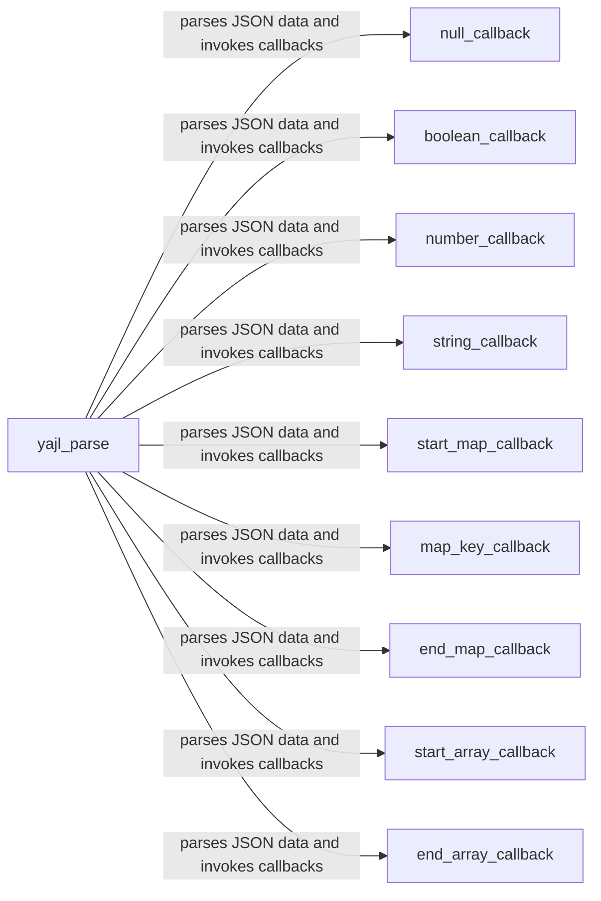

## Component Details

The Yajl2 backend provides a fast and efficient JSON parsing implementation using the `yajl2` library. It leverages both CFFI and C extensions for optimized performance. The core of the backend is the `yajl_parse` function, which parses the JSON data and invokes a set of callbacks to emit events representing the different JSON tokens encountered. These events are then used by higher-level functions to generate a stream of parsed JSON data.

### yajl_parse
This function is the core of the yajl2_cffi backend. It takes a data source and a set of callbacks as input, and parses the JSON data, invoking the callbacks as it encounters different JSON tokens. It uses the yajl2 C library via CFFI to perform the actual parsing.
- **Related Classes/Methods**: `ijson.src.ijson.backends.yajl2_cffi:yajl_parse`

### null_callback
This function is a callback that is invoked by `yajl_parse` when it encounters a JSON null value. It emits a 'null' event.
- **Related Classes/Methods**: `ijson.src.ijson.backends.yajl2_cffi:null`

### boolean_callback
This function is a callback that is invoked by `yajl_parse` when it encounters a JSON boolean value. It emits a 'boolean' event with the boolean value.
- **Related Classes/Methods**: `ijson.src.ijson.backends.yajl2_cffi:boolean`

### number_callback
This function is a callback that is invoked by `yajl_parse` when it encounters a JSON number value (integer or double). It emits a 'number' event with the numeric value.
- **Related Classes/Methods**: `ijson.src.ijson.backends.yajl2_cffi:integer`, `ijson.src.ijson.backends.yajl2_cffi:double`

### string_callback
This function is a callback that is invoked by `yajl_parse` when it encounters a JSON string value. It emits a 'string' event with the string value.
- **Related Classes/Methods**: `ijson.src.ijson.backends.yajl2_cffi:string`

### start_map_callback
This function is a callback that is invoked by `yajl_parse` when it encounters the start of a JSON map (object). It emits a 'start_map' event.
- **Related Classes/Methods**: `ijson.src.ijson.backends.yajl2_cffi:start_map`

### map_key_callback
This function is a callback that is invoked by `yajl_parse` when it encounters a key within a JSON map (object). It emits a 'map_key' event with the key value.
- **Related Classes/Methods**: `ijson.src.ijson.backends.yajl2_cffi:map_key`

### end_map_callback
This function is a callback that is invoked by `yajl_parse` when it encounters the end of a JSON map (object). It emits an 'end_map' event.
- **Related Classes/Methods**: `ijson.src.ijson.backends.yajl2_cffi:end_map`

### start_array_callback
This function is a callback that is invoked by `yajl_parse` when it encounters the start of a JSON array. It emits a 'start_array' event.
- **Related Classes/Methods**: `ijson.src.ijson.backends.yajl2_cffi:start_array`

### end_array_callback
This function is a callback that is invoked by `yajl_parse` when it encounters the end of a JSON array. It emits an 'end_array' event.
- **Related Classes/Methods**: `ijson.src.ijson.backends.yajl2_cffi:end_array`
