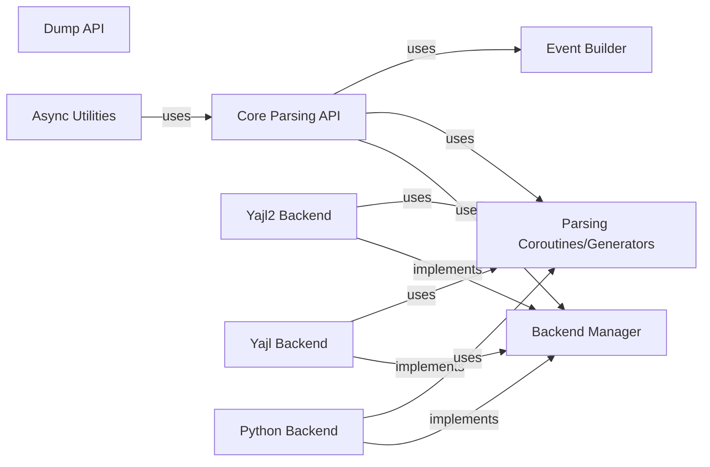

## Component Details

The `ijson` library provides an iterative JSON parser for Python. It allows parsing large JSON files without loading the entire file into memory. The library supports multiple backends, including `yajl`, `yajl2_cffi`, `yajl2_c`, and a pure Python implementation. The core parsing API provides functions for parsing JSON data from various sources, including files, strings, and iterators. The library also includes utilities for asynchronous parsing and benchmarking.

### Core Parsing API
This component serves as the main entry point for parsing JSON data. It provides the `parse`, `items`, and `kvitems` functions, which handle input source management and delegate the actual parsing to backend-specific coroutines or generators. It orchestrates the parsing process and provides a consistent interface for users.
- **Related Classes/Methods**: `ijson.src.ijson.common:parse`, `ijson.src.ijson.common:kvitems`, `ijson.src.ijson.common:items`, `ijson.src.ijson.common:file_source`, `ijson.src.ijson.common:is_async_file`

### Backend Manager
The Backend Manager abstracts the different JSON parsing backends. It is responsible for finding and loading the best available backend based on installed libraries (yajl, yajl2_cffi, yajl2_c) and defines a common interface for parsing. It acts as a factory for creating backend-specific parsers.
- **Related Classes/Methods**: `ijson.src.ijson:_default_backend`, `ijson.src.ijson.common:enrich_backend`, `ijson.src.ijson.backends:find_yajl_ctypes`, `ijson.src.ijson.backends:find_yajl_cffi`, `ijson.src.ijson.backends:require_version`

### Yajl2 Backend
This component implements the JSON parsing logic using the `yajl2` library, providing a fast and efficient parsing implementation. It includes both CFFI and C extension implementations, offering flexibility and performance optimization based on the available environment.
- **Related Classes/Methods**: `ijson.src.ijson.backends.yajl2_cffi:null`, `ijson.src.ijson.backends.yajl2_cffi:boolean`, `ijson.src.ijson.backends.yajl2_cffi:integer`, `ijson.src.ijson.backends.yajl2_cffi:double`, `ijson.src.ijson.backends.yajl2_cffi:number`, `ijson.src.ijson.backends.yajl2_cffi:string`, `ijson.src.ijson.backends.yajl2_cffi:start_map`, `ijson.src.ijson.backends.yajl2_cffi:map_key`, `ijson.src.ijson.backends.yajl2_cffi:end_map`, `ijson.src.ijson.backends.yajl2_cffi:start_array`, `ijson.src.ijson.backends.yajl2_cffi:end_array`, `ijson.src.ijson.backends.yajl2_cffi:yajl_parse`, `ijson.src.ijson.backends.yajl2_cffi:basic_parse_basecoro`, `ijson.src.ijson.backends.yajl2_c:basic_parse_gen`, `ijson.src.ijson.backends.yajl2_c:basic_parse_async`, `ijson.src.ijson.backends.yajl2_c:parse_gen`, `ijson.src.ijson.backends.yajl2_c:parse_async`, `ijson.src.ijson.backends.yajl2_c:kvitems_gen`, `ijson.src.ijson.backends.yajl2_c:kvitems_async`, `ijson.src.ijson.backends.yajl2_c:items_gen`, `ijson.src.ijson.backends.yajl2_c:items_async`

### Yajl Backend
This component implements the JSON parsing logic using the `yajl` library. It provides a JSON parsing implementation using the yajl library.
- **Related Classes/Methods**: `ijson.src.ijson.backends.yajl:basic_parse_basecoro`

### Python Backend
The Python Backend provides a pure Python implementation of the JSON parsing logic, including a Lexer and functions for parsing JSON values. It serves as a fallback when no other backends are available, ensuring that the library can function in environments without external dependencies.
- **Related Classes/Methods**: `ijson.src.ijson.backends.python:utf8_encoder`, `ijson.src.ijson.backends.python:Lexer`, `ijson.src.ijson.backends.python:parse_value`, `ijson.src.ijson.backends.python:basic_parse_basecoro`

### Parsing Coroutines/Generators
This component defines common coroutines and generators used by the backends for parsing JSON data. These include functions for parsing basic JSON structures, items, and key-value pairs. It provides reusable parsing logic for different backends, reducing code duplication and promoting consistency.
- **Related Classes/Methods**: `ijson.src.ijson.common:_make_basic_parse_coro`, `ijson.src.ijson.common:_make_parse_coro`, `ijson.src.ijson.common:_make_items_coro`, `ijson.src.ijson.common:_make_kvitems_coro`, `ijson.src.ijson.common:_make_basic_parse_gen`, `ijson.src.ijson.common:_make_parse_gen`, `ijson.src.ijson.common:_make_items_gen`, `ijson.src.ijson.common:_make_kvitems_gen`, `ijson.src.ijson.common:_make_basic_parse`, `ijson.src.ijson.common:_make_parse`, `ijson.src.ijson.common:_make_items`, `ijson.src.ijson.common:_make_kvitems`

### Event Builder
The Event Builder component, specifically the `ObjectBuilder` class, is responsible for constructing Python objects from the JSON events emitted by the parser. It acts as a sink for JSON events and builds the corresponding Python objects, providing a structured representation of the parsed JSON data.
- **Related Classes/Methods**: `ijson.src.ijson.common.ObjectBuilder:event`

### Dump API
The Dump API component provides the `dump` function for serializing Python objects to JSON. It offers a way to convert Python data structures into JSON format, complementing the parsing functionality of the library.
- **Related Classes/Methods**: `ijson.src.ijson.dump:dump`

### Async Utilities
This component includes utilities for asynchronous parsing, enabling non-blocking JSON processing. It provides asynchronous parsing capabilities, allowing the library to be used in asynchronous applications.
- **Related Classes/Methods**: `ijson.src.ijson.utils35:_get_read`, `ijson.src.ijson.utils35.async_iterable:__init__`, `ijson.src.ijson.utils35.async_iterable:__anext__`, `ijson.src.ijson.utils35:_make_basic_parse_async`, `ijson.src.ijson.utils35:_make_parse_async`, `ijson.src.ijson.utils35:_make_items_async`, `ijson.src.ijson.utils35:_make_kvitems_async`