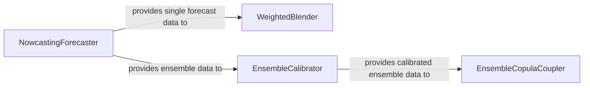

## Details

The nowcasting subsystem begins with the `NowcastingForecaster`, which generates initial short-term forecasts, potentially as an ensemble. These forecasts can then be processed in two distinct pathways. For applications requiring a single, robust forecast, the `WeightedBlender` combines multiple inputs into a single blended output. Alternatively, for ensemble-based applications, the `NowcastingForecaster`'s ensemble output can be directly fed into the `EnsembleCalibrator`. The `EnsembleCalibrator` refines the ensemble forecasts by correcting biases and improving spread. The calibrated ensemble from `EnsembleCalibrator` is then passed to the `EnsembleCopulaCoupler`, which applies advanced post-processing to further refine the ensemble, ensuring statistical consistency and enhancing overall forecast skill.

### NowcastingForecaster
This component generates initial, short-term forecasts (nowcasts) by advecting input meteorological fields. It produces a list of forecast cubes, which can represent an ensemble, serving as a primary data source for subsequent processing stages within the subsystem.

**Related Classes/Methods**:

- <a href="https://github.com/metoppv/improver/blob/master/improver/nowcasting/forecasting.py#L474-L491" target="_blank" rel="noopener noreferrer">`improver.nowcasting.forecasting.process`:474-491</a>

### WeightedBlender
This component combines multiple input forecasts into a single, more robust blended forecast using weighted averaging techniques. It supports both percentile and mean blending strategies to enhance forecast quality and reduce uncertainty.

**Related Classes/Methods**:

- <a href="https://github.com/metoppv/improver/blob/master/improver/blending/weighted_blend.py#L666-L731" target="_blank" rel="noopener noreferrer">`improver.blending.weighted_blend.process`:666-731</a>

### EnsembleCalibrator
This component improves the accuracy and statistical properties of ensemble forecasts by adjusting them based on observations or other reference data. It fits a distribution to ensemble members to correct biases and improve spread, ensuring statistically reliable forecasts.

**Related Classes/Methods**:

- <a href="https://github.com/metoppv/improver/blob/master/improver/calibration/ensemble_calibration.py#L1921-L2026" target="_blank" rel="noopener noreferrer">`improver.calibration.ensemble_calibration.process`:1921-2026</a>

### EnsembleCopulaCoupler
This component applies advanced post-processing using Ensemble Copula Coupling (ECC) to refine ensemble forecasts. It enables sophisticated transformations between different representations while maintaining statistical consistency and improving overall forecast skill.

**Related Classes/Methods**:

- <a href="https://github.com/metoppv/improver/blob/master/improver/ensemble_copula_coupling/ensemble_copula_coupling.py#L1507-L1573" target="_blank" rel="noopener noreferrer">`improver.ensemble_copula_coupling.ensemble_copula_coupling.process`:1507-1573</a>

### [FAQ](https://github.com/CodeBoarding/GeneratedOnBoardings/tree/main?tab=readme-ov-file#faq)