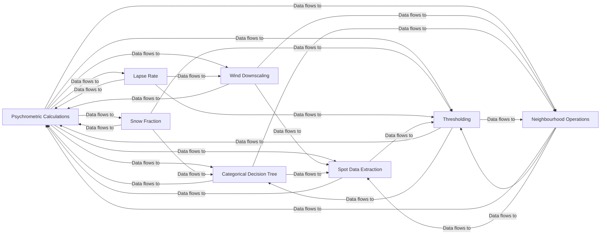

## Details

The Core Meteorological Algorithms subsystem is defined by the following modules, which encapsulate the primary scientific computations and data processing operations: improver.psychrometric_calculations.psychrometric_calculations, improver.precipitation.snow_fraction, improver.temperature.lapse_rate, improver.wind_calculations.wind_downscaling, improver.categorical.decision_tree, improver.spotdata.spot_extraction, improver.threshold.threshold, improver.nbhood.nbhood

### Psychrometric Calculations
Orchestrates the generation of humidity and pressure cubes and determines phase change levels. It performs core psychrometric computations essential for atmospheric analysis.

**Related Classes/Methods**:

- <a href="https://github.com/metoppv/improver/blob/master/improver/psychrometric_calculations/psychrometric_calculations.py" target="_blank" rel="noopener noreferrer">`improver.psychrometric_calculations.psychrometric_calculations`</a>

### Snow Fraction
Calculates the fraction of precipitation that is snow based on input meteorological data, contributing to precipitation type forecasting.

**Related Classes/Methods**:

- <a href="https://github.com/metoppv/improver/blob/master/improver/precipitation/snow_fraction.py" target="_blank" rel="noopener noreferrer">`improver.precipitation.snow_fraction`</a>

### Lapse Rate
Computes and adjusts atmospheric lapse rates, potentially incorporating orographic differences for accurate temperature profiling and stability analysis.

**Related Classes/Methods**:

- <a href="https://github.com/metoppv/improver/blob/master/improver/temperature/lapse_rate.py" target="_blank" rel="noopener noreferrer">`improver.temperature.lapse_rate`</a>

### Wind Downscaling
Performs downscaling of wind data, integrating roughness and height corrections to refine wind field representations for localized predictions.

**Related Classes/Methods**:

- <a href="https://github.com/metoppv/improver/blob/master/improver/wind_calculations/wind_downscaling.py" target="_blank" rel="noopener noreferrer">`improver.wind_calculations.wind_downscaling`</a>

### Categorical Decision Tree
Processes categorical data by evaluating a decision tree, including input preparation, condition creation, and logical evaluation for classification or event detection.

**Related Classes/Methods**:

- <a href="https://github.com/metoppv/improver/blob/master/improver/categorical/decision_tree.py" target="_blank" rel="noopener noreferrer">`improver.categorical.decision_tree`</a>

### Spot Data Extraction
Extracts meteorological data at specific spot locations, handling coordinate and auxiliary data, and constructing diagnostic cubes for localized analysis and verification.

**Related Classes/Methods**:

- <a href="https://github.com/metoppv/improver/blob/master/improver/spotdata/spot_extraction.py" target="_blank" rel="noopener noreferrer">`improver.spotdata.spot_extraction`</a>

### Thresholding
Applies thresholding operations to data, calculates truth values based on defined criteria, manages metadata, and handles vicinity-based processing for event detection and binary classification.

**Related Classes/Methods**:

- <a href="https://github.com/metoppv/improver/blob/master/improver/threshold.py" target="_blank" rel="noopener noreferrer">`improver.threshold.threshold`</a>

### Neighbourhood Operations
Performs neighbourhood operations on data, such as finding radii, calculating neighbourhood sums, padding/unpadding cubes, and generating percentiles for spatial smoothing and feature extraction.

**Related Classes/Methods**:

- <a href="https://github.com/metoppv/improver/blob/master/improver/nbhood/nbhood.py" target="_blank" rel="noopener noreferrer">`improver.nbhood.nbhood`</a>

### [FAQ](https://github.com/CodeBoarding/GeneratedOnBoardings/tree/main?tab=readme-ov-file#faq)