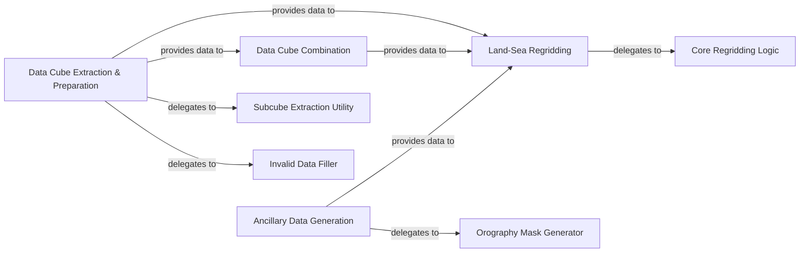

## Details

The `Data Ingestion & Ancillary Management` subsystem is responsible for the initial loading, standardization, and regridding of meteorological data, as well as the generation and management of essential ancillary data fields required for further processing.

### Data Cube Extraction & Preparation
Orchestrates the initial loading, extraction of specific data subcubes, and manages grid operations including filling invalid data points. It acts as a primary entry point for preparing raw meteorological data.

**Related Classes/Methods**:

- <a href="https://github.com/metoppv/improver/blob/master/improver/utilities/cube_extraction.py#L501-L562" target="_blank" rel="noopener noreferrer">`improver.utilities.cube_extraction.process`:501-562</a>

### Data Cube Combination
Manages the combination of multiple meteorological data cubes, ensuring dimensional and metadata consistency across different data sources or time steps.

**Related Classes/Methods**:

- <a href="https://github.com/metoppv/improver/blob/master/improver/cube_combiner.py#L621-L642" target="_blank" rel="noopener noreferrer">`improver.cube_combiner.process`:621-642</a>

### Land-Sea Regridding
Facilitates the regridding of meteorological data, with a specific focus on correctly handling land-sea points during grid transformations to maintain geographical accuracy.

**Related Classes/Methods**:

- <a href="https://github.com/metoppv/improver/blob/master/improver/regrid/landsea.py#L307-L362" target="_blank" rel="noopener noreferrer">`improver.regrid.landsea.process`:307-362</a>

### Ancillary Data Generation
Generates and manages essential ancillary data fields, such as orography masks, which are critical inputs for other processing steps like regridding.

**Related Classes/Methods**:

- <a href="https://github.com/metoppv/improver/blob/master/improver/generate_ancillaries/generate_ancillary.py#L285-L322" target="_blank" rel="noopener noreferrer">`improver.generate_ancillaries.generate_ancillary.process`:285-322</a>

### Subcube Extraction Utility
Performs the actual extraction of data subcubes based on specified constraints, serving as a core utility for data subsetting.

**Related Classes/Methods**:

- <a href="https://github.com/metoppv/improver/blob/master/improver/utilities/cube_extraction.py#L225-L265" target="_blank" rel="noopener noreferrer">`improver.utilities.cube_extraction.extract_subcube`:225-265</a>

### Invalid Data Filler
Addresses and fills missing or invalid data points within data cubes, ensuring data quality and completeness for subsequent processing.

**Related Classes/Methods**:

- <a href="https://github.com/metoppv/improver/blob/master/improver/utilities/cube_extraction.py#L408-L440" target="_blank" rel="noopener noreferrer">`improver.utilities.cube_extraction.fill_invalid`:408-440</a>

### Core Regridding Logic
Executes the low-level regridding operation, applying the necessary interpolation and adjustments, particularly for land-sea boundaries.

**Related Classes/Methods**:

- <a href="https://github.com/metoppv/improver/blob/master/improver/regrid/landsea.py#L83-L171" target="_blank" rel="noopener noreferrer">`improver.regrid.landsea._regrid_to_target`:83-171</a>

### Orography Mask Generator
Creates detailed orography masks, including sea masks, which are vital ancillary data for geographical and atmospheric modeling.

**Related Classes/Methods**:

- <a href="https://github.com/metoppv/improver/blob/master/improver/generate_ancillaries/generate_ancillary.py#L198-L283" target="_blank" rel="noopener noreferrer">`improver.generate_ancillaries.generate_ancillary.gen_orography_masks`:198-283</a>

### [FAQ](https://github.com/CodeBoarding/GeneratedOnBoardings/tree/main?tab=readme-ov-file#faq)