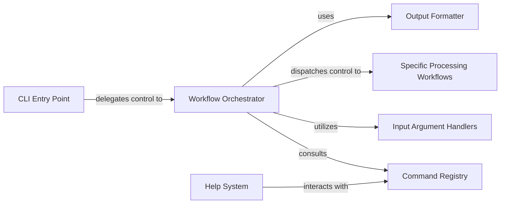

## Details

The `improver` CLI subsystem is structured around a central `Workflow Orchestrator` that manages the execution of data processing tasks. User interaction begins at the `CLI Entry Point`, which delegates control to the orchestrator. The `Workflow Orchestrator` consults the `Command Registry` to understand available commands and their metadata. It then utilizes `Input Argument Handlers` to parse and validate user inputs before dispatching control to `Specific Processing Workflows` for the actual scientific computations. Finally, the `Output Formatter` standardizes the results for presentation. The `Help System` provides user assistance by interacting with the `Command Registry` to retrieve command documentation, ensuring a clear and consistent user experience.

### CLI Entry Point
The initial point of interaction for users, responsible for launching the command-line interface and delegating to the core orchestration logic. It acts as the system's public interface.

**Related Classes/Methods**:

- <a href="https://github.com/metoppv/improver/blob/master/improver/cli/__main__.py" target="_blank" rel="noopener noreferrer">`improver.cli.__main__`</a>
- <a href="https://github.com/metoppv/improver/blob/master/improver/cli/__init__.py" target="_blank" rel="noopener noreferrer">`improver.cli.__init__:main`</a>
- <a href="https://github.com/metoppv/improver/blob/master/improver/cli/__init__.py" target="_blank" rel="noopener noreferrer">`improver.cli.__init__:command_executor`</a>

### Workflow Orchestrator
The core component that manages the execution of various data processing workflows. It identifies the requested command, prepares inputs, executes the workflow, and handles output, embodying the "Pipeline/Workflow" pattern.

**Related Classes/Methods**:

- <a href="https://github.com/metoppv/improver/blob/master/improver/cli/__init__.py" target="_blank" rel="noopener noreferrer">`improver.cli.__init__:execute_command`</a>

### Command Registry
A component responsible for discovering, registering, and providing metadata for all available `improver` CLI commands, facilitating a modular and extensible command set. This supports the "Modular Design" and "Extensibility" architectural biases.

**Related Classes/Methods**:

- <a href="https://github.com/metoppv/improver/blob/master/improver/cli/__init__.py" target="_blank" rel="noopener noreferrer">`improver.cli.__init__:_cli_items`</a>

### Input Argument Handlers
A group of functions dedicated to parsing, validating, and coercing command-line arguments into appropriate Python data types, including domain-specific objects like Iris cubes or JSON. This is crucial for robust data ingestion.

**Related Classes/Methods**:

- <a href="https://github.com/metoppv/improver/blob/master/improver/cli/__init__.py" target="_blank" rel="noopener noreferrer">`improver.cli.__init__:inputcube`</a>
- <a href="https://github.com/metoppv/improver/blob/master/improver/cli/__init__.py" target="_blank" rel="noopener noreferrer">`improver.cli.__init__:inputcubelist`</a>
- <a href="https://github.com/metoppv/improver/blob/master/improver/cli/__init__.py" target="_blank" rel="noopener noreferrer">`improver.cli.__init__:inputjson`</a>
- <a href="https://github.com/metoppv/improver/blob/master/improver/cli/__init__.py" target="_blank" rel="noopener noreferrer">`improver.cli.__init__:inputpath`</a>
- <a href="https://github.com/metoppv/improver/blob/master/improver/cli/__init__.py" target="_blank" rel="noopener noreferrer">`improver.cli.__init__:inputdatetime`</a>
- <a href="https://github.com/metoppv/improver/blob/master/improver/cli/__init__.py" target="_blank" rel="noopener noreferrer">`improver.cli.__init__:comma_separated_list`</a>
- <a href="https://github.com/metoppv/improver/blob/master/improver/cli/__init__.py" target="_blank" rel="noopener noreferrer">`improver.cli.__init__:constrained_inputcubelist_converter`</a>
- <a href="https://github.com/metoppv/improver/blob/master/improver/cli/__init__.py" target="_blank" rel="noopener noreferrer">`improver.cli.__init__:maybe_coerce_with`</a>

### Output Formatter
Handles the standardized formatting and output of processed data or results generated by the workflows, ensuring consistency and user-friendliness for the CLI user.

**Related Classes/Methods**:

- <a href="https://github.com/metoppv/improver/blob/master/improver/cli/__init__.py" target="_blank" rel="noopener noreferrer">`improver.cli.__init__:with_output`</a>
- <a href="https://github.com/metoppv/improver/blob/master/improver/cli/__init__.py" target="_blank" rel="noopener noreferrer">`improver.cli.__init__:ObjectAsStr`</a>

### Help System
Provides comprehensive user assistance and documentation for all CLI commands, including usage instructions and argument descriptions, enhancing usability.

**Related Classes/Methods**:

- <a href="https://github.com/metoppv/improver/blob/master/improver/cli/__init__.py" target="_blank" rel="noopener noreferrer">`improver.cli.__init__:improver_help`</a>

### Specific Processing Workflows
Represents individual data processing pipelines or algorithms that perform the core scientific computations. These are the "actions" that the CLI orchestrates, embodying the "Algorithm Modules" and "Data Flow Emphasis" aspects.

**Related Classes/Methods**:

- <a href="https://github.com/metoppv/improver/blob/master/improver/cli/orographic_enhancement.py" target="_blank" rel="noopener noreferrer">`improver.cli.orographic_enhancement:process`</a>
- <a href="https://github.com/metoppv/improver/blob/master/improver/cli/orographic_enhancement.py" target="_blank" rel="noopener noreferrer">`improver.cli.orographic_enhancement:extract_and_check`</a>
- <a href="https://github.com/metoppv/improver/blob/master/improver/cli/orographic_enhancement.py" target="_blank" rel="noopener noreferrer">`improver.cli.orographic_enhancement`</a>

### [FAQ](https://github.com/CodeBoarding/GeneratedOnBoardings/tree/main?tab=readme-ov-file#faq)