```mermaid
graph LR
    External_Data_Sources["External Data Sources"]
    Workflow_Orchestration_CLI["Workflow Orchestration & CLI"]
    Data_Ingestion_Ancillary_Management["Data Ingestion & Ancillary Management"]
    Core_Meteorological_Algorithms["Core Meteorological Algorithms"]
    Advanced_Forecasting_Post_processing["Advanced Forecasting & Post-processing"]
    Metadata_Configuration_Management["Metadata & Configuration Management"]
    Output_Verification["Output & Verification"]
    External_Data_Sources -- "provides data to" --> Data_Ingestion_Ancillary_Management
    Workflow_Orchestration_CLI -- "initiates" --> Data_Ingestion_Ancillary_Management
    Workflow_Orchestration_CLI -- "initiates" --> Core_Meteorological_Algorithms
    Workflow_Orchestration_CLI -- "initiates" --> Advanced_Forecasting_Post_processing
    Workflow_Orchestration_CLI -- "receives configuration from" --> Metadata_Configuration_Management
    Data_Ingestion_Ancillary_Management -- "provides data to" --> Core_Meteorological_Algorithms
    Data_Ingestion_Ancillary_Management -- "provides data to" --> Advanced_Forecasting_Post_processing
    Core_Meteorological_Algorithms -- "provides data to" --> Advanced_Forecasting_Post_processing
    Core_Meteorological_Algorithms -- "provides data to" --> Output_Verification
    Advanced_Forecasting_Post_processing -- "provides data to" --> Output_Verification
    Metadata_Configuration_Management -- "interacts with" --> Data_Ingestion_Ancillary_Management
    Metadata_Configuration_Management -- "interacts with" --> Core_Meteorological_Algorithms
    Metadata_Configuration_Management -- "interacts with" --> Advanced_Forecasting_Post_processing
    click Workflow_Orchestration_CLI href "https://github.com/CodeBoarding/GeneratedOnBoardings/blob/main/improver/Workflow_Orchestration_CLI.md" "Details"
    click Data_Ingestion_Ancillary_Management href "https://github.com/CodeBoarding/GeneratedOnBoardings/blob/main/improver/Data_Ingestion_Ancillary_Management.md" "Details"
    click Core_Meteorological_Algorithms href "https://github.com/CodeBoarding/GeneratedOnBoardings/blob/main/improver/Core_Meteorological_Algorithms.md" "Details"
    click Advanced_Forecasting_Post_processing href "https://github.com/CodeBoarding/GeneratedOnBoardings/blob/main/improver/Advanced_Forecasting_Post_processing.md" "Details"
```

## Details

The `improver` system is designed as a modular meteorological data processing pipeline. It begins with `External Data Sources` providing raw meteorological data, which is then handled by the `Data Ingestion & Ancillary Management` component for initial processing and standardization. The `Workflow Orchestration & CLI` acts as the central control, initiating various processing steps and receiving configuration from `Metadata & Configuration Management`. Core scientific computations are performed within `Core Meteorological Algorithms`, which then feed into `Advanced Forecasting & Post-processing` for specialized tasks like nowcasting and ensemble blending. Finally, all processed data is managed by the `Output & Verification` component for storage and potential verification. `Metadata & Configuration Management` plays a crucial cross-cutting role, ensuring data consistency and proper parameter application across `Data Ingestion`, `Core Meteorological Algorithms`, and `Advanced Forecasting & Post-processing`.

### External Data Sources
Represents the origin of all raw meteorological data entering the improver system.

**Related Classes/Methods**:

- <a href="https://github.com/metoppv/improver/blob/master/improver/utilities/load.py#L87-L120" target="_blank" rel="noopener noreferrer">`improver.utilities.load.load_cube`:87-120</a>
- <a href="https://github.com/metoppv/improver/blob/master/improver/utilities/load.py#L20-L84" target="_blank" rel="noopener noreferrer">`improver.utilities.load.load_cubelist`:20-84</a>

### Workflow Orchestration & CLI [[Expand]](./Workflow_Orchestration_CLI.md)
Provides the command-line interface and orchestrates the execution of various data processing workflows.

**Related Classes/Methods**:

- <a href="https://github.com/metoppv/improver/blob/master/improver/cli/__main__.py" target="_blank" rel="noopener noreferrer">`improver/cli/__main__.py`</a>

### Data Ingestion & Ancillary Management [[Expand]](./Data_Ingestion_Ancillary_Management.md)
Handles the loading, initial standardization, regridding of meteorological data, and the generation/management of essential ancillary data fields.

**Related Classes/Methods**:

- <a href="https://github.com/metoppv/improver/blob/master/improver/utilities/cube_extraction.py#L501-L562" target="_blank" rel="noopener noreferrer">`improver.utilities.cube_extraction.process`:501-562</a>
- <a href="https://github.com/metoppv/improver/blob/master/improver/cube_combiner.py#L621-L642" target="_blank" rel="noopener noreferrer">`improver.cube_combiner.process`:621-642</a>
- <a href="https://github.com/metoppv/improver/blob/master/improver/regrid/landsea.py#L307-L362" target="_blank" rel="noopener noreferrer">`improver.regrid.landsea.process`:307-362</a>
- <a href="https://github.com/metoppv/improver/blob/master/improver/generate_ancillaries/generate_ancillary.py#L285-L322" target="_blank" rel="noopener noreferrer">`improver.generate_ancillaries.generate_ancillary.process`:285-322</a>

### Core Meteorological Algorithms [[Expand]](./Core_Meteorological_Algorithms.md)
Contains the primary algorithms for scientific computations, diagnostics (e.g., psychrometric, precipitation, temperature, wind), categorical data processing, spot data extraction, thresholding, and neighbourhood operations.

**Related Classes/Methods**:

- <a href="https://github.com/metoppv/improver/blob/master/improver/psychrometric_calculations/psychrometric_calculations.py#L909-L1017" target="_blank" rel="noopener noreferrer">`improver.psychrometric_calculations.psychrometric_calculations.process`:909-1017</a>
- <a href="https://github.com/metoppv/improver/blob/master/improver/precipitation/snow_fraction.py#L134-L155" target="_blank" rel="noopener noreferrer">`improver.precipitation.snow_fraction.process`:134-155</a>
- <a href="https://github.com/metoppv/improver/blob/master/improver/temperature/lapse_rate.py#L382-L475" target="_blank" rel="noopener noreferrer">`improver.temperature.lapse_rate.process`:382-475</a>
- <a href="https://github.com/metoppv/improver/blob/master/improver/wind_calculations/wind_downscaling.py#L894-L952" target="_blank" rel="noopener noreferrer">`improver.wind_calculations.wind_downscaling.process`:894-952</a>
- <a href="https://github.com/metoppv/improver/blob/master/improver/categorical/decision_tree.py#L818-L906" target="_blank" rel="noopener noreferrer">`improver.categorical.decision_tree.process`:818-906</a>
- <a href="https://github.com/metoppv/improver/blob/master/improver/spotdata/spot_extraction.py#L248-L343" target="_blank" rel="noopener noreferrer">`improver.spotdata.spot_extraction.process`:248-343</a>
- <a href="https://github.com/metoppv/improver/blob/master/improver/threshold.py#L818-L879" target="_blank" rel="noopener noreferrer">`improver.threshold.process`:818-879</a>
- <a href="https://github.com/metoppv/improver/blob/master/improver/nbhood/nbhood.py#L852-L894" target="_blank" rel="noopener noreferrer">`improver.nbhood.nbhood.process`:852-894</a>

### Advanced Forecasting & Post-processing [[Expand]](./Advanced_Forecasting_Post_processing.md)
Encompasses specialized components for short-term nowcasting, ensemble blending, calibration, and advanced post-processing techniques like Ensemble Copula Coupling (ECC).

**Related Classes/Methods**:

- <a href="https://github.com/metoppv/improver/blob/master/improver/nowcasting/forecasting.py#L474-L491" target="_blank" rel="noopener noreferrer">`improver.nowcasting.forecasting.process`:474-491</a>
- <a href="https://github.com/metoppv/improver/blob/master/improver/blending/weighted_blend.py#L666-L731" target="_blank" rel="noopener noreferrer">`improver.blending.weighted_blend.process`:666-731</a>
- <a href="https://github.com/metoppv/improver/blob/master/improver/calibration/ensemble_calibration.py#L1921-L2026" target="_blank" rel="noopener noreferrer">`improver.calibration.ensemble_calibration.process`:1921-2026</a>
- <a href="https://github.com/metoppv/improver/blob/master/improver/ensemble_copula_coupling/ensemble_copula_coupling.py#L1507-L1573" target="_blank" rel="noopener noreferrer">`improver.ensemble_copula_coupling.ensemble_copula_coupling.process`:1507-1573</a>

### Metadata & Configuration Management
Manages, validates, and interprets metadata associated with data cubes and handles system-wide configuration parameters, ensuring data consistency and proper processing.

**Related Classes/Methods**:

- <a href="https://github.com/metoppv/improver/blob/master/improver/metadata/forecast_times.py#L256-L311" target="_blank" rel="noopener noreferrer">`improver.metadata.forecast_times.unify_cycletime`:256-311</a>
- <a href="https://github.com/metoppv/improver/blob/master/improver/developer_tools/metadata_interpreter.py#L433-L557" target="_blank" rel="noopener noreferrer">`improver.developer_tools.metadata_interpreter.run`:433-557</a>

### Output & Verification
Responsible for handling the final output of processed meteorological data, including formatting for storage or visualization, and potentially incorporating verification functionalities.

**Related Classes/Methods**:

- <a href="https://github.com/metoppv/improver/blob/master/improver/utilities/save.py" target="_blank" rel="noopener noreferrer">`improver.utilities.save.save_json`</a>
- <a href="https://github.com/metoppv/improver/blob/master/improver/utilities/save.py#L55-L154" target="_blank" rel="noopener noreferrer">`improver.utilities.save.save_netcdf`:55-154</a>

### [FAQ](https://github.com/CodeBoarding/GeneratedOnBoardings/tree/main?tab=readme-ov-file#faq)