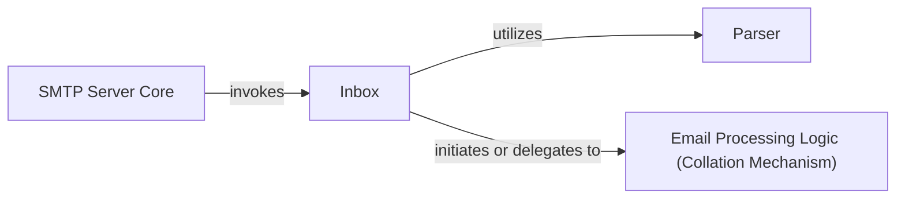

## Details

The `inbox` project functions as a simple SMTP server designed to receive and process incoming emails. At its core, the `SMTP Server Core` (implemented by `inbox.InboxServer`) listens for incoming email messages via the SMTP protocol. Upon receiving a complete message, the `SMTP Server Core` delegates the raw email data to the `Inbox` component. The `Inbox` then orchestrates the subsequent processing: it utilizes the `Parser` component (specifically `email.parser.Parser`) to transform the raw email content into a structured format. Finally, the `Inbox` initiates or delegates the structured email data to the `Email Processing Logic (Collation Mechanism)`, which represents the application-specific, user-defined functions for handling and collating the received emails. This design provides a clear separation of concerns, allowing for flexible and extensible email processing.

### SMTP Server Core
The foundational component responsible for receiving complete emails via the SMTP protocol and initiating the overall processing pipeline. It handles network listening and basic protocol interactions.

**Related Classes/Methods**:

- <a href="https://github.com/billzhong/inbox.py/blob/master/inbox.py#L14-L25" target="_blank" rel="noopener noreferrer">`inbox.InboxServer`:14-25</a>

### Inbox
The central orchestration component for email processing. It coordinates the parsing of raw email content and delegates the structured data to the user-defined email processing logic.

**Related Classes/Methods**:

- <a href="https://github.com/billzhong/inbox.py/blob/master/inbox.py#L28-L64" target="_blank" rel="noopener noreferrer">`inbox.Inbox`:28-64</a>

### Parser
Responsible for transforming raw, unstructured email content received from the `SMTP Server Core` into a structured, usable format for subsequent processing by the `Inbox` and `Email Processing Logic`.

**Related Classes/Methods**: _None_

### Email Processing Logic (Collation Mechanism) [[Expand]](./Email_Processing_Logic_Collation_Mechanism_.md)
An abstract component representing the application-specific, user-defined functions or modules that process and collate received emails. It serves as the primary extension point where developers implement custom email handling, invoked by the `Inbox` component after initial parsing.

**Related Classes/Methods**:

- <a href="https://github.com/billzhong/inbox.py/blob/master#L21-L25" target="_blank" rel="noopener noreferrer">`inbox.Inbox.process_message`:21-25</a>

### [FAQ](https://github.com/CodeBoarding/GeneratedOnBoardings/tree/main?tab=readme-ov-file#faq)