```mermaid
graph LR
    CLI_Interface["CLI Interface"]
    Server_Orchestration["Server Orchestration"]
    SMTP_Server_Core["SMTP Server Core"]
    Email_Processing_Logic_Collation_Mechanism_["Email Processing Logic (Collation Mechanism)"]
    CLI_Interface -- "Initiates Server Setup" --> Server_Orchestration
    Server_Orchestration -- "Configures & Starts Server, Provides Handler" --> SMTP_Server_Core
    SMTP_Server_Core -- "Dispatches Processed Email Data" --> Email_Processing_Logic_Collation_Mechanism_
    click Email_Processing_Logic_Collation_Mechanism_ href "https://github.com/CodeBoarding/GeneratedOnBoardings/blob/main/inbox.py/Email_Processing_Logic_Collation_Mechanism_.md" "Details"
```

## Details

The `inbox.py` project implements a lightweight, asynchronous SMTP server designed for efficient email processing. The architecture is structured around a clear data flow, beginning with the `CLI Interface` (`inbox`) which acts as the initial configuration and launch point. This component hands off control to the `Server Orchestration` (`inbox.serve`), responsible for setting up the `asyncio` event loop and managing the server's lifecycle. The `Server Orchestration` then initializes the `SMTP Server Core` (`inbox.InboxServer`), which is dedicated to handling all aspects of the SMTP protocol, from receiving connections to parsing email data. Finally, the `SMTP Server Core` dispatches the parsed email content to the `Email Processing Logic (Collation Mechanism)` (`inbox.process_message`), providing a flexible extension point for custom email handling. This design emphasizes modularity and a clear separation of concerns, making it suitable for both embedded use and custom email processing workflows.

### CLI Interface
The application's entry point, handling command-line arguments and initiating the server's operation.

**Related Classes/Methods**:

- <a href="https://github.com/billzhong/inbox.py/blob/master/inbox.py#L28-L64" target="_blank" rel="noopener noreferrer">`inbox`:28-64</a>

### Server Orchestration
Manages the overall lifecycle of the SMTP server, including network binding and asynchronous event loop setup.

**Related Classes/Methods**:

- <a href="https://github.com/billzhong/inbox.py/blob/master/inbox.py#L41-L53" target="_blank" rel="noopener noreferrer">`inbox.serve`:41-53</a>

### SMTP Server Core
The heart of the SMTP server, responsible for handling network connections, parsing SMTP commands, and receiving email content according to the protocol.

**Related Classes/Methods**:

- <a href="https://github.com/billzhong/inbox.py/blob/master/inbox.py#L14-L25" target="_blank" rel="noopener noreferrer">`inbox.InboxServer`:14-25</a>

### Email Processing Logic (Collation Mechanism) [[Expand]](./Email_Processing_Logic_Collation_Mechanism_.md)
An abstract component representing the user-defined functions or modules that process received emails, serving as the primary extension point.

**Related Classes/Methods**:

- <a href="https://github.com/billzhong/inbox.py/blob/master/inbox.py#L21-L25" target="_blank" rel="noopener noreferrer">`inbox.process_message`:21-25</a>

### [FAQ](https://github.com/CodeBoarding/GeneratedOnBoardings/tree/main?tab=readme-ov-file#faq)