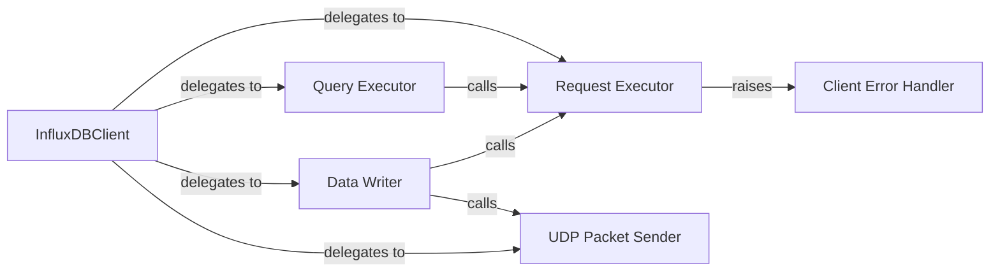

## Details

The InfluxDB 0.8 Client subsystem is primarily encapsulated within the `influxdb.influxdb08.client` module, specifically the `client.py` file. Its boundaries are defined by the `InfluxDBClient` class and its associated internal methods and custom exceptions, which collectively provide a compatibility layer for interacting with InfluxDB 0.8 servers.

### InfluxDBClient
The primary public interface and facade for all interactions with an InfluxDB 0.8 server. It manages connection parameters, orchestrates API calls, and delegates specific operations to internal methods. It acts as the central hub for client operations.

**Related Classes/Methods**:

- <a href="https://github.com/influxdata/influxdb-python/blob/master/influxdb/influxdb08/client.py" target="_blank" rel="noopener noreferrer">`influxdb.influxdb08.client:InfluxDBClient`</a>

### Request Executor
An internal method within InfluxDBClient responsible for executing low-level HTTP requests to the InfluxDB 0.8 server. It handles the actual network communication.

**Related Classes/Methods**:

- <a href="https://github.com/influxdata/influxdb-python/blob/master/influxdb/influxdb08/client.py" target="_blank" rel="noopener noreferrer">`influxdb.influxdb08.client:request`</a>

### Query Executor
An internal method dedicated to preparing, sending, and parsing responses for queries against the InfluxDB 0.8 server. It leverages the Request Executor for network operations.

**Related Classes/Methods**:

- <a href="https://github.com/influxdata/influxdb-python/blob/master/influxdb/influxdb08/client.py" target="_blank" rel="noopener noreferrer">`influxdb.influxdb08.client:_query`</a>

### Data Writer
An internal method responsible for formatting and transmitting data points to the InfluxDB 0.8 server, supporting both HTTP and UDP protocols. It delegates to Request Executor for HTTP and UDP Packet Sender for UDP.

**Related Classes/Methods**:

- <a href="https://github.com/influxdata/influxdb-python/blob/master/influxdb/influxdb08/client.py" target="_blank" rel="noopener noreferrer">`influxdb.influxdb08.client:_write_points`</a>

### UDP Packet Sender
An internal method specifically designed for sending data over UDP to the InfluxDB 0.8 server. This provides an alternative, potentially more performant, data transmission mechanism.

**Related Classes/Methods**:

- <a href="https://github.com/influxdata/influxdb-python/blob/master/influxdb/influxdb08/client.py" target="_blank" rel="noopener noreferrer">`influxdb.influxdb08.client:send_packet`</a>

### Client Error Handler
A custom exception class used to signal errors originating from the InfluxDB 0.8 client's interaction with the server, typically due to unexpected HTTP response codes. It provides specific error context for the client.

**Related Classes/Methods**:

- <a href="https://github.com/influxdata/influxdb-python/blob/master/influxdb/influxdb08/client.py" target="_blank" rel="noopener noreferrer">`influxdb.influxdb08.client:InfluxDBClientError`</a>

### [FAQ](https://github.com/CodeBoarding/GeneratedOnBoardings/tree/main?tab=readme-ov-file#faq)