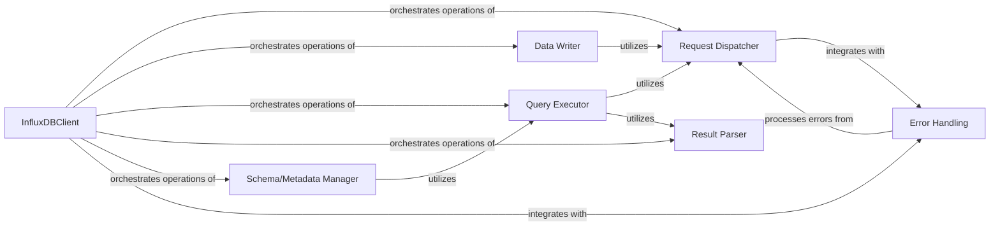

## Details

Analysis of the InfluxDB Client Core subsystem components and their relationships.

### InfluxDBClient
The primary interface and facade for interacting with the InfluxDB API. It manages connection parameters (host, port, database, SSL, timeout, retries, proxies, etc.) and orchestrates all high-level database operations. It embodies the "Facade" and "Connection/Client Management" patterns.

**Related Classes/Methods**:

- <a href="https://github.com/influxdata/influxdb-python/blob/master/influxdb/client.py#L32-L1205" target="_blank" rel="noopener noreferrer">`influxdb.client.InfluxDBClient`:32-1205</a>

### Request Dispatcher
Handles the low-level HTTP/UDP communication with the InfluxDB server. This includes constructing URLs, setting headers, managing data compression (gzip), implementing retry logic for connection errors, and dispatching requests using the underlying `requests.Session`. It centralizes network communication, aligning with the "Data Access Object (DAO)" pattern for data interaction.

**Related Classes/Methods**:

- <a href="https://github.com/influxdata/influxdb-python/blob/master/influxdb/client.py#L1-L1000" target="_blank" rel="noopener noreferrer">`influxdb.client.InfluxDBClient:request`:1-1000</a>

### Data Writer
Manages the process of ingesting data points into InfluxDB. This includes formatting data based on protocol (JSON or line protocol), handling batching of points, and selecting the appropriate communication protocol (HTTP or UDP). This directly corresponds to the "Data Writer" expected component.

**Related Classes/Methods**:

- <a href="https://github.com/influxdata/influxdb-python/blob/master/influxdb/client.py#L1-L1000" target="_blank" rel="noopener noreferrer">`influxdb.client.InfluxDBClient:write`:1-1000</a>
- <a href="https://github.com/influxdata/influxdb-python/blob/master/influxdb/client.py#L1-L1000" target="_blank" rel="noopener noreferrer">`influxdb.client.InfluxDBClient:write_points`:1-1000</a>

### Query Executor
Executes InfluxDB queries and processes the results. It handles query parameters, bind parameters, epoch precision, and manages chunked responses. This component fulfills the "Query Executor" role.

**Related Classes/Methods**:

- <a href="https://github.com/influxdata/influxdb-python/blob/master/influxdb/client.py#L1-L1000" target="_blank" rel="noopener noreferrer">`influxdb.client.InfluxDBClient:query`:1-1000</a>

### Result Parser
Responsible for parsing raw responses from InfluxDB, particularly for chunked queries, and converting them into structured `ResultSet` objects.

**Related Classes/Methods**:

- <a href="https://github.com/influxdata/influxdb-python/blob/master/influxdb/client.py#L1-L1000" target="_blank" rel="noopener noreferrer">`influxdb.client.InfluxDBClient:_read_chunked_response`:1-1000</a>

### Schema/Metadata Manager
Provides functionalities for managing database schemas, measurements, retention policies, users, and continuous queries. These operations are typically performed by constructing InfluxQL queries and leveraging the `Query Executor`.

**Related Classes/Methods**:

- <a href="https://github.com/influxdata/influxdb-python/blob/master/influxdb/client.py#L1-L1000" target="_blank" rel="noopener noreferrer">`influxdb.client.InfluxDBClient:create_database`:1-1000</a>
- <a href="https://github.com/influxdata/influxdb-python/blob/master/influxdb/client.py#L1-L1000" target="_blank" rel="noopener noreferrer">`influxdb.client.InfluxDBClient:get_list_users`:1-1000</a>

### Error Handling
Standardizes and re-formats error messages received from the InfluxDB API, ensuring consistent error reporting across the client library by raising specific exceptions (`InfluxDBServerError`, `InfluxDBClientError`). This aligns with the "Exception Handling/Error Reporting" expected component.

**Related Classes/Methods**:

- <a href="https://github.com/influxdata/influxdb-python/blob/master/influxdb/client.py#L1-L1000" target="_blank" rel="noopener noreferrer">`influxdb.client.InfluxDBClient:request:reformat_error`:1-1000</a>

### [FAQ](https://github.com/CodeBoarding/GeneratedOnBoardings/tree/main?tab=readme-ov-file#faq)