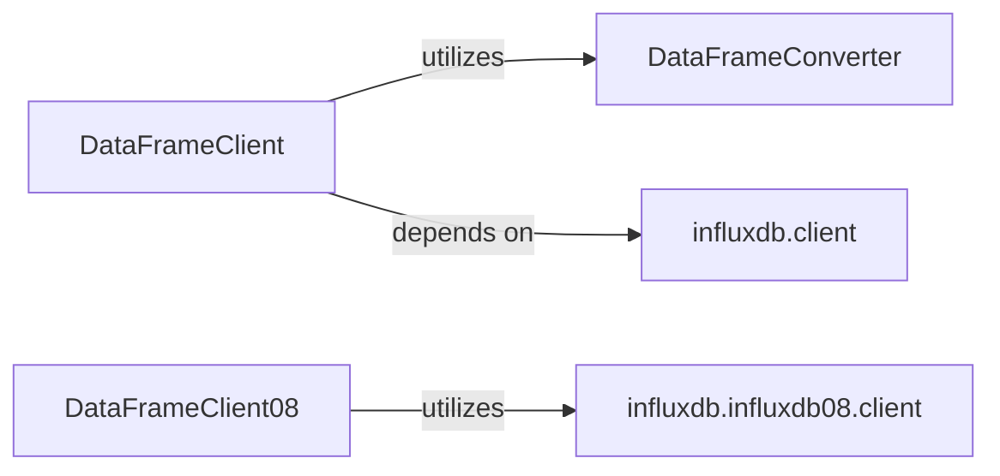

## Details

The Pandas DataFrame Integration subsystem provides a high-level, DataFrame-centric interface for interacting with InfluxDB, abstracting the complexities of data conversion and underlying client operations for both current and legacy 0.8 APIs.

### DataFrameClient
This component serves as a high-level facade for users to interact with the current InfluxDB API using pandas DataFrames. It simplifies the process of writing and querying time-series data by abstracting underlying client operations and data conversion complexities. It embodies the Facade pattern, providing a simplified interface to a complex subsystem.

**Related Classes/Methods**:

- <a href="https://github.com/influxdata/influxdb-python/blob/master/influxdb/dataframe_client.py#L17-L26" target="_blank" rel="noopener noreferrer">`influxdb.dataframe_client.DataFrameClient`:17-26</a>

### DataFrameConverter
This internal helper component is responsible for the intricate details of converting pandas DataFrames into InfluxDB-compatible formats (e.g., JSON, line protocol) for writing, and transforming InfluxDB query results back into pandas DataFrames for the current API. It acts as a Data Access Object (DAO) for data transformation, handling the mapping between application-level DataFrames and database-specific data structures.

**Related Classes/Methods**:

- <a href="https://github.com/influxdata/influxdb-python/blob/master/influxdb/dataframe_client.py" target="_blank" rel="noopener noreferrer">`influxdb.dataframe_client.DataFrameConverter`</a>

### DataFrameClient08
This component provides a dedicated DataFrame-centric interface for the legacy InfluxDB 0.8 API. It encapsulates both the high-level write/query operations and the specific data conversion logic required for the older API. It acts as a combined Facade and Data Access Object for 0.8 API interactions, isolating the legacy API concerns from the current API.

**Related Classes/Methods**:

- <a href="https://github.com/influxdata/influxdb-python/blob/master/influxdb/influxdb08/dataframe_client.py" target="_blank" rel="noopener noreferrer">`influxdb.influxdb08.dataframe_client.DataFrameClient08`</a>

### influxdb.client
Core InfluxDB client for actual communication with the database (current API).

**Related Classes/Methods**:

- <a href="https://github.com/influxdata/influxdb-python/blob/master/influxdb/client.py" target="_blank" rel="noopener noreferrer">`influxdb.client`</a>

### influxdb.influxdb08.client
Core InfluxDB 0.8 client for actual communication with the legacy database.

**Related Classes/Methods**:

- <a href="https://github.com/influxdata/influxdb-python/blob/master/influxdb/influxdb08/client.py" target="_blank" rel="noopener noreferrer">`influxdb.influxdb08.client`</a>

### [FAQ](https://github.com/CodeBoarding/GeneratedOnBoardings/tree/main?tab=readme-ov-file#faq)