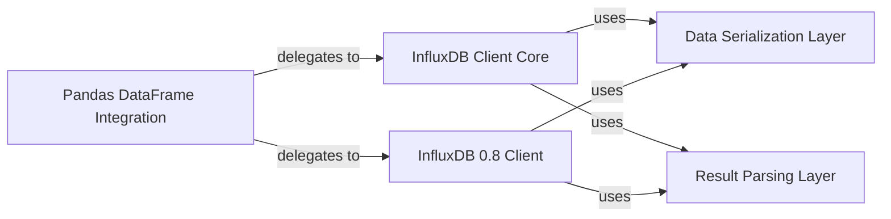

## Details

The `influxdb-python` library is architected as a client-side facade for the InfluxDB database, providing distinct pathways for interacting with current and legacy (0.8) InfluxDB APIs. The core of the library revolves around the `InfluxDB Client Core` and `InfluxDB 0.8 Client` components, which manage the fundamental communication with the database. These clients rely on the `Data Serialization Layer` to prepare data for ingestion and the `Result Parsing Layer` to interpret query responses, ensuring a consistent data flow. For enhanced usability, the `Pandas DataFrame Integration` component acts as a high-level abstraction, allowing users to seamlessly interact with InfluxDB using familiar DataFrame structures, which in turn delegate their operations to the appropriate underlying client (current or 0.8). This layered approach promotes modularity, reusability, and clear separation of concerns, making the library adaptable and easy to maintain.

### InfluxDB Client Core [[Expand]](./InfluxDB_Client_Core.md)
The primary interface for interacting with the current InfluxDB API, handling connection, request dispatch, query execution, and data ingestion.

**Related Classes/Methods**:

- <a href="https://github.com/influxdata/influxdb-python/blob/master/influxdb/client.py" target="_blank" rel="noopener noreferrer">`influxdb.client`</a>

### InfluxDB 0.8 Client [[Expand]](./InfluxDB_0_8_Client.md)
A dedicated compatibility layer for interacting with InfluxDB 0.8 servers, encapsulating version-specific API interactions.

**Related Classes/Methods**:

- <a href="https://github.com/influxdata/influxdb-python/blob/master/influxdb/influxdb08/client.py" target="_blank" rel="noopener noreferrer">`influxdb.influxdb08.client`</a>

### Data Serialization Layer
Responsible for converting Python data structures into the InfluxDB Line Protocol format for data writing.

**Related Classes/Methods**:

- <a href="https://github.com/influxdata/influxdb-python/blob/master/influxdb/line_protocol.py" target="_blank" rel="noopener noreferrer">`influxdb.line_protocol`</a>

### Result Parsing Layer
Transforms raw JSON responses from InfluxDB queries into structured Python objects.

**Related Classes/Methods**:

- <a href="https://github.com/influxdata/influxdb-python/blob/master/influxdb/resultset.py" target="_blank" rel="noopener noreferrer">`influxdb.resultset`</a>

### Pandas DataFrame Integration [[Expand]](./Pandas_DataFrame_Integration.md)
Provides a high-level interface for reading and writing data using pandas DataFrames, abstracting underlying client operations. This component encompasses both current and 0.8 API integrations.

**Related Classes/Methods**:

- <a href="https://github.com/influxdata/influxdb-python/blob/master/influxdb/dataframe_client.py" target="_blank" rel="noopener noreferrer">`influxdb.dataframe_client`</a>
- <a href="https://github.com/influxdata/influxdb-python/blob/master/influxdb/influxdb08/dataframe_client.py" target="_blank" rel="noopener noreferrer">`influxdb.influxdb08.dataframe_client`</a>

### [FAQ](https://github.com/CodeBoarding/GeneratedOnBoardings/tree/main?tab=readme-ov-file#faq)