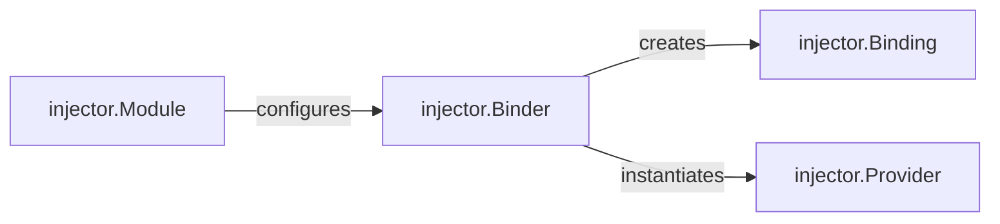

## Details

The `Binding & Module Configuration` subsystem is the foundational layer where users define and register how dependencies are mapped to their concrete implementations within the `injector` framework. It provides the necessary interfaces and mechanisms for declaring these mappings and preparing them for the dependency resolution process.

### injector.Module
Serves as the primary configuration unit for users. It provides a structured way to declare how dependencies are mapped to their concrete implementations or providers. Users extend `Module` and implement its `configure` method to define a set of related dependency bindings.

**Related Classes/Methods**:

- <a href="https://github.com/python-injector/injector/blob/master/injector/__init__.py" target="_blank" rel="noopener noreferrer">`injector.Module`</a>
- <a href="https://github.com/python-injector/injector/blob/master/injector/__init__.py" target="_blank" rel="noopener noreferrer">`injector.Module:configure`</a>

### injector.Binder
Acts as the central registry and orchestrator for dependency bindings. It is responsible for receiving, storing, and managing the lifecycle of binding declarations, translating them into concrete mapping rules that the injector can use for dependency resolution.

**Related Classes/Methods**:

- <a href="https://github.com/python-injector/injector/blob/master/injector/__init__.py" target="_blank" rel="noopener noreferrer">`injector.Binder`</a>
- <a href="https://github.com/python-injector/injector/blob/master/injector/__init__.py" target="_blank" rel="noopener noreferrer">`injector.Binder:bind`</a>

### injector.Binding
Represents the actual mapping rules or immutable representations of the dependency mappings. It encapsulates the "what" (the dependency) and the "how" (the provider or concrete implementation) of a single dependency relationship.

**Related Classes/Methods**:

- <a href="https://github.com/python-injector/injector/blob/master/injector/__init__.py" target="_blank" rel="noopener noreferrer">`injector.Binding`</a>

### injector.Provider
Encapsulates the logic for creating bound instances. This can be a factory function, a class type, or a pre-existing instance, providing a unified interface for the `Injector` to obtain dependency instances.

**Related Classes/Methods**:

- <a href="https://github.com/python-injector/injector/blob/master/injector/__init__.py" target="_blank" rel="noopener noreferrer">`injector.Provider`</a>

### [FAQ](https://github.com/CodeBoarding/GeneratedOnBoardings/tree/main?tab=readme-ov-file#faq)