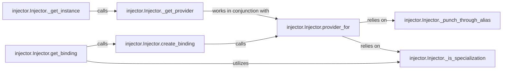

## Details

The `injector` subsystem, centered around the `Injector` class, is responsible for managing and providing dependencies within an application. Its core functionality revolves around a structured process of binding lookup, creation, and instance provision. The system efficiently resolves dependencies by first identifying appropriate bindings, then constructing providers based on these bindings, and finally instantiating or retrieving the required objects. This modular design ensures that components can declare their dependencies without needing to know how those dependencies are constructed, promoting loose coupling and testability.

### injector.Injector.get_binding
Orchestrates the initial lookup and retrieval of a Binding for a requested dependency. It handles implicit bindings and ensures correct resolution for specialized types, acting as a primary entry point for binding discovery.

**Related Classes/Methods**:

- <a href="https://github.com/python-injector/injector/blob/master/injector/__init__.py" target="_blank" rel="noopener noreferrer">`injector.Injector.create_binding`</a>
- <a href="https://github.com/python-injector/injector/blob/master/injector/__init__.py" target="_blank" rel="noopener noreferrer">`injector.Injector._is_specialization`</a>

### injector.Injector.create_binding
Constructs the Binding object itself, determining the appropriate Provider based on the dependency's nature (e.g., a class, an instance, a factory function). This component is responsible for the actual configuration of how a dependency will be provided.

**Related Classes/Methods**:

- <a href="https://github.com/python-injector/injector/blob/master/injector/__init__.py" target="_blank" rel="noopener noreferrer">`injector.Injector.provider_for`</a>

### injector.Injector.provider_for
Interprets a resolved Binding to determine and return the specific Provider instance that can fulfill the dependency. This involves understanding the binding's configuration and selecting the correct mechanism for instance creation.

**Related Classes/Methods**:

- <a href="https://github.com/python-injector/injector/blob/master/injector/__init__.py" target="_blank" rel="noopener noreferrer">`injector.Injector._punch_through_alias`</a>
- <a href="https://github.com/python-injector/injector/blob/master/injector/__init__.py" target="_blank" rel="noopener noreferrer">`injector.Injector._is_specialization`</a>

### injector.Injector._get_provider
The internal mechanism responsible for locating and retrieving the concrete Provider instance for a given dependency request. This component handles the granular details of fetching the provider, potentially involving alias resolution and specialization handling.

**Related Classes/Methods**:

- <a href="https://github.com/python-injector/injector/blob/master/injector/__init__.py" target="_blank" rel="noopener noreferrer">`injector.Injector.provider_for`</a>

### injector.Injector._get_instance
Responsible for obtaining the actual instance of a dependency by invoking the resolved Provider. This is the final step in the dependency resolution process, where the concrete object is created or retrieved from its scope.

**Related Classes/Methods**:

- <a href="https://github.com/python-injector/injector/blob/master/injector/__init__.py" target="_blank" rel="noopener noreferrer">`injector.Injector._get_provider`</a>

### injector.Injector._punch_through_alias
Ensures that type aliases are correctly resolved to their underlying concrete types. This is crucial for accurate binding matching and provider determination, especially in complex type-hinted codebases.

**Related Classes/Methods**: _None_

### injector.Injector._is_specialization
Identifies and correctly processes specialized generic types (e.g., List[str] vs. List[int]). This enables the injector to resolve bindings for complex type hints, ensuring type safety and correctness.

**Related Classes/Methods**: _None_

### [FAQ](https://github.com/CodeBoarding/GeneratedOnBoardings/tree/main?tab=readme-ov-file#faq)