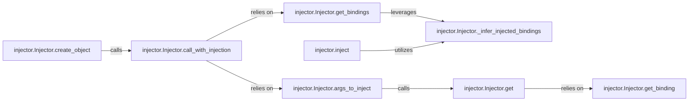

## Details

The "Dependency Injection Execution" subsystem encompasses the core logic for identifying required dependencies within a target object's constructor or a function's parameters and performing the actual injection. It is primarily centered around the `injector.Injector` class and the `injector.inject` function, focusing on the dynamic resolution and provision of dependencies at runtime.

### injector.Injector.create_object
Orchestrates the instantiation of an object, serving as the high-level entry point for object creation within the DI context by ensuring its constructor dependencies are met.

**Related Classes/Methods**:

- <a href="https://github.com/python-injector/injector/blob/master/injector/__init__.py" target="_blank" rel="noopener noreferrer">`injector.Injector.create_object`</a>

### injector.Injector.call_with_injection
The core execution engine that dynamically provides required arguments to any callable (e.g., a constructor, method, or function) marked for injection.

**Related Classes/Methods**:

- <a href="https://github.com/python-injector/injector/blob/master/injector/__init__.py" target="_blank" rel="noopener noreferrer">`injector.Injector.call_with_injection`</a>

### injector.Injector.args_to_inject
Identifies and resolves the specific arguments that need to be injected into a target callable by fetching the actual instances of dependencies.

**Related Classes/Methods**:

- <a href="https://github.com/python-injector/injector/blob/master/injector/__init__.py" target="_blank" rel="noopener noreferrer">`injector.Injector.args_to_inject`</a>

### injector.Injector.get_bindings
Retrieves the necessary binding information for the parameters of a callable, acting as a bridge between the callable's requirements and the injector's configuration.

**Related Classes/Methods**:

- <a href="https://github.com/python-injector/injector/blob/master/injector/__init__.py" target="_blank" rel="noopener noreferrer">`injector.Injector.get_bindings`</a>

### injector.Injector._infer_injected_bindings
Analyzes type hints and injection annotations (e.g., `@inject`) to determine the dependencies required by a callable, providing the intelligence for identifying what needs to be injected.

**Related Classes/Methods**:

- <a href="https://github.com/python-injector/injector/blob/master/injector/__init__.py" target="_blank" rel="noopener noreferrer">`injector.Injector._infer_injected_bindings`</a>

### injector.inject
A decorator or function that explicitly marks callables for dependency injection and assists in inferring their required bindings, offering a declarative way to indicate injection points.

**Related Classes/Methods**:

- <a href="https://github.com/python-injector/injector/blob/master/injector/__init__.py" target="_blank" rel="noopener noreferrer">`injector.inject`</a>

### injector.Injector.get
The primary public interface for requesting an instance of a type, crucial within this subsystem for resolving individual dependencies identified by `args_to_inject`.

**Related Classes/Methods**:

- <a href="https://github.com/python-injector/injector/blob/master/injector/__init__.py" target="_blank" rel="noopener noreferrer">`injector.Injector.get`</a>

### injector.Injector.get_binding
Locates or creates a binding for a given dependency key, fundamental to the injector's ability to find the correct dependency mapping types to their providers.

**Related Classes/Methods**:

- <a href="https://github.com/python-injector/injector/blob/master/injector/__init__.py" target="_blank" rel="noopener noreferrer">`injector.Injector.get_binding`</a>

### [FAQ](https://github.com/CodeBoarding/GeneratedOnBoardings/tree/main?tab=readme-ov-file#faq)