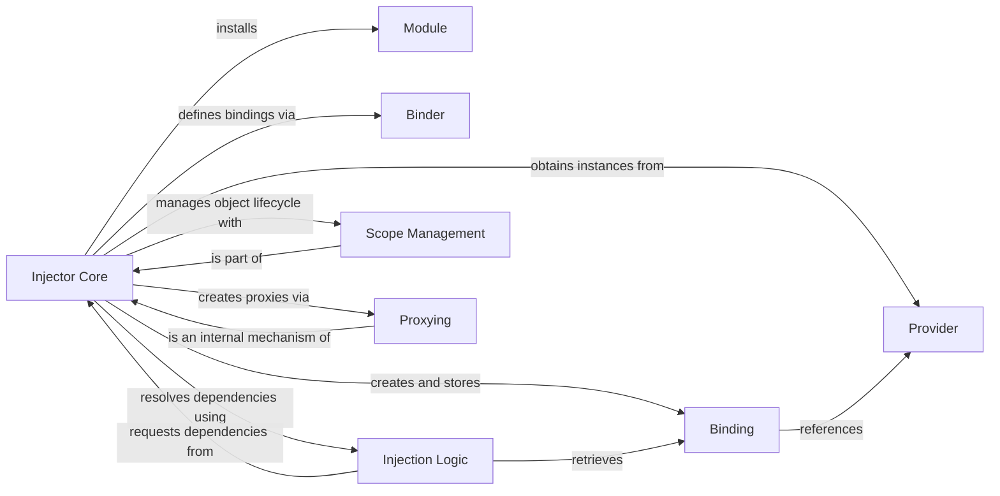

## Details

The injector subsystem provides a robust dependency injection framework centered around the Injector Core. This core component is responsible for managing the entire dependency resolution process, from accepting Module configurations that define Bindings via a Binder interface, to creating and storing these Bindings. When an object is requested, the Injector Core leverages its Injection Logic to identify and resolve dependencies, obtaining instances from associated Providers. Furthermore, it employs Scope Management to control object lifecycles and utilizes Proxying for deferred dependency resolution, ensuring efficient and flexible object graph construction.

### Injector Core [[Expand]](./Injector_Core.md)
The central orchestrator managing dependency resolution and providing the primary interface for clients to obtain injected objects. It is responsible for configuring, storing, and resolving dependencies based on defined bindings, and for managing the lifecycle of injected objects through scopes.

**Related Classes/Methods**:

- <a href="https://github.com/python-injector/injector/blob/master/injector/__init__.py" target="_blank" rel="noopener noreferrer">`injector.Injector`</a>
- <a href="https://github.com/python-injector/injector/blob/master/injector/__init__.py" target="_blank" rel="noopener noreferrer">`injector.Injector:bind`</a>
- <a href="https://github.com/python-injector/injector/blob/master/injector/__init__.py" target="_blank" rel="noopener noreferrer">`injector.Injector:get`</a>
- <a href="https://github.com/python-injector/injector/blob/master/injector/__init__.py" target="_blank" rel="noopener noreferrer">`injector.Injector:install`</a>
- <a href="https://github.com/python-injector/injector/blob/master/injector/__init__.py" target="_blank" rel="noopener noreferrer">`injector.Injector:create_object`</a>
- <a href="https://github.com/python-injector/injector/blob/master/injector/__init__.py" target="_blank" rel="noopener noreferrer">`injector.Injector:call_with_injection`</a>
- <a href="https://github.com/python-injector/injector/blob/master/injector/__init__.py" target="_blank" rel="noopener noreferrer">`injector.Injector:create_child_injector`</a>

### Module
A configuration unit used by Injector Core to define and organize a set of bindings. Modules encapsulate the setup logic for specific parts of an application, promoting modularity.

**Related Classes/Methods**:

- <a href="https://github.com/python-injector/injector/blob/master/injector/__init__.py" target="_blank" rel="noopener noreferrer">`injector.Injector:install`</a>

### Binder
An interface or component used by Injector Core to define and manage Binding objects. It provides methods for declaring how dependencies should be resolved.

**Related Classes/Methods**:

- <a href="https://github.com/python-injector/injector/blob/master/injector/__init__.py" target="_blank" rel="noopener noreferrer">`injector.Injector:bind`</a>
- <a href="https://github.com/python-injector/injector/blob/master/injector/__init__.py" target="_blank" rel="noopener noreferrer">`injector.Injector:multibind`</a>

### Binding
An object created and stored by Injector Core that maps a key (e.g., an interface or type) to a Provider instance. It represents a specific dependency declaration.

**Related Classes/Methods**:

- <a href="https://github.com/python-injector/injector/blob/master/injector/__init__.py" target="_blank" rel="noopener noreferrer">`injector.Injector:create_binding`</a>
- <a href="https://github.com/python-injector/injector/blob/master/injector/__init__.py" target="_blank" rel="noopener noreferrer">`injector.Injector:get_binding`</a>

### Provider
An instance associated with a Binding object, responsible for producing the actual object instance when requested. Providers abstract the object creation logic.

**Related Classes/Methods**:

- <a href="https://github.com/python-injector/injector/blob/master/injector/__init__.py" target="_blank" rel="noopener noreferrer">`injector.Injector:provider_for`</a>
- <a href="https://github.com/python-injector/injector/blob/master/injector/__init__.py" target="_blank" rel="noopener noreferrer">`injector.Injector:provider`</a>
- <a href="https://github.com/python-injector/injector/blob/master/injector/__init__.py" target="_blank" rel="noopener noreferrer">`injector.Injector:multiprovider`</a>

### Injection Logic
Components or internal mechanisms leveraged by Injector Core to identify and resolve dependencies for callable arguments (e.g., constructor parameters, method arguments) using introspection and type hints.

**Related Classes/Methods**:

- <a href="https://github.com/python-injector/injector/blob/master/injector/__init__.py" target="_blank" rel="noopener noreferrer">`injector.Injector:inject`</a>
- <a href="https://github.com/python-injector/injector/blob/master/injector/__init__.py" target="_blank" rel="noopener noreferrer">`injector.Injector:args_to_inject`</a>
- <a href="https://github.com/python-injector/injector/blob/master/injector/__init__.py" target="_blank" rel="noopener noreferrer">`injector.Injector:_infer_injected_bindings`</a>

### Scope Management
Components or internal mechanisms used by Injector Core to manage the lifecycle of injected objects, ensuring that instances are created and reused according to defined scopes (e.g., singleton, per-request). This includes handling child injectors and delegation.

**Related Classes/Methods**:

- <a href="https://github.com/python-injector/injector/blob/master/injector/__init__.py" target="_blank" rel="noopener noreferrer">`injector.Injector:create_child_injector`</a>
- <a href="https://github.com/python-injector/injector/blob/master/injector/__init__.py" target="_blank" rel="noopener noreferrer">`injector.Injector:_get_instance_from_parent`</a>

### Proxying
Components utilized by Injector Core to create deferred resolution objects (proxies). These proxies act as placeholders, enabling lazy loading and helping to resolve circular dependencies by delaying the actual object instantiation until it's truly needed.

**Related Classes/Methods**:

- <a href="https://github.com/python-injector/injector/blob/master/injector/__init__.py" target="_blank" rel="noopener noreferrer">`injector.Injector:proxy`</a>

### [FAQ](https://github.com/CodeBoarding/GeneratedOnBoardings/tree/main?tab=readme-ov-file#faq)