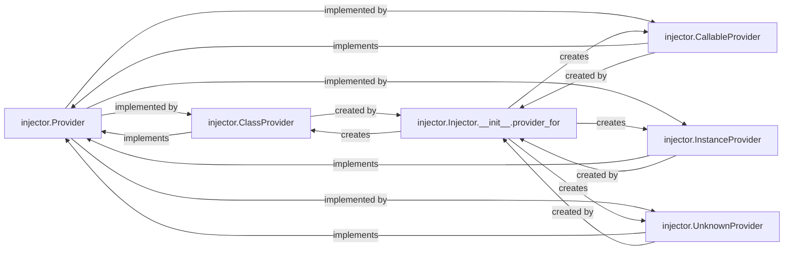

## Details

The Provider Management subsystem is responsible for abstracting and managing the instantiation logic of dependencies within the injector framework. Its boundaries encompass the abstract Provider interface and all its concrete implementations, along with the factory mechanism within the Injector that selects and creates these providers. This subsystem ensures that the Injector can obtain instances of required types without needing to know the specific creation mechanism. The Provider Management subsystem is centered around the abstract injector.Provider interface, which defines the common contract for obtaining instances. All concrete provider implementations (ClassProvider, CallableProvider, InstanceProvider, UnknownProvider) adhere to this contract, allowing the Injector to interact with them uniformly. The injector.Injector.__init__.provider_for method acts as the entry point into this subsystem, dynamically selecting and instantiating the correct Provider based on the dependency's nature. This design ensures that the Injector remains decoupled from the specific instantiation logic, promoting flexibility and extensibility in how dependencies are created and managed.

### injector.Provider
The foundational abstract interface that defines the contract for all concrete provider implementations. It establishes a unified `get_instance` method, ensuring consistency across various dependency instantiation strategies.

**Related Classes/Methods**:

- <a href="https://github.com/python-injector/injector/blob/master/injector/__init__.py" target="_blank" rel="noopener noreferrer">`injector.Provider`</a>

### injector.ClassProvider
A concrete `Provider` implementation specifically designed to instantiate classes. It handles the resolution of constructor dependencies by interacting with the `Injector` to fulfill its own requirements.

**Related Classes/Methods**:

- <a href="https://github.com/python-injector/injector/blob/master/injector/__init__.py" target="_blank" rel="noopener noreferrer">`injector.ClassProvider`</a>

### injector.CallableProvider
A concrete `Provider` implementation that executes a given callable (e.g., a function or method) to obtain an instance. It manages the injection of arguments into the callable, allowing for flexible instance creation logic.

**Related Classes/Methods**:

- <a href="https://github.com/python-injector/injector/blob/master/injector/__init__.py" target="_blank" rel="noopener noreferrer">`injector.CallableProvider`</a>

### injector.InstanceProvider
A straightforward concrete `Provider` implementation that simply returns a pre-existing, already-created instance. This is crucial for managing singletons or pre-configured objects, avoiding redundant instantiation.

**Related Classes/Methods**:

- <a href="https://github.com/python-injector/injector/blob/master/injector/__init__.py" target="_blank" rel="noopener noreferrer">`injector.InstanceProvider`</a>

### injector.UnknownProvider
A concrete `Provider` implementation that acts as a robust fallback mechanism. It signals when the `Injector` cannot determine a suitable provider for a requested type, which is vital for error handling and debugging in a DI system.

**Related Classes/Methods**:

- <a href="https://github.com/python-injector/injector/blob/master/injector/__init__.py" target="_blank" rel="noopener noreferrer">`injector.UnknownProvider`</a>

### injector.Injector.__init__.provider_for
A method within the `Injector` that serves as a factory or strategy selector. Its primary responsibility is to analyze the type of binding (e.g., a class, a callable, or an existing instance) and return the appropriate concrete `Provider` implementation (`ClassProvider`, `CallableProvider`, `InstanceProvider`, or `UnknownProvider`).

**Related Classes/Methods**:

- <a href="https://github.com/python-injector/injector/blob/master/injector/__init__.py" target="_blank" rel="noopener noreferrer">`injector.Injector.__init__.provider_for`</a>

### [FAQ](https://github.com/CodeBoarding/GeneratedOnBoardings/tree/main?tab=readme-ov-file#faq)