```mermaid
graph LR
    Injector_Core["Injector Core"]
    Binding_Module_Configuration["Binding & Module Configuration"]
    Binding_Resolution_Logic["Binding Resolution Logic"]
    Provider_Management["Provider Management"]
    Dependency_Injection_Execution["Dependency Injection Execution"]
    Error_Handling_Lifecycle["Error Handling & Lifecycle"]
    Binding_Module_Configuration -- "feeds configuration data to" --> Injector_Core
    Injector_Core -- "requests binding from" --> Binding_Resolution_Logic
    Binding_Resolution_Logic -- "directs instance creation via" --> Provider_Management
    Provider_Management -- "returns instantiated objects to" --> Injector_Core
    Injector_Core -- "initiates injection process in" --> Dependency_Injection_Execution
    Dependency_Injection_Execution -- "queries for dependencies from" --> Binding_Resolution_Logic
    Binding_Resolution_Logic -- "signals errors to" --> Error_Handling_Lifecycle
    Dependency_Injection_Execution -- "signals errors to" --> Error_Handling_Lifecycle
    Injector_Core -- "propagates errors to" --> Error_Handling_Lifecycle
    click Injector_Core href "https://github.com/CodeBoarding/GeneratedOnBoardings/blob/main/injector/Injector_Core.md" "Details"
    click Binding_Module_Configuration href "https://github.com/CodeBoarding/GeneratedOnBoardings/blob/main/injector/Binding_Module_Configuration.md" "Details"
    click Binding_Resolution_Logic href "https://github.com/CodeBoarding/GeneratedOnBoardings/blob/main/injector/Binding_Resolution_Logic.md" "Details"
    click Provider_Management href "https://github.com/CodeBoarding/GeneratedOnBoardings/blob/main/injector/Provider_Management.md" "Details"
    click Dependency_Injection_Execution href "https://github.com/CodeBoarding/GeneratedOnBoardings/blob/main/injector/Dependency_Injection_Execution.md" "Details"
```

## Details

The `injector` library's architecture is built around a core `Injector` component that orchestrates dependency resolution and object instantiation. Users define dependency mappings through `Binding & Module Configuration`, which informs the `Injector Core`. When an object is requested, the `Injector Core` leverages `Binding Resolution Logic` to find the appropriate `Provider` from `Provider Management`. This `Provider` then creates the concrete instance, and `Dependency Injection Execution` handles the actual injection of dependencies into the object's constructor or methods. Robust `Error Handling & Lifecycle` mechanisms are integrated throughout, ensuring that issues like unsatisfied requirements or circular dependencies are caught and reported effectively. This design promotes modularity, testability, and maintainability by centralizing dependency management.

### Injector Core [[Expand]](./Injector_Core.md)
The central orchestrator managing dependency resolution and providing the primary interface for clients to obtain injected objects.

**Related Classes/Methods**:

- <a href="https://github.com/python-injector/injector/blob/master/injector/__init__.py" target="_blank" rel="noopener noreferrer">`injector.Injector`</a>

### Binding & Module Configuration [[Expand]](./Binding_Module_Configuration.md)
Provides the interface for users to define how dependencies are mapped to their concrete implementations, including the installation of modules.

**Related Classes/Methods**:

- <a href="https://github.com/python-injector/injector/blob/master/injector/__init__.py" target="_blank" rel="noopener noreferrer">`injector.Module`</a>
- <a href="https://github.com/python-injector/injector/blob/master/injector/__init__.py" target="_blank" rel="noopener noreferrer">`injector.Binder`</a>

### Binding Resolution Logic [[Expand]](./Binding_Resolution_Logic.md)
The internal mechanism responsible for locating and interpreting the correct binding for a given dependency request, handling aliases and specializations.

**Related Classes/Methods**:

- <a href="https://github.com/python-injector/injector/blob/master/injector/__init__.py" target="_blank" rel="noopener noreferrer">`injector.Injector._get_provider`</a>
- <a href="https://github.com/python-injector/injector/blob/master/injector/__init__.py" target="_blank" rel="noopener noreferrer">`injector.Injector._get_instance`</a>

### Provider Management [[Expand]](./Provider_Management.md)
Manages the creation of concrete instances based on the resolved bindings, abstracting the instantiation logic for different types of dependencies.

**Related Classes/Methods**:

- <a href="https://github.com/python-injector/injector/blob/master/injector/__init__.py" target="_blank" rel="noopener noreferrer">`injector.Provider`</a>
- <a href="https://github.com/python-injector/injector/blob/master/injector/__init__.py" target="_blank" rel="noopener noreferrer">`injector.ClassProvider`</a>
- <a href="https://github.com/python-injector/injector/blob/master/injector/__init__.py" target="_blank" rel="noopener noreferrer">`injector.CallableProvider`</a>

### Dependency Injection Execution [[Expand]](./Dependency_Injection_Execution.md)
The core logic for identifying required dependencies within a target object's constructor or a function's parameters and performing the actual injection.

**Related Classes/Methods**:

- <a href="https://github.com/python-injector/injector/blob/master/injector/__init__.py" target="_blank" rel="noopener noreferrer">`injector.Injector.create_object`</a>
- <a href="https://github.com/python-injector/injector/blob/master/injector/__init__.py" target="_blank" rel="noopener noreferrer">`injector.inject`</a>

### Error Handling & Lifecycle
Manages exceptions and specific states that can occur during the dependency resolution and injection process, ensuring robust operation.

**Related Classes/Methods**:

- <a href="https://github.com/python-injector/injector/blob/master/injector/__init__.py" target="_blank" rel="noopener noreferrer">`injector.Error`</a>
- <a href="https://github.com/python-injector/injector/blob/master/injector/__init__.py" target="_blank" rel="noopener noreferrer">`injector.UnsatisfiedRequirement`</a>
- <a href="https://github.com/python-injector/injector/blob/master/injector/__init__.py" target="_blank" rel="noopener noreferrer">`injector.CallError`</a>
- <a href="https://github.com/python-injector/injector/blob/master/injector/__init__.py" target="_blank" rel="noopener noreferrer">`injector.CircularDependency`</a>
- <a href="https://github.com/python-injector/injector/blob/master/injector/__init__.py" target="_blank" rel="noopener noreferrer">`injector.UnknownProvider`</a>
- <a href="https://github.com/python-injector/injector/blob/master/injector/__init__.py" target="_blank" rel="noopener noreferrer">`injector.UnknownArgument`</a>

### [FAQ](https://github.com/CodeBoarding/GeneratedOnBoardings/tree/main?tab=readme-ov-file#faq)