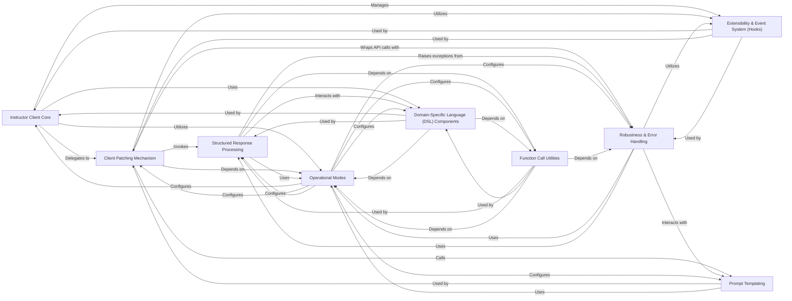

## Component Details

The `Instructor Core Client` subsystem is the heart of the Instructor library, providing the main interface for users to interact with Large Language Models (LLMs) while enforcing structured outputs, handling retries, and enabling extensibility through hooks. It orchestrates the entire lifecycle of an LLM interaction, from preparing the input to processing the output.

### Instructor Client Core
This is the primary user-facing interface, embodied by the `Instructor` and `AsyncInstructor` classes (`instructor/client.py`). It offers synchronous and asynchronous methods (`create`, `create_partial`, `create_iterable`, `create_with_completion`) for interacting with LLMs. It acts as the orchestrator, managing the request lifecycle, integrating with other components like the `Client Patching Mechanism` to inject Instructor's core capabilities (structured output, retries, hooks). It also handles the initial setup of the client with specific operational modes and default parameters.

**Related Classes/Methods**:

- <a href="https://github.com/567-labs/instructor/blob/master/instructor/client.py#L1-L1" target="_blank" rel="noopener noreferrer">`instructor.client` (1:1)</a>

### Client Patching Mechanism
This crucial component, primarily the `patch` function (`instructor/patch.py`), modifies an existing LLM client instance (e.g., OpenAI client) to inject Instructor's enhanced capabilities. It replaces the client's original `create` method with Instructor's custom version, which then incorporates `Structured Response Processing`, `Robustness & Error Handling`, `Prompt Templating`, and `Extensibility & Event System (Hooks)` into the LLM interaction flow.

**Related Classes/Methods**:

- <a href="https://github.com/567-labs/instructor/blob/master/instructor/patch.py#L89-L92" target="_blank" rel="noopener noreferrer">`instructor.patch` (89:92)</a>

### Structured Response Processing
This component (`instructor/process_response.py`) is fundamental to Instructor's ability to enforce structured outputs. It takes a `response_model` (e.g., a Pydantic model) and the current `Operational Mode` to transform API call arguments, guiding the LLM to generate output conforming to the specified model. It also handles message conversion, image detection, and integrates with various `Domain-Specific Language (DSL) Components` for advanced output structures.

**Related Classes/Methods**:

- <a href="https://github.com/567-labs/instructor/blob/master/instructor/process_response.py#L120-L193" target="_blank" rel="noopener noreferrer">`instructor.process_response` (120:193)</a>

### Robustness & Error Handling
This component (`instructor/retry.py`, `instructor/exceptions.py`) ensures the reliability of LLM interactions. The `Retry Mechanism` (`retry_sync`, `retry_async`) implements retry logic for API calls, re-attempting failed requests (e.g., due to validation errors or transient network issues) a specified number of times. The `Exceptions Module` defines custom exceptions (`InstructorRetryException`), providing specific error information for better diagnosis and handling.

**Related Classes/Methods**:

- <a href="https://github.com/567-labs/instructor/blob/master/instructor/retry.py#L1-L1" target="_blank" rel="noopener noreferrer">`instructor.retry` (1:1)</a>
- <a href="https://github.com/567-labs/instructor/blob/master/instructor/exceptions.py#L1-L1" target="_blank" rel="noopener noreferrer">`instructor.exceptions` (1:1)</a>

### Extensibility & Event System (Hooks)
The `Hooks` component (`instructor/hooks.py`) provides a flexible event system, allowing developers to register and emit handlers for various events (e.g., `completion:kwargs`, `completion:response`, `parse:error`) that occur throughout the LLM interaction lifecycle. This enables custom logging, metrics collection, or error handling, making the system highly extensible without modifying core logic.

**Related Classes/Methods**:

- <a href="https://github.com/567-labs/instructor/blob/master/instructor/hooks.py#L1-L1" target="_blank" rel="noopener noreferrer">`instructor.hooks` (1:1)</a>

### Operational Modes
This component, represented by the `Mode` enumeration (`instructor/mode.py`), defines the various operational strategies for Instructor. These modes dictate how Instructor interacts with the underlying LLM API, specifically how it structures the request (e.g., using OpenAI's `tools` API, `json_mode`, or custom JSON formatting) and how it expects the response.

**Related Classes/Methods**:

- <a href="https://github.com/567-labs/instructor/blob/master/instructor/mode.py#L1-L1" target="_blank" rel="noopener noreferrer">`instructor.mode` (1:1)</a>

### Prompt Templating
This component (`instructor/templating.py`) applies Jinja2 templating to the messages sent to the LLM. It allows dynamic insertion of context variables into the chat messages, making prompts more flexible, reusable, and easier to manage for complex interactions across different LLM providers.

**Related Classes/Methods**:

- <a href="https://github.com/567-labs/instructor/blob/master/instructor/templating.py#L1-L1" target="_blank" rel="noopener noreferrer">`instructor.templating` (1:1)</a>

### Domain-Specific Language (DSL) Components
This is a collection of modules under `instructor.dsl` (e.g., `iterable.py`, `parallel.py`, `partial.py`, `simple_type.py`, `validators.py`) that provide specialized functionalities for handling complex output structures and interaction patterns. These components extend Instructor's capabilities beyond basic structured output, enabling features like streaming partial responses or handling multiple function calls.

**Related Classes/Methods**:

- <a href="https://github.com/567-labs/instructor/blob/master/instructor/dsl/iterable.py#L1-L1" target="_blank" rel="noopener noreferrer">`instructor.dsl.iterable` (1:1)</a>
- <a href="https://github.com/567-labs/instructor/blob/master/instructor/dsl/parallel.py#L1-L1" target="_blank" rel="noopener noreferrer">`instructor.dsl.parallel` (1:1)</a>
- <a href="https://github.com/567-labs/instructor/blob/master/instructor/dsl/partial.py#L1-L1" target="_blank" rel="noopener noreferrer">`instructor.dsl.partial` (1:1)</a>
- <a href="https://github.com/567-labs/instructor/blob/master/instructor/dsl/simple_type.py#L1-L1" target="_blank" rel="noopener noreferrer">`instructor.dsl.simple_type` (1:1)</a>
- <a href="https://github.com/567-labs/instructor/blob/master/instructor/dsl/validators.py#L1-L1" target="_blank" rel="noopener noreferrer">`instructor.dsl.validators` (1:1)</a>

### Function Call Utilities
This component (`instructor/function_calls.py`) provides utilities for handling function calls, which are crucial for interacting with LLMs in `TOOLS` or `FUNCTIONS` modes. It helps in structuring function call arguments, generating tool schemas from Pydantic models, and processing function call responses.

**Related Classes/Methods**:

- <a href="https://github.com/567-labs/instructor/blob/master/instructor/function_calls.py#L1-L1" target="_blank" rel="noopener noreferrer">`instructor.function_calls` (1:1)</a>

### [FAQ](https://github.com/CodeBoarding/GeneratedOnBoardings/tree/main?tab=readme-ov-file#faq)