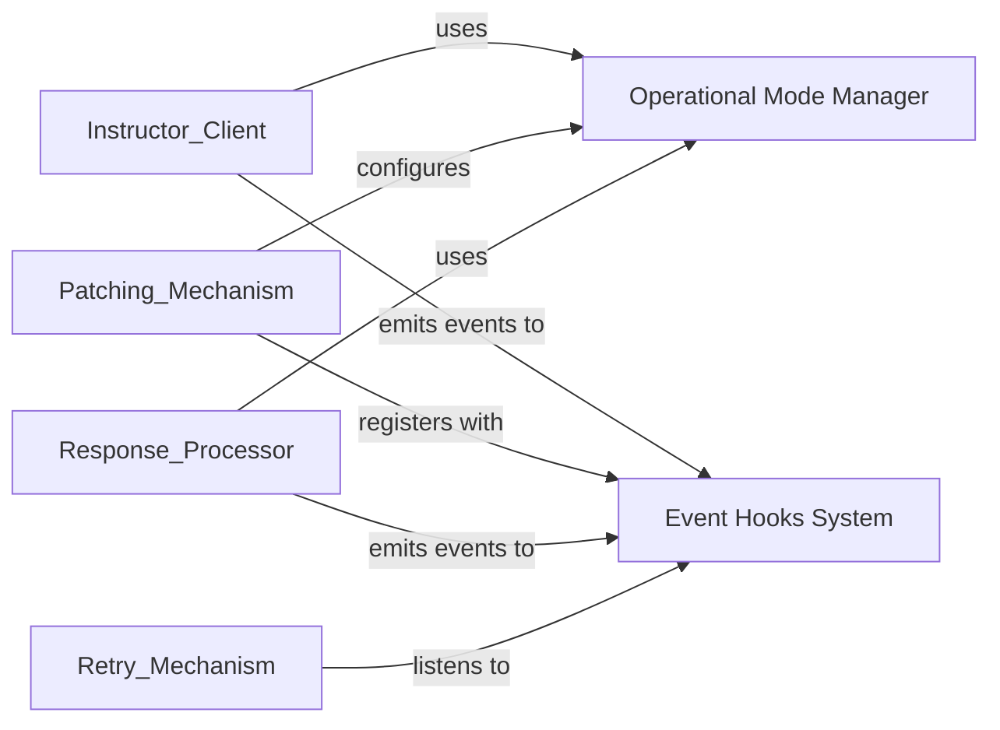

## Component Details

Component overview for Lifecycle & Configuration Management focusing on Operational Mode Manager and Event Hooks System

### Operational Mode Manager
This component defines and manages the various operational modes (`instructor.mode.Mode`) that dictate how the `instructor` library interacts with different AI models. It centralizes the strategy for formatting requests (e.g., using tools, functions, or JSON mode) and interpreting responses, ensuring `instructor` adapts to diverse model capabilities and use cases.

**Related Classes/Methods**:

- <a href="https://github.com/567-labs/instructor/blob/master/instructor/mode.py#L8-L128" target="_blank" rel="noopener noreferrer">`instructor.mode.Mode` (8:128)</a>

### Event Hooks System
This component provides a flexible and extensible event dispatching system, allowing users and internal components to register custom callback functions (`Handlers`) at predefined points (`instructor.hooks.HookName`s) within the AI interaction lifecycle. It enables observability, debugging, and behavior modification without altering core library logic.

**Related Classes/Methods**:

- <a href="https://github.com/567-labs/instructor/blob/master/instructor/hooks.py#L11-L16" target="_blank" rel="noopener noreferrer">`instructor.hooks.HookName` (11:16)</a>

### [FAQ](https://github.com/CodeBoarding/GeneratedOnBoardings/tree/main?tab=readme-ov-file#faq)