```mermaid
graph LR
    Provider_Integration_Layer["Provider Integration Layer"]
    instructor_auto_client["instructor.auto_client"]
    instructor_client["instructor.client"]
    instructor_client_anthropic["instructor.client_anthropic"]
    instructor_client_gemini["instructor.client_gemini"]
    instructor_patch["instructor.patch"]
    instructor_mode["instructor.mode"]
    instructor_hooks["instructor.hooks"]
    instructor_utils["instructor.utils"]
    instructor_process_response["instructor.process_response"]
    instructor_auto_client -- "initializes/configures" --> instructor_client_anthropic
    instructor_auto_client -- "utilizes" --> instructor_patch
    instructor_client_anthropic -- "extends/utilizes" --> instructor_client
    instructor_client -- "uses" --> instructor_hooks
    instructor_client_anthropic -- "integrates with" --> instructor_patch
    instructor_client_anthropic -- "determines" --> instructor_mode
    instructor_client_gemini -- "integrates with" --> instructor_patch
    instructor_client_gemini -- "determines" --> instructor_mode
    instructor_patch -- "modifies" --> instructor_client_anthropic
    instructor_patch -- "modifies" --> instructor_client_gemini
    instructor_patch -- "utilizes" --> instructor_mode
    instructor_mode -- "guides behavior of" --> instructor_patch
    instructor_hooks -- "uses" --> instructor_client
    instructor_hooks -- "provides extensibility for" --> instructor_patch
    instructor_utils -- "uses" --> instructor_client
    instructor_utils -- "supports" --> instructor_patch
    instructor_patch -- "invokes" --> instructor_process_response
    instructor_process_response -- "utilizes" --> instructor_mode
    click Provider_Integration_Layer href "https://github.com/CodeBoarding/GeneratedOnBoardings/blob/main//instructor/Provider_Integration_Layer.md" "Details"
```

## Component Details

The `Provider Integration Layer` is a crucial part of the `instructor` library, designed to abstract and standardize interactions with various Large Language Model (LLM) providers. It acts as a factory, ensuring that `instructor`'s capabilities, such as response model enforcement and retry mechanisms, are correctly applied to provider-specific API clients. These components are fundamental because they collectively form the core mechanism of the `Provider Integration Layer`. Together, these components ensure that `instructor` can seamlessly integrate with various LLM providers, abstracting away complexities and providing a consistent, robust experience for structured output generation.

### Provider Integration Layer
This is the overarching conceptual layer responsible for initializing, configuring, and patching various LLM provider clients to work seamlessly with `instructor`'s features. It abstracts away provider-specific complexities and ensures consistent behavior across different LLMs.

**Related Classes/Methods**: _None_

### instructor.auto_client
This module provides an automated mechanism to detect the appropriate LLM client (e.g., OpenAI, Anthropic, Gemini) based on the environment or provided client instance, and then applies `instructor`'s patching logic to it. It simplifies the initial setup for users.

**Related Classes/Methods**:

- <a href="https://github.com/567-labs/instructor/blob/master/instructor/auto_client.py#L1-L1" target="_blank" rel="noopener noreferrer">`instructor.auto_client` (1:1)</a>

### instructor.client
This module likely serves as a base or a common interface for various provider-specific clients. It might contain shared logic or utility functions that are leveraged by individual client integrations.

**Related Classes/Methods**:

- <a href="https://github.com/567-labs/instructor/blob/master/instructor/client.py#L1-L1" target="_blank" rel="noopener noreferrer">`instructor.client` (1:1)</a>

### instructor.client_anthropic
This module specifically handles the integration with Anthropic's API. It initializes the native Anthropic client and applies `instructor`'s patching to its API methods (e.g., `create`), enabling features like response model enforcement and re-asking. It also determines the appropriate `instructor.Mode` for Anthropic interactions.

**Related Classes/Methods**:

- <a href="https://github.com/567-labs/instructor/blob/master/instructor/client_anthropic.py#L1-L1" target="_blank" rel="noopener noreferrer">`instructor.client_anthropic` (1:1)</a>

### instructor.client_gemini
Similar to `instructor.client_anthropic`, this module manages the integration with Google Gemini's API. It initializes the Gemini client, applies `instructor`'s patching to its methods, and sets the correct `instructor.Mode` for Gemini-specific interactions.

**Related Classes/Methods**:

- <a href="https://github.com/567-labs/instructor/blob/master/instructor/client_gemini.py#L1-L1" target="_blank" rel="noopener noreferrer">`instructor.client_gemini` (1:1)</a>

### instructor.patch
This is a core module responsible for dynamically modifying (patching) the methods of LLM API clients. It injects `instructor`'s functionalities, such as response model validation, retry logic, and re-asking, into the client's `create` or `chat.completions.create` methods.

**Related Classes/Methods**:

- <a href="https://github.com/567-labs/instructor/blob/master/instructor/patch.py#L89-L92" target="_blank" rel="noopener noreferrer">`instructor.patch` (89:92)</a>

### instructor.mode
This module defines the various operational modes for `instructor`, such as `TOOLS`, `JSON`, `ANTHROPIC_TOOLS`, etc. These modes dictate how `instructor` should process and validate responses from different LLM providers, often aligning with the provider's native tool-calling or JSON output capabilities.

**Related Classes/Methods**:

- <a href="https://github.com/567-labs/instructor/blob/master/instructor/mode.py#L1-L1" target="_blank" rel="noopener noreferrer">`instructor.mode` (1:1)</a>

### instructor.hooks
This module provides a mechanism for registering and executing callback functions at various points within the `instructor`'s workflow. It allows for extensibility and custom logic to be injected, for example, before or after an LLM call.

**Related Classes/Methods**:

- <a href="https://github.com/567-labs/instructor/blob/master/instructor/hooks.py#L1-L1" target="_blank" rel="noopener noreferrer">`instructor.hooks` (1:1)</a>

### instructor.utils
This module contains a collection of general utility functions that are used across the `instructor` library. These functions might include helpers for type checking, data manipulation, or other common operations.

**Related Classes/Methods**:

- <a href="https://github.com/567-labs/instructor/blob/master/instructor/utils.py#L1-L1" target="_blank" rel="noopener noreferrer">`instructor.utils` (1:1)</a>

### instructor.process_response
This module is responsible for processing the raw responses received from the LLM API. It handles parsing, validation against the defined response model, and potentially triggers re-asking logic if the response does not conform to the expected structure.

**Related Classes/Methods**:

- <a href="https://github.com/567-labs/instructor/blob/master/instructor/process_response.py#L120-L193" target="_blank" rel="noopener noreferrer">`instructor.process_response` (120:193)</a>

### [FAQ](https://github.com/CodeBoarding/GeneratedOnBoardings/tree/main?tab=readme-ov-file#faq)