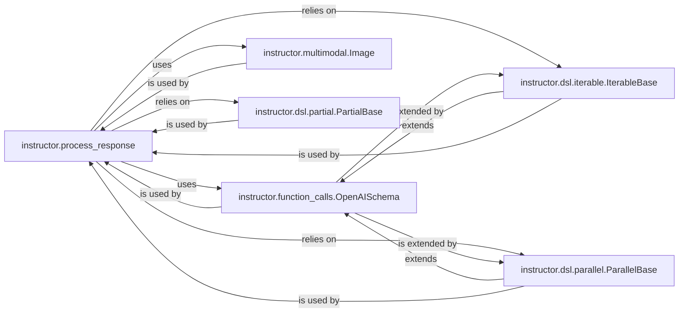

## Component Details

This component is the core of `instructor`, responsible for transforming raw AI model responses into validated, structured Pydantic models. It encompasses the generation of AI-compatible schemas from Pydantic models, parsing of function/tool calls, management of various response modes (e.g., JSON, tool calls), and integration of advanced Domain Specific Language (DSL) features like parallel, iterable, and partial models, as well as multimodal data handling.

### instructor.process_response
This module serves as the central orchestrator for the entire response processing pipeline. It prepares the response model and modifies keyword arguments before an API call, then processes the raw API response based on the `mode`. It dispatches to various mode-specific handlers and integrates DSL features. It's fundamental because it acts as the central hub that ties together schema generation, parsing, and advanced response handling, ensuring that the correct processing logic is applied based on the AI model's response and the desired output structure.

**Related Classes/Methods**:

- <a href="https://github.com/567-labs/instructor/blob/master/instructor/process_response.py#L120-L193" target="_blank" rel="noopener noreferrer">`instructor.process_response` (120:193)</a>

### instructor.function_calls.OpenAISchema
This class is a foundational component responsible for generating AI-compatible schemas (e.g., OpenAI, Anthropic, Gemini) from Pydantic models. It also provides the core logic for parsing and validating raw AI model responses into structured Pydantic models. It's fundamental because it defines the contract between Pydantic models and AI model capabilities, enabling `instructor` to enforce structured output and validate the AI's responses against predefined schemas.

**Related Classes/Methods**:

- <a href="https://github.com/567-labs/instructor/blob/master/instructor/function_calls.py#L102-L658" target="_blank" rel="noopener noreferrer">`instructor.function_calls.OpenAISchema` (102:658)</a>

### instructor.multimodal.Image
This class is specifically designed to handle multimodal inputs, primarily images. It provides utility methods for autodetection of image sources (base64, URL, local path) and conversion to formats suitable for various AI models. It's fundamental for extending `instructor`'s capabilities to AI models that support multimodal inputs, allowing users to seamlessly integrate image data into their structured prompts and responses.

**Related Classes/Methods**:

- <a href="https://github.com/567-labs/instructor/blob/master/instructor/multimodal.py#L57-L287" target="_blank" rel="noopener noreferrer">`instructor.multimodal.Image` (57:287)</a>

### instructor.dsl.iterable.IterableBase
This base class provides the core functionality for handling streaming responses where the LLM is expected to return a sequence of structured outputs. It extracts and processes JSON chunks from a stream, yielding individual models as they become available. It's fundamental for enabling real-time, continuous parsing of structured data from streaming AI models, which is crucial for applications requiring immediate feedback or processing of large outputs.

**Related Classes/Methods**:

- <a href="https://github.com/567-labs/instructor/blob/master/instructor/dsl/iterable.py#L9-L296" target="_blank" rel="noopener noreferrer">`instructor.dsl.iterable.IterableBase` (9:296)</a>

### instructor.dsl.parallel.ParallelBase
This module facilitates the handling of parallel tool calls or multiple structured outputs from an LLM. It prepares the necessary schema for concurrent execution of different models or functions and parses the responses containing multiple tool calls. It's fundamental for scenarios requiring the AI model to return multiple distinct structured outputs simultaneously, enhancing efficiency and complexity handling in AI interactions.

**Related Classes/Methods**:

- <a href="https://github.com/567-labs/instructor/blob/master/instructor/dsl/parallel.py#L20-L45" target="_blank" rel="noopener noreferrer">`instructor.dsl.parallel.ParallelBase` (20:45)</a>

### instructor.dsl.partial.PartialBase
This module focuses on handling partial or incomplete streaming responses. It allows for the progressive construction of a Pydantic model as chunks of data arrive from a streaming LLM, enabling a "type-as-you-go" experience. It's fundamental for improving user experience with streaming models by providing immediate, albeit incomplete, structured data, which can be particularly useful for long-running generations or interactive applications.

**Related Classes/Methods**:

- <a href="https://github.com/567-labs/instructor/blob/master/instructor/dsl/partial.py#L129-L432" target="_blank" rel="noopener noreferrer">`instructor.dsl.partial.PartialBase` (129:432)</a>

### [FAQ](https://github.com/CodeBoarding/GeneratedOnBoardings/tree/main?tab=readme-ov-file#faq)