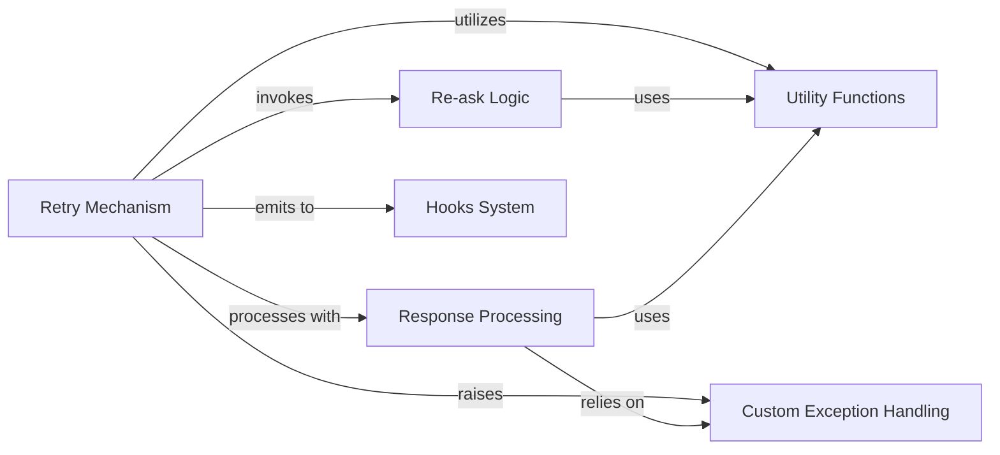

## Component Details

This system is designed to ensure reliable structured output from AI models by implementing robust retry and "reasking" mechanisms, along with custom exception handling. It intelligently retries requests and re-prompts the AI with error details when validation fails.

### Retry Mechanism
This component is the central orchestrator of the robustness system. It executes API calls to Language Model Models (LLMs) and intelligently retries them upon specific failures, such as `ValidationError` or `JSONDecodeError`. It manages retry attempts, integrates with the `Re-ask Logic` to guide the LLM, and emits events through the `Hooks System`. It provides both synchronous (`retry_sync`) and asynchronous (`retry_async`) capabilities.

**Related Classes/Methods**:

- <a href="https://github.com/567-labs/instructor/blob/master/instructor/retry.py#L136-L219" target="_blank" rel="noopener noreferrer">`instructor.retry:retry_sync` (136:219)</a>
- <a href="https://github.com/567-labs/instructor/blob/master/instructor/retry.py#L222-L309" target="_blank" rel="noopener noreferrer">`instructor.retry:retry_async` (222:309)</a>

### Re-ask Logic
This component acts as a central dispatcher for various re-asking strategies. When a parsing or validation error occurs in an LLM response, it determines the appropriate re-asking function based on the LLM's `mode`. It then intelligently modifies the original request parameters (`kwargs`) to provide specific error details and guidance to the LLM, helping it generate a correct and valid structured response in subsequent retry attempts.

**Related Classes/Methods**: _None_

### Response Processing
This component is responsible for transforming raw responses received from LLM APIs into structured Python objects, typically Pydantic models. It handles diverse response formats (streaming, iterable, parallel) and performs crucial validation to ensure the output conforms to the expected schema. Errors detected during this process can trigger the `Retry Mechanism` and `Re-ask Logic`.

**Related Classes/Methods**: _None_

### Hooks System
This component provides a flexible, event-driven mechanism that allows developers to register and emit custom events at various stages of the LLM interaction lifecycle (e.g., before/after completion, on parse error, on retry). It enables the injection of custom logic, logging, or monitoring without modifying the core `instructor` codebase, enhancing extensibility and observability.

**Related Classes/Methods**:

- <a href="https://github.com/567-labs/instructor/blob/master/instructor/hooks.py#L65-L226" target="_blank" rel="noopener noreferrer">`instructor.hooks:Hooks` (65:226)</a>

### Utility Functions
This component encapsulates a collection of general-purpose helper functions that support various aspects of the `Robustness & Error Handling System` and other parts of the `instructor` library. Key functions include `update_total_usage` for aggregating token usage and `extract_json_from_codeblock` for robust JSON parsing.

**Related Classes/Methods**:

- <a href="https://github.com/567-labs/instructor/blob/master/instructor/utils.py#L393-L447" target="_blank" rel="noopener noreferrer">`instructor.utils:update_total_usage` (393:447)</a>
- <a href="https://github.com/567-labs/instructor/blob/master/instructor/utils.py#L102-L132" target="_blank" rel="noopener noreferrer">`instructor.utils:extract_json_from_codeblock` (102:132)</a>
- <a href="https://github.com/567-labs/instructor/blob/master/instructor/utils.py#L450-L475" target="_blank" rel="noopener noreferrer">`instructor.utils:dump_message` (450:475)</a>
- <a href="https://github.com/567-labs/instructor/blob/master/instructor/utils.py#L135-L261" target="_blank" rel="noopener noreferrer">`instructor.utils:extract_json_from_stream` (135:261)</a>

### Custom Exception Handling
This component defines specialized exceptions tailored for `instructor`'s robust interaction patterns. The primary exception, `InstructorRetryException`, is raised when all configured retry attempts have been exhausted. It provides comprehensive details about the failure, facilitating debugging and error analysis. Other exceptions like `ValidationError` are also defined here.

**Related Classes/Methods**:

- <a href="https://github.com/567-labs/instructor/blob/master/instructor/exceptions.py#L25-L43" target="_blank" rel="noopener noreferrer">`instructor.exceptions:InstructorRetryException` (25:43)</a>
- <a href="https://github.com/567-labs/instructor/blob/master/instructor/exceptions.py#L46-L49" target="_blank" rel="noopener noreferrer">`instructor.exceptions:ValidationError` (46:49)</a>

### [FAQ](https://github.com/CodeBoarding/GeneratedOnBoardings/tree/main?tab=readme-ov-file#faq)