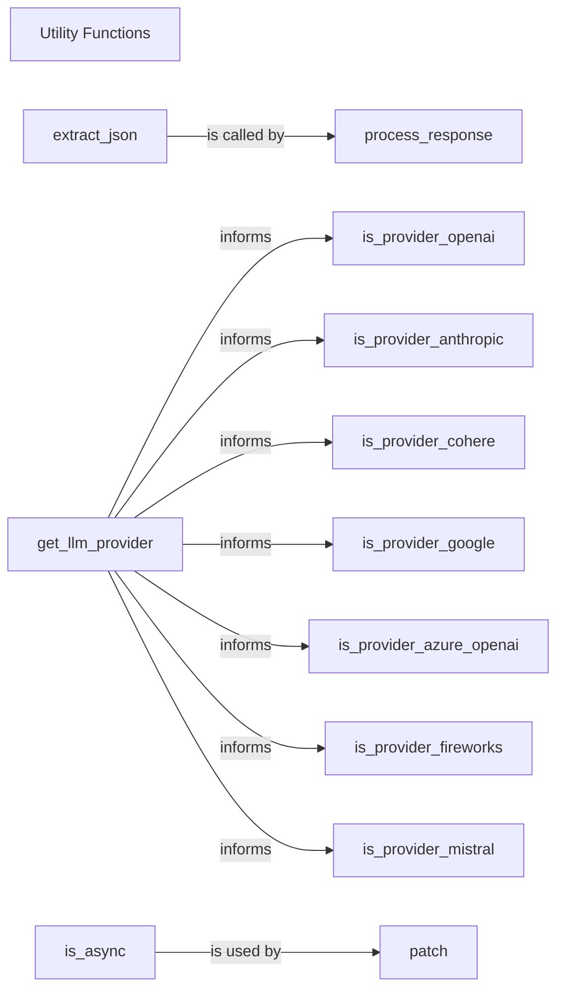

## Component Details

The `Utility Functions` component, primarily encapsulated within `instructor/utils.py`, serves as a crucial support system for the entire `instructor` codebase. It provides a collection of general-purpose helper functions that are not tied to a specific domain but are essential for various core operations.

### Utility Functions
This component comprises a collection of general-purpose helper functions that are used across the instructor codebase. These utilities support various core components by performing common tasks such as extracting JSON from different text formats, determining the LLM provider from a base URL, converting messages, and managing usage statistics. While not a primary flow component, it provides essential foundational support.

**Related Classes/Methods**:

- <a href="https://github.com/567-labs/instructor/blob/master/instructor/utils.py#L1-L1" target="_blank" rel="noopener noreferrer">`instructor.utils` (1:1)</a>

### extract_json
This function is responsible for robustly extracting JSON objects from various text formats, including those that might be embedded within markdown code blocks or contain extraneous text. It's crucial for parsing LLM responses.

**Related Classes/Methods**:

- <a href="https://github.com/567-labs/instructor/blob/master/instructor/utils.py#L1-L1" target="_blank" rel="noopener noreferrer">`instructor.utils.extract_json` (1:1)</a>

### get_llm_provider
Determines the LLM provider (e.g., OpenAI, Anthropic, Cohere) based on the base URL of the LLM client. This is vital for dynamic configuration and behavior based on the underlying model.

**Related Classes/Methods**:

- <a href="https://github.com/567-labs/instructor/blob/master/instructor/utils.py#L1-L1" target="_blank" rel="noopener noreferrer">`instructor.utils.get_llm_provider` (1:1)</a>

### is_async
A utility function to check if a given callable (function or method) is an asynchronous function.

**Related Classes/Methods**:

- <a href="https://github.com/567-labs/instructor/blob/master/instructor/utils.py#L478-L484" target="_blank" rel="noopener noreferrer">`instructor.utils.is_async` (478:484)</a>

### is_provider_openai
Checks if the detected LLM provider is OpenAI.

**Related Classes/Methods**:

- <a href="https://github.com/567-labs/instructor/blob/master/instructor/utils.py#L1-L1" target="_blank" rel="noopener noreferrer">`instructor.utils.is_provider_openai` (1:1)</a>

### is_provider_anthropic
Checks if the detected LLM provider is Anthropic.

**Related Classes/Methods**:

- <a href="https://github.com/567-labs/instructor/blob/master/instructor/utils.py#L1-L1" target="_blank" rel="noopener noreferrer">`instructor.utils.is_provider_anthropic` (1:1)</a>

### is_provider_cohere
Checks if the detected LLM provider is Cohere.

**Related Classes/Methods**:

- <a href="https://github.com/567-labs/instructor/blob/master/instructor/utils.py#L1-L1" target="_blank" rel="noopener noreferrer">`instructor.utils.is_provider_cohere` (1:1)</a>

### is_provider_google
Checks if the detected LLM provider is Google (e.g., Gemini, Vertex AI).

**Related Classes/Methods**:

- <a href="https://github.com/567-labs/instructor/blob/master/instructor/utils.py#L1-L1" target="_blank" rel="noopener noreferrer">`instructor.utils.is_provider_google` (1:1)</a>

### is_provider_azure_openai
Checks if the detected LLM provider is Azure OpenAI.

**Related Classes/Methods**:

- <a href="https://github.com/567-labs/instructor/blob/master/instructor/utils.py#L1-L1" target="_blank" rel="noopener noreferrer">`instructor.utils.is_provider_azure_openai` (1:1)</a>

### is_provider_fireworks
Checks if the detected LLM provider is Fireworks.

**Related Classes/Methods**:

- <a href="https://github.com/567-labs/instructor/blob/master/instructor/utils.py#L1-L1" target="_blank" rel="noopener noreferrer">`instructor.utils.is_provider_fireworks` (1:1)</a>

### is_provider_mistral
Checks if the detected LLM provider is Mistral.

**Related Classes/Methods**:

- <a href="https://github.com/567-labs/instructor/blob/master/instructor/utils.py#L1-L1" target="_blank" rel="noopener noreferrer">`instructor.utils.is_provider_mistral` (1:1)</a>

### process_response
A component responsible for processing LLM responses, likely calling `extract_json`.

**Related Classes/Methods**:

- <a href="https://github.com/567-labs/instructor/blob/master/instructor/process_response.py#L120-L193" target="_blank" rel="noopener noreferrer">`instructor.process_response` (120:193)</a>

### patch
A component responsible for dynamically modifying client behavior, likely using `is_async`.

**Related Classes/Methods**:

- <a href="https://github.com/567-labs/instructor/blob/master/instructor/patch.py#L89-L92" target="_blank" rel="noopener noreferrer">`instructor.patch` (89:92)</a>

### [FAQ](https://github.com/CodeBoarding/GeneratedOnBoardings/tree/main?tab=readme-ov-file#faq)