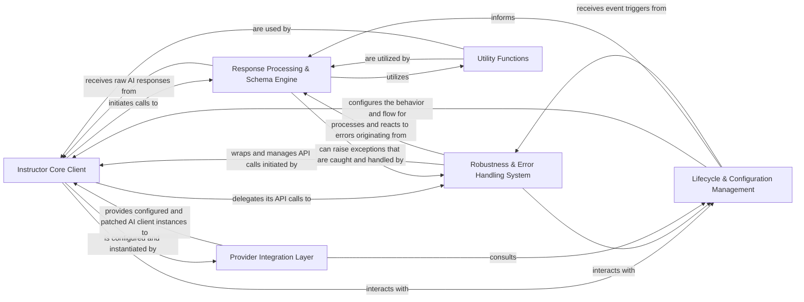

## Component Details

The instructor library's architecture is designed to provide a robust and intuitive way to interact with Large Language Models (LLMs), primarily focusing on enabling structured output (Pydantic models) and enhancing reliability. The analysis of its Control Flow Graph (CFG) and source code reveals a modular design centered around patching existing AI clients, processing responses, and ensuring resilience.

### Instructor Core Client
This is the central user-facing interface, encompassing the Instructor and AsyncInstructor classes. It acts as the orchestrator, wrapping and patching the underlying AI client's create method to inject instructor's core capabilities, such as response_model for structured output, max_retries, and hooks. It manages the overall request lifecycle from initiation to receiving the final processed output.

**Related Classes/Methods**:

- <a href="https://github.com/567-labs/instructor/blob/master/instructor/client.py#L1-L1" target="_blank" rel="noopener noreferrer">`instructor.client` (1:1)</a>
- <a href="https://github.com/567-labs/instructor/blob/master/instructor/patch.py#L89-L92" target="_blank" rel="noopener noreferrer">`instructor.patch` (89:92)</a>

### Response Processing & Schema Engine
This component is responsible for the core value proposition of instructor: transforming raw AI model responses into validated, structured Pydantic models. It handles the generation of AI-compatible schemas from Pydantic models, parses function/tool calls, manages different response modes (e.g., JSON, tool calls), and integrates advanced Domain Specific Language (DSL) features like parallel, iterable, and partial models, as well as multimodal data handling.

**Related Classes/Methods**:

- <a href="https://github.com/567-labs/instructor/blob/master/instructor/process_response.py#L120-L193" target="_blank" rel="noopener noreferrer">`instructor.process_response` (120:193)</a>
- <a href="https://github.com/567-labs/instructor/blob/master/instructor/function_calls.py#L1-L1" target="_blank" rel="noopener noreferrer">`instructor.function_calls` (1:1)</a>
- <a href="https://github.com/567-labs/instructor/blob/master/instructor/multimodal.py#L1-L1" target="_blank" rel="noopener noreferrer">`instructor.multimodal` (1:1)</a>
- <a href="https://github.com/567-labs/instructor/blob/master/instructor/dsl/parallel.py#L1-L1" target="_blank" rel="noopener noreferrer">`instructor.dsl.parallel` (1:1)</a>
- <a href="https://github.com/567-labs/instructor/blob/master/instructor/dsl/iterable.py#L1-L1" target="_blank" rel="noopener noreferrer">`instructor.dsl.iterable` (1:1)</a>
- <a href="https://github.com/567-labs/instructor/blob/master/instructor/dsl/partial.py#L1-L1" target="_blank" rel="noopener noreferrer">`instructor.dsl.partial` (1:1)</a>

### Robustness & Error Handling System
This critical component implements the robust retry and "reasking" mechanisms that ensure reliable structured output from AI models. It defines and handles custom instructor-specific exceptions (e.g., ValidationError, IncompleteOutputException). When an AI response fails validation, this system intelligently retries the request, potentially re-prompting the AI with specific error details to guide it towards a correct and valid structured response.

**Related Classes/Methods**:

- <a href="https://github.com/567-labs/instructor/blob/master/instructor/retry.py#L1-L1" target="_blank" rel="noopener noreferrer">`instructor.retry` (1:1)</a>
- <a href="https://github.com/567-labs/instructor/blob/master/instructor/reask.py#L1-L1" target="_blank" rel="noopener noreferrer">`instructor.reask` (1:1)</a>
- <a href="https://github.com/567-labs/instructor/blob/master/instructor/exceptions.py#L1-L1" target="_blank" rel="noopener noreferrer">`instructor.exceptions` (1:1)</a>

### Provider Integration Layer
This layer acts as a factory for initializing and configuring instructor-enhanced AI clients across various providers (e.g., OpenAI, Anthropic, Google Gemini, Cohere). It abstracts away provider-specific client setup complexities and ensures that instructor's patching and capabilities are correctly applied to the respective client's API methods, often determining the appropriate instructor.Mode for the integration.

**Related Classes/Methods**:

- <a href="https://github.com/567-labs/instructor/blob/master/instructor/auto_client.py#L1-L1" target="_blank" rel="noopener noreferrer">`instructor.auto_client` (1:1)</a>
- <a href="https://github.com/567-labs/instructor/blob/master/instructor/client_anthropic.py#L1-L1" target="_blank" rel="noopener noreferrer">`instructor.client_anthropic` (1:1)</a>
- <a href="https://github.com/567-labs/instructor/blob/master/instructor/client_bedrock.py#L1-L1" target="_blank" rel="noopener noreferrer">`instructor.client_bedrock` (1:1)</a>
- <a href="https://github.com/567-labs/instructor/blob/master/instructor/client_gemini.py#L1-L1" target="_blank" rel="noopener noreferrer">`instructor.client_gemini` (1:1)</a>
- <a href="https://github.com/567-labs/instructor/blob/master/instructor/client_cohere.py#L1-L1" target="_blank" rel="noopener noreferrer">`instructor.client_cohere` (1:1)</a>

### Lifecycle & Configuration Management
This component manages the various operational modes (instructor.Mode) that dictate how instructor interacts with different AI models (e.g., using tools, functions, or json_mode). It also provides a flexible and extensible event hooks system, allowing users to register custom callback functions at various predefined points within the AI interaction lifecycle for purposes like logging, monitoring, debugging, or modifying behavior.

**Related Classes/Methods**:

- <a href="https://github.com/567-labs/instructor/blob/master/instructor/mode.py#L1-L1" target="_blank" rel="noopener noreferrer">`instructor.mode` (1:1)</a>
- <a href="https://github.com/567-labs/instructor/blob/master/instructor/hooks.py#L1-L1" target="_blank" rel="noopener noreferrer">`instructor.hooks` (1:1)</a>

### Utility Functions
This component comprises a collection of general-purpose helper functions that are used across the instructor codebase. These utilities support various core components by performing common tasks such as extracting JSON from different text formats, determining the LLM provider from a base URL, converting messages, and managing usage statistics. While not a primary flow component, it provides essential foundational support.

**Related Classes/Methods**:

- <a href="https://github.com/567-labs/instructor/blob/master/instructor/utils.py#L1-L1" target="_blank" rel="noopener noreferrer">`instructor.utils` (1:1)</a>

### [FAQ](https://github.com/CodeBoarding/GeneratedOnBoardings/tree/main?tab=readme-ov-file#faq)