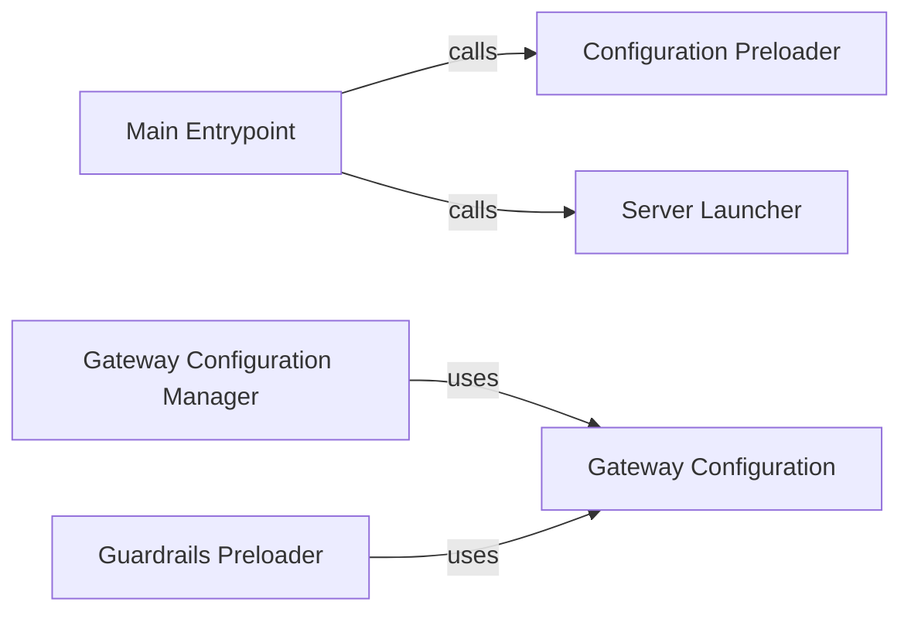

## Component Details

The Core Application and Configuration component is responsible for the application's startup, configuration loading, and overall lifecycle management. It initializes the server, manages configurations including guardrails, and provides access to configuration parameters, ensuring the gateway is properly configured and ready to handle incoming requests. The main entry point `gateway.__main__.main` orchestrates the startup by calling `gateway.__main__.up` to load configurations and guardrails, and then starts the server using `gateway.__main__.run_server_command`. The `GatewayConfigManager` handles the loading, storing, and providing access to the configuration, while `GatewayConfig` represents the configuration settings and guardrails. Guardrails are preloaded using `gateway.integrations.guardrails.preload_guardrails` to ensure request validation and processing.

### Main Entrypoint
The main function that serves as the entry point for the gateway application. It orchestrates the initialization process by calling the `up` function to preload configurations and guardrails, and then starts the server using the `run_server_command` function.
- **Related Classes/Methods**: `gateway.__main__:main`

### Configuration Preloader
Initializes the gateway by preloading necessary configurations and guardrails. This function ensures that the gateway is properly set up before it starts accepting requests.
- **Related Classes/Methods**: `gateway.__main__:up`

### Server Launcher
Starts the server to listen for incoming requests. This function is responsible for launching the server and handling incoming traffic.
- **Related Classes/Methods**: `gateway.__main__:run_server_command`

### Gateway Configuration Manager
Manages the gateway's configuration, including loading, storing, and providing access to the configuration. It uses the `GatewayConfig` class to represent the configuration and handles loading guardrails from files.
- **Related Classes/Methods**: `gateway.common.config_manager.GatewayConfigManager`

### Gateway Configuration
Represents the gateway's configuration, holding settings and guardrails. It provides a structured way to access configuration parameters and guardrail settings.
- **Related Classes/Methods**: `gateway.common.config_manager.GatewayConfig`

### Guardrails Preloader
Preloads guardrails to be used for request validation and processing. This function ensures that the gateway has the necessary guardrails loaded before it starts processing requests.
- **Related Classes/Methods**: `gateway.integrations.guardrails:preload_guardrails`
