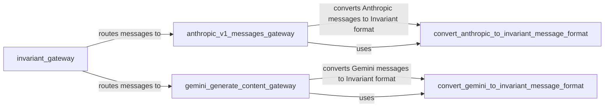

## Component Details

The data conversion subsystem is responsible for transforming data between the formats used by different Large Language Models (LLMs) and the gateway's internal representation. This ensures that the gateway can seamlessly interact with various LLMs, regardless of their specific data formats. The core of this subsystem lies in the converter modules, which handle the translation of both requests and responses. The converted data is then used within the gateway for further processing or routing.

### anthropic_v1_messages_gateway
This component acts as the entry point for handling messages intended for the Anthropic model. It receives requests, potentially performs pre-processing steps specific to Anthropic, interacts with the Anthropic API, and then returns the response. It is responsible for routing and managing the communication flow with the Anthropic service.
- **Related Classes/Methods**: `invariant-gateway.gateway.routes.anthropic:anthropic_v1_messages_gateway`

### gemini_generate_content_gateway
This component serves as the gateway for messages directed towards the Gemini model. It receives requests, handles any necessary pre-processing for Gemini, communicates with the Gemini API, and returns the resulting response. It manages the routing and interaction with the Gemini service.
- **Related Classes/Methods**: `invariant-gateway.gateway.routes.gemini:gemini_generate_content_gateway`

### convert_anthropic_to_invariant_message_format
This component is responsible for converting messages from the Anthropic-specific format into the gateway's internal invariant message format. This conversion ensures that all messages are represented in a consistent format, regardless of their origin, simplifying subsequent processing within the gateway.
- **Related Classes/Methods**: `invariant-gateway.gateway.converters.anthropic_to_invariant:convert_anthropic_to_invariant_message_format`

### convert_gemini_to_invariant_message_format
This component handles the conversion of messages from the Gemini format to the gateway's internal invariant message format. This ensures consistency in message representation within the gateway, regardless of whether the message originated from Gemini or another LLM.
- **Related Classes/Methods**: `invariant-gateway.gateway.converters.gemini_to_invariant:convert_gemini_to_invariant_message_format`
