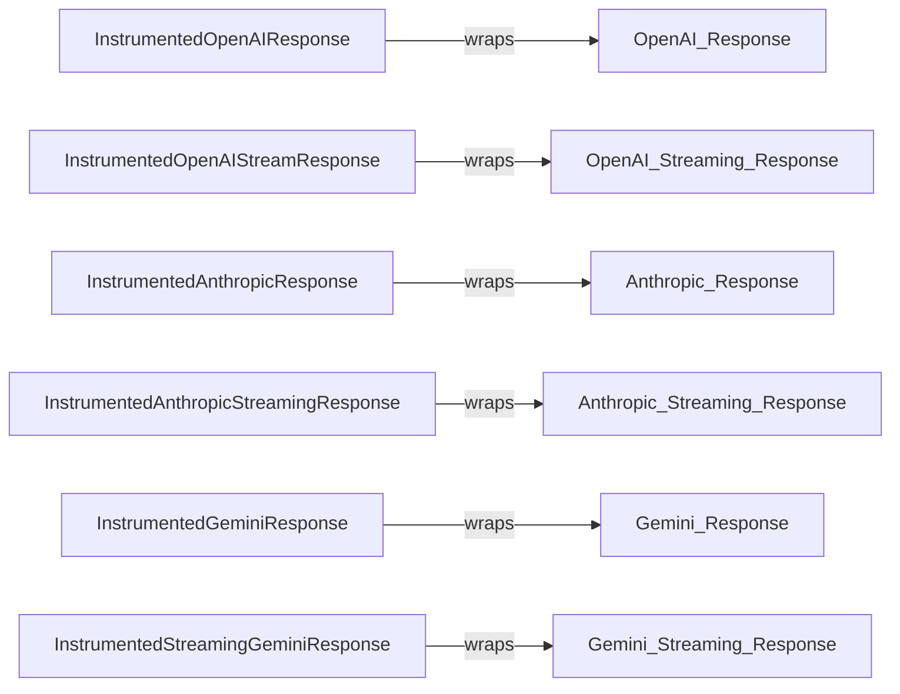

## Component Details

The Instrumentation component provides a mechanism to wrap HTTP responses from various Large Language Model (LLM) providers like OpenAI, Anthropic, and Gemini. This wrapping allows for the insertion of instrumentation hooks at the beginning, during (for streaming responses), and at the end of the response processing. This enables detailed monitoring, logging, and debugging of the gateway's interactions with these LLM providers, capturing valuable data for analysis and troubleshooting.

### InstrumentedOpenAIResponse
Wraps OpenAI's non-streaming responses. It allows actions to be performed at the start and end of the response processing, enabling instrumentation for standard HTTP responses.
- **Related Classes/Methods**: `gateway.routes.open_ai.InstrumentedOpenAIResponse`

### InstrumentedOpenAIStreamResponse
Wraps OpenAI's streaming responses, providing instrumentation hooks for the start, each chunk, and the end of the response processing. This is crucial for capturing data from streaming responses where data is received in chunks.
- **Related Classes/Methods**: `gateway.routes.open_ai.InstrumentedOpenAIStreamResponse`

### InstrumentedAnthropicResponse
Wraps Anthropic's non-streaming responses to provide instrumentation hooks. It allows actions to be performed at the start and end of the response processing.
- **Related Classes/Methods**: `gateway.routes.anthropic.InstrumentedAnthropicResponse`

### InstrumentedAnthropicStreamingResponse
Wraps Anthropic's streaming responses, providing instrumentation hooks for the start, each chunk, and the end of the response processing. This is essential for instrumenting streaming data from Anthropic.
- **Related Classes/Methods**: `gateway.routes.anthropic.InstrumentedStreamingAnthropicResponse`

### InstrumentedGeminiResponse
Wraps Gemini's non-streaming responses to provide instrumentation hooks. It allows actions to be performed at the start and end of the response processing.
- **Related Classes/Methods**: `gateway.routes.gemini.InstrumentedGeminiResponse`

### InstrumentedStreamingGeminiResponse
Wraps Gemini's streaming responses, providing instrumentation hooks for the start, each chunk, and the end of the response processing. This is important for capturing streaming data from Gemini.
- **Related Classes/Methods**: `gateway.routes.gemini.InstrumentedStreamingGeminiResponse`
