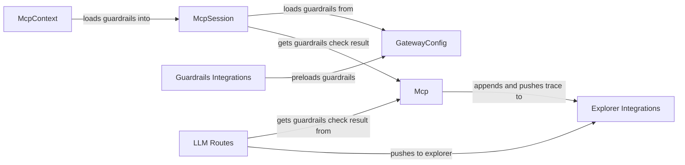

## Component Details

The Integrations component is responsible for connecting the gateway with external services like Explorer for debugging and Guardrails for content moderation. It handles preloading guardrails configurations, pushing traces and annotations to Explorer, and managing the instrumentation of requests and responses to ensure proper integration with these external tools. The main flow involves initializing and configuring these integrations, applying guardrails checks, and reporting the results to Explorer for observability.

### GatewayConfig
Manages the gateway's configuration, including loading guardrails from files and headers. It provides a centralized point for accessing configuration parameters, which are essential for the proper functioning of the integrations.
- **Related Classes/Methods**: `invariant-gateway.gateway.common.config_manager.GatewayConfig:_load_guardrails_from_file`, `invariant-gateway.gateway.common.config_manager:extract_guardrails_from_header`

### McpSession
Manages guardrails sessions, loading and retrieving guardrails check results. It handles the lifecycle of a guardrails check within a session, providing a context for the checks to be performed.
- **Related Classes/Methods**: `invariant-gateway.gateway.common.mcp_sessions_manager.McpSession:load_guardrails`, `invariant-gateway.gateway.common.mcp_sessions_manager.McpSession:get_guardrails_check_result`

### McpContext
Provides context for the guardrails checks, holding information about the request, response, and other relevant data. It loads guardrails into the context for use during the checks, ensuring that the checks have the necessary information to operate.
- **Related Classes/Methods**: `invariant-gateway.gateway.mcp.mcp_context.McpContext:load_guardrails`

### Mcp
The main component responsible for performing guardrails checks. It receives requests and responses, applies the guardrails, and returns the check results. It also handles pushing traces to Explorer, providing a central point for the guardrails checks.
- **Related Classes/Methods**: `invariant-gateway.gateway.mcp.mcp:get_guardrails_check_result`, `invariant-gateway.gateway.mcp.mcp:append_and_push_trace`

### Guardrails Integrations
Handles the integration with the Guardrails system. This includes preloading guardrails, instrumenting requests and responses, and managing replacements. It ensures that the gateway can properly interact with the Guardrails system.
- **Related Classes/Methods**: `invariant-gateway.gateway.integrations.guardrails:_preload`, `invariant-gateway.gateway.integrations.guardrails:preload_guardrails`, `invariant-gateway.gateway.integrations.guardrails.Replacement:__init__`, `invariant-gateway.gateway.integrations.guardrails.InstrumentedStreamingResponse:instrumented_event_generator`, `invariant-gateway.gateway.integrations.guardrails.InstrumentedResponse:event_generator`, `invariant-gateway.gateway.integrations.guardrails.InstrumentedResponse:instrumented_request`

### Explorer Integrations
Handles the integration with the Explorer system for observability. This includes pushing traces, creating annotations from guardrails errors, and fetching guardrails from Explorer. It ensures that the gateway can properly interact with the Explorer system.
- **Related Classes/Methods**: `invariant-gateway.gateway.integrations.explorer:create_annotations_from_guardrails_errors`, `invariant-gateway.gateway.integrations.explorer:push_trace`, `invariant-gateway.gateway.integrations.explorer:fetch_guardrails_from_explorer`

### LLM Routes
Defines the routes specific to the LLMs (Anthropic, OpenAI, Gemini). It handles requests to check guardrails and push data to Explorer, providing the entry points for the integration with the LLMs.
- **Related Classes/Methods**: `invariant-gateway.gateway.routes.anthropic:get_guardrails_check_result`, `invariant-gateway.gateway.routes.anthropic:push_to_explorer`, `invariant-gateway.gateway.routes.open_ai:push_to_explorer`, `invariant-gateway.gateway.routes.open_ai:get_guardrails_check_result`, `invariant-gateway.gateway.routes.gemini:get_guardrails_check_result`, `invariant-gateway.gateway.routes.gemini:push_to_explorer`
