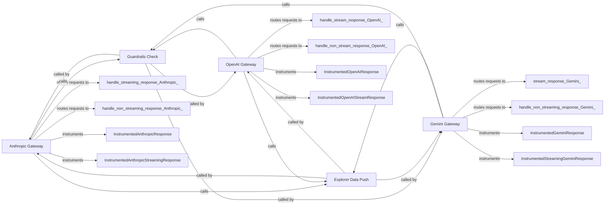

## Component Details

The LLM Route Handlers component acts as a gateway, routing requests to different LLM providers (Anthropic, OpenAI, Gemini). It ensures a unified interface by handling request/response instrumentation, guardrails checks, and data conversion. The component orchestrates the interaction with each LLM, managing both streaming and non-streaming responses, and pushing data to an explorer for monitoring and analysis. It also includes instrumentation for capturing metadata about the requests and responses.

### Anthropic Gateway
The Anthropic Gateway handles requests to the Anthropic LLM. It manages both streaming and non-streaming responses, performs guardrails checks, pushes data to the explorer, and instruments the requests and responses for monitoring.
- **Related Classes/Methods**: `invariant-gateway.gateway.routes.anthropic:anthropic_v1_messages_gateway`, `invariant-gateway.gateway.routes.anthropic:handle_streaming_response`, `invariant-gateway.gateway.routes.anthropic:handle_non_streaming_response`, `invariant-gateway.gateway.routes.anthropic.InstrumentedAnthropicResponse:__init__`, `invariant-gateway.gateway.routes.anthropic.InstrumentedAnthropicResponse:on_start`, `invariant-gateway.gateway.routes.anthropic.InstrumentedAnthropicResponse:request`, `invariant-gateway.gateway.routes.anthropic.InstrumentedAnthropicResponse:on_end`, `invariant-gateway.gateway.routes.anthropic.InstrumentedAnthropicStreamingResponse:__init__`, `invariant-gateway.gateway.routes.anthropic.InstrumentedAnthropicStreamingResponse:on_start`, `invariant-gateway.gateway.routes.anthropic.InstrumentedAnthropicStreamingResponse:on_chunk`, `invariant-gateway.gateway.routes.anthropic.InstrumentedAnthropicStreamingResponse:on_end`

### OpenAI Gateway
The OpenAI Gateway handles requests to the OpenAI LLM. It manages both streaming and non-streaming responses, performs guardrails checks, pushes data to the explorer, and instruments the requests and responses for monitoring.
- **Related Classes/Methods**: `invariant-gateway.gateway.routes.open_ai:openai_chat_completions_gateway`, `invariant-gateway.gateway.routes.open_ai:handle_stream_response`, `invariant-gateway.gateway.routes.open_ai:handle_non_stream_response`, `invariant-gateway.gateway.routes.open_ai.InstrumentedOpenAIResponse:__init__`, `invariant-gateway.gateway.routes.open_ai.InstrumentedOpenAIResponse:on_start`, `invariant-gateway.gateway.routes.open_ai.InstrumentedOpenAIResponse:on_end`, `invariant-gateway.gateway.routes.open_ai.InstrumentedOpenAIStreamResponse:__init__`, `invariant-gateway.gateway.routes.open_ai.InstrumentedOpenAIStreamResponse:on_start`, `invariant-gateway.gateway.routes.open_ai.InstrumentedOpenAIStreamResponse:on_chunk`, `invariant-gateway.gateway.routes.open_ai.InstrumentedOpenAIStreamResponse:on_end`

### Gemini Gateway
The Gemini Gateway handles requests to the Gemini LLM. It manages both streaming and non-streaming responses, performs guardrails checks, pushes data to the explorer, and instruments the requests and responses for monitoring.
- **Related Classes/Methods**: `invariant-gateway.gateway.routes.gemini:gemini_generate_content_gateway`, `invariant-gateway.gateway.routes.gemini:stream_response`, `invariant-gateway.gateway.routes.gemini:handle_non_streaming_response`, `invariant-gateway.gateway.routes.gemini.InstrumentedGeminiResponse:__init__`, `invariant-gateway.gateway.routes.gemini.InstrumentedGeminiResponse:on_start`, `invariant-gateway.gateway.routes.gemini.InstrumentedGeminiResponse:on_end`, `invariant-gateway.gateway.routes.gemini.InstrumentedStreamingGeminiResponse:__init__`, `invariant-gateway.gateway.routes.gemini.InstrumentedStreamingGeminiResponse:on_start`, `invariant-gateway.gateway.routes.gemini.InstrumentedStreamingGeminiResponse:on_chunk`, `invariant-gateway.gateway.routes.gemini.InstrumentedStreamingGeminiResponse:on_end`

### Guardrails Check
The Guardrails Check component is responsible for checking the safety and policy compliance of the requests and responses. It is invoked by each of the LLM gateways.
- **Related Classes/Methods**: `invariant-gateway.gateway.routes.anthropic:get_guardrails_check_result`, `invariant-gateway.gateway.routes.open_ai:get_guardrails_check_result`, `invariant-gateway.gateway.routes.gemini:get_guardrails_check_result`

### Explorer Data Push
The Explorer Data Push component sends request and response data to an external explorer system for monitoring, analysis, and debugging purposes. It is invoked by each of the LLM gateways.
- **Related Classes/Methods**: `invariant-gateway.gateway.routes.anthropic:push_to_explorer`, `invariant-gateway.gateway.routes.open_ai:push_to_explorer`, `invariant-gateway.gateway.routes.gemini:push_to_explorer`
