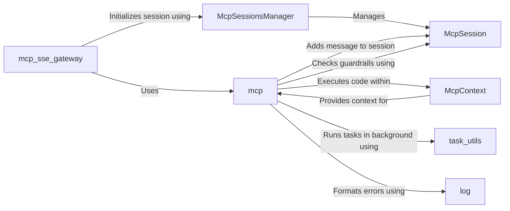

## Component Details

The MCP SSE Route Handler facilitates real-time communication for Meta-Control Protocol (MCP) functionalities via Server-Sent Events (SSE). It manages MCP sessions, processes requests through a managed code pipeline, and streams responses back to the client. The handler initializes sessions, executes code within a defined context, and ensures proper error handling and guardrail evaluation. It serves as a gateway for interacting with MCP, providing a persistent connection for ongoing communication and control.

### McpSessionsManager
The McpSessionsManager is responsible for managing MCP sessions. It handles the creation, retrieval, and storage of McpSession objects. It also manages session-related data, such as SSE header attributes.
- **Related Classes/Methods**: `invariant-gateway.gateway.common.mcp_sessions_manager.McpSessionsManager`, `invariant-gateway.gateway.common.mcp_sessions_manager.McpSession`, `invariant-gateway.gateway.common.mcp_sessions_manager.SseHeaderAttributes`

### McpSession
The McpSession component represents a single MCP session. It stores session-specific data, including guardrails, messages, and pending errors. It provides methods for adding messages, checking guardrails, and retrieving error messages.
- **Related Classes/Methods**: `invariant-gateway.gateway.common.mcp_sessions_manager.McpSession`

### mcp_sse_gateway
The mcp_sse_gateway component serves as the entry point for handling MCP requests via SSE. It receives requests, delegates to other components for processing, and streams responses back to the client.
- **Related Classes/Methods**: `invariant-gateway.gateway.routes.mcp_sse:mcp_post_gateway`, `invariant-gateway.gateway.routes.mcp_sse:mcp_get_sse_gateway`

### McpContext
The McpContext component provides the execution context for MCP code. It includes loading guardrails and managing resources. It encapsulates the environment in which the code is executed.
- **Related Classes/Methods**: `invariant-gateway.gateway.mcp.mcp_context.McpContext`

### mcp
The mcp component is the core module responsible for executing the managed code pipeline. It handles session metadata, error checking, guardrail evaluation, output streaming, and the overall execution flow.
- **Related Classes/Methods**: `invariant-gateway.gateway.mcp.mcp`

### task_utils
The task_utils component provides utility functions for running tasks in the background, enabling asynchronous execution of certain operations.
- **Related Classes/Methods**: `invariant-gateway.gateway.mcp.task_utils`

### log
The log component handles the formatting of errors in the response.
- **Related Classes/Methods**: `invariant-gateway.gateway.mcp.log`
