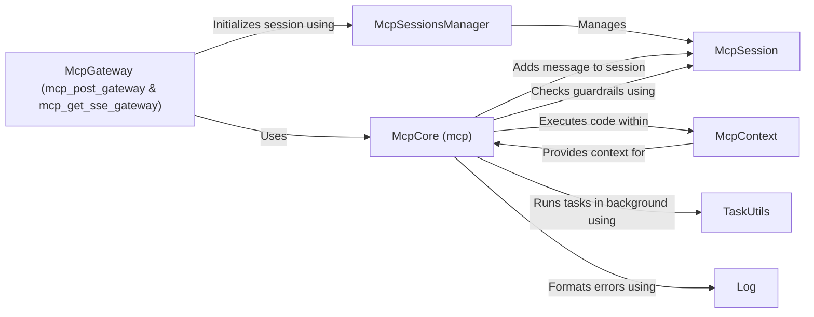

## Component Details

The Meta-Control Protocol (MCP) Management component orchestrates the execution of managed code within a secure and controlled environment. It handles incoming requests, manages MCP sessions, sets up the execution context, enforces guardrails, executes the code, and returns the results. The core flow involves receiving a request, initializing or retrieving an MCP session, creating an execution context with loaded guardrails, executing the code within this context, managing any errors or exceptions, and finally returning the output or error messages to the client. This system ensures that the managed code adheres to predefined security and operational policies.

### McpSessionsManager
The McpSessionsManager is responsible for managing MCP sessions. It handles the creation, retrieval, and storage of McpSession objects. It provides methods to initialize new sessions and retrieve existing sessions based on a session ID. This component ensures that session-related data is properly managed and accessible throughout the MCP lifecycle.
- **Related Classes/Methods**: `invariant-gateway.gateway.common.mcp_sessions_manager.McpSessionsManager`, `invariant-gateway.gateway.common.mcp_sessions_manager.McpSession`, `invariant-gateway.gateway.common.mcp_sessions_manager.SseHeaderAttributes`

### McpSession
The McpSession component represents a single MCP session. It stores session-specific data, such as guardrails, messages exchanged during the session, and any pending errors encountered. It provides methods for adding messages to the session history, checking guardrails against the session's state, and retrieving error messages for reporting. This component encapsulates all the information related to a specific MCP session.
- **Related Classes/Methods**: `invariant-gateway.gateway.common.mcp_sessions_manager.McpSession`

### McpGateway (mcp_post_gateway & mcp_get_sse_gateway)
The McpGateway serves as the entry point for handling MCP requests. It consists of two parts: `mcp_post_gateway` which handles requests via POST, and `mcp_get_sse_gateway` which handles requests via Server-Sent Events (SSE). These components receive incoming requests, delegate the processing to other components such as the McpSessionsManager and the core `mcp` module, and then return the appropriate responses to the client. They manage the initial interaction with the MCP system.
- **Related Classes/Methods**: `invariant-gateway.gateway.routes.mcp_sse:mcp_post_gateway`, `invariant-gateway.gateway.routes.mcp_sse:mcp_get_sse_gateway`

### McpContext
The McpContext component provides the execution context for MCP code. It is responsible for loading guardrails and managing the resources available to the code during execution. It encapsulates the environment in which the code runs, ensuring that it has access to the necessary resources and is subject to the defined guardrails. This component sets the stage for secure and controlled code execution.
- **Related Classes/Methods**: `invariant-gateway.gateway.mcp.mcp_context.McpContext`

### McpCore (mcp)
The McpCore component is the heart of the MCP system. It is responsible for executing the managed code pipeline. It handles session metadata, performs error checking, evaluates guardrails, manages output streaming, and controls the overall execution flow. This component orchestrates the execution of the code within the context provided by the McpContext, ensuring that it adheres to the defined policies and constraints.
- **Related Classes/Methods**: `invariant-gateway.gateway.mcp.mcp`

### TaskUtils
The TaskUtils component provides utility functions for running tasks in the background. It enables asynchronous execution of certain operations, allowing the MCP system to perform tasks without blocking the main execution thread. This component enhances the responsiveness and efficiency of the MCP system.
- **Related Classes/Methods**: `invariant-gateway.gateway.mcp.task_utils`

### Log
The Log component is responsible for formatting errors in the response. It provides a consistent and informative way to report errors encountered during the execution of the managed code. This component ensures that error messages are clear and helpful for debugging and troubleshooting.
- **Related Classes/Methods**: `invariant-gateway.gateway.mcp.log`
