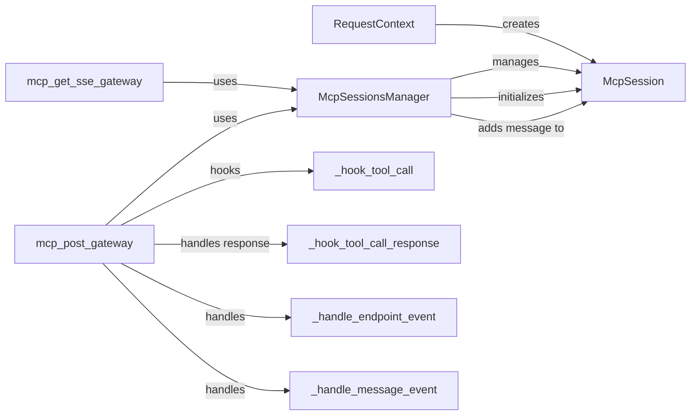

## Component Details

The Request and Session Management component is responsible for handling incoming requests, establishing and maintaining user sessions, and managing the context for each request. It initializes request-specific information, manages the lifecycle of MCP sessions, and ensures that messages are properly routed and processed within the session. This component also handles tool calls, endpoint events, and message events, providing a structured environment for processing requests and managing user interactions.

### RequestContext
The RequestContext component manages the context of an incoming request. It stores request-specific information such as request ID, user ID, and other relevant data. It is created at the beginning of a request's lifecycle and is used throughout the request processing to maintain state and provide access to request-related information.
- **Related Classes/Methods**: `invariant-gateway.gateway.common.request_context.RequestContext`

### McpSession
The McpSession component represents a session with the MCP (Message Control Plane). It manages guardrails, messages, and errors associated with the session. It handles loading guardrails, checking guardrail results, adding messages, and managing pending error messages. Each session is associated with a specific user and maintains the state of their interaction with the MCP.
- **Related Classes/Methods**: `invariant-gateway.gateway.common.mcp_sessions_manager.McpSession`

### McpSessionsManager
The McpSessionsManager component manages MCP sessions, including initializing new sessions, retrieving existing sessions, and adding messages to sessions. It provides a central point for managing the lifecycle of MCP sessions and ensures that sessions are properly maintained and accessible.
- **Related Classes/Methods**: `invariant-gateway.gateway.common.mcp_sessions_manager.McpSessionsManager`

### mcp_post_gateway
The mcp_post_gateway component handles POST requests to the MCP gateway, processing incoming messages. It receives messages from the client, adds them to the appropriate MCP session, and triggers the necessary processing steps. It also handles tool calls, endpoint events, and message events.
- **Related Classes/Methods**: `invariant-gateway.gateway.routes.mcp_sse:mcp_post_gateway`

### mcp_get_sse_gateway
The mcp_get_sse_gateway component handles GET requests to the MCP SSE gateway, establishing SSE connections. It extracts SSE header attributes from the request, initializes a new MCP session, and sets up the SSE stream to send events to the client. It manages the connection lifecycle and ensures that events are properly streamed to the client.
- **Related Classes/Methods**: `invariant-gateway.gateway.routes.mcp_sse:mcp_get_sse_gateway`

### _hook_tool_call
The _hook_tool_call component hooks tool calls within the MCP SSE gateway. It intercepts tool calls, performs any necessary pre-processing, and forwards the call to the appropriate handler. It allows for customization and extension of the tool call processing logic.
- **Related Classes/Methods**: `invariant-gateway.gateway.routes.mcp_sse:_hook_tool_call`

### _hook_tool_call_response
The _hook_tool_call_response component handles responses from tool calls within the MCP SSE gateway. It receives the response from a tool call, performs any necessary post-processing, and sends the response back to the client. It ensures that tool call responses are properly handled and integrated into the session.
- **Related Classes/Methods**: `invariant-gateway.gateway.routes.mcp_sse:_hook_tool_call_response`

### _handle_endpoint_event
The _handle_endpoint_event component handles endpoint events within the MCP SSE gateway. It receives events related to endpoints, processes them, and updates the session state accordingly. It allows for dynamic management of endpoints and their associated events.
- **Related Classes/Methods**: `invariant-gateway.gateway.routes.mcp_sse:_handle_endpoint_event`

### _handle_message_event
The _handle_message_event component handles message events within the MCP SSE gateway. It receives events related to messages, processes them, and updates the session state accordingly. It ensures that message events are properly handled and integrated into the session.
- **Related Classes/Methods**: `invariant-gateway.gateway.routes.mcp_sse:_handle_message_event`
