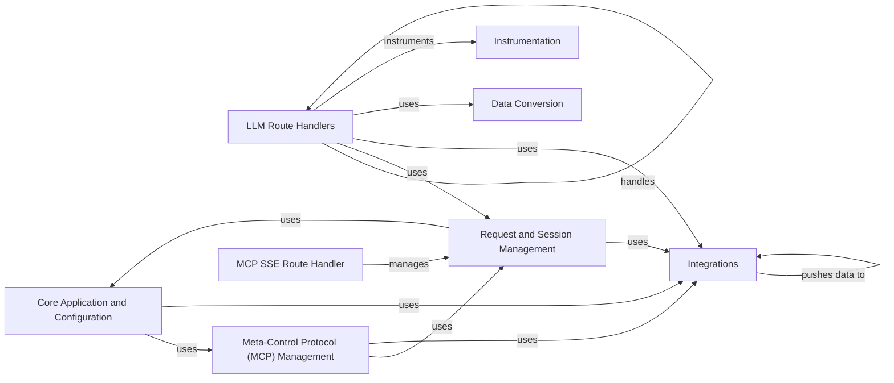

## Component Details

The Invariant Gateway acts as a central point for routing and processing requests to various Large Language Models (LLMs) such as Anthropic, OpenAI, and Gemini. It incorporates features like request context management, guardrails integration for content moderation, data conversion between different LLM formats, and instrumentation for monitoring and debugging. The gateway also supports the Meta-Control Protocol (MCP) for advanced session management and tool execution, and integrates with external tools like the Explorer for enhanced debugging capabilities. Overall, the gateway provides a secure, configurable, and observable interface for interacting with multiple LLMs.

### Core Application and Configuration
This component is responsible for the application's startup, configuration loading, and overall lifecycle management. It initializes the server, manages configurations including guardrails, and provides access to configuration parameters, ensuring the gateway is properly configured and ready to handle incoming requests.
- **Related Classes/Methods**: `gateway.__main__`, `gateway.common.config_manager`

### Request and Session Management
This component creates and manages the context for each incoming request, including authorization, configurations, and guardrails. It also manages MCP sessions, handling initialization, message addition, and error handling, providing a structured environment for processing requests and managing user interactions.
- **Related Classes/Methods**: `gateway.common.request_context`, `gateway.common.mcp_sessions_manager`

### LLM Route Handlers
This component handles routing requests to specific LLMs (Anthropic, OpenAI, Gemini). It includes request/response instrumentation, guardrails checks, and data conversion to ensure proper communication with each LLM, providing a unified interface for interacting with different LLM providers.
- **Related Classes/Methods**: `gateway.routes.anthropic`, `gateway.routes.open_ai`, `gateway.routes.gemini`

### Meta-Control Protocol (MCP) Management
This component implements the core logic for the Meta-Control Protocol (MCP), including session management, tool execution, and error handling. It also manages the context for MCP sessions, loading guardrails and integrating with the explorer tool, enabling advanced control and interaction with the LLMs.
- **Related Classes/Methods**: `gateway.mcp.mcp`, `gateway.mcp.mcp_context`

### Data Conversion
This component provides modules responsible for converting data formats between the LLMs and the gateway's internal representation, ensuring compatibility and proper data handling, and facilitating seamless communication between different systems.
- **Related Classes/Methods**: `gateway.converters.anthropic_to_invariant`, `gateway.converters.gemini_to_invariant`

### Instrumentation
This component instruments requests and responses to capture data for analysis and debugging. It provides specific instrumentation for OpenAI, Anthropic, and Gemini, handling both streaming and non-streaming responses, enabling detailed monitoring and troubleshooting of the gateway's operations.
- **Related Classes/Methods**: `gateway.routes.open_ai.InstrumentedOpenAIStreamResponse`, `gateway.routes.open_ai.InstrumentedOpenAIResponse`, `gateway.routes.anthropic.InstrumentedAnthropicResponse`, `gateway.routes.anthropic.InstrumentedStreamingAnthropicResponse`, `gateway.routes.gemini.InstrumentedStreamingGeminiResponse`, `gateway.routes.gemini.InstrumentedGeminiResponse`

### Integrations
This component handles integrations with external tools such as the explorer for debugging and analysis, and the guardrails system for content moderation. It manages preloading guardrails and pushing traces and annotations, enhancing the gateway's functionality with external services.
- **Related Classes/Methods**: `gateway.integrations.explorer`, `gateway.integrations.guardrails`

### MCP SSE Route Handler
This component handles requests related to the Meta-Control Protocol (MCP) over Server-Sent Events (SSE), managing sessions and tool interactions, providing a real-time communication channel for MCP functionalities.
- **Related Classes/Methods**: `gateway.routes.mcp_sse`