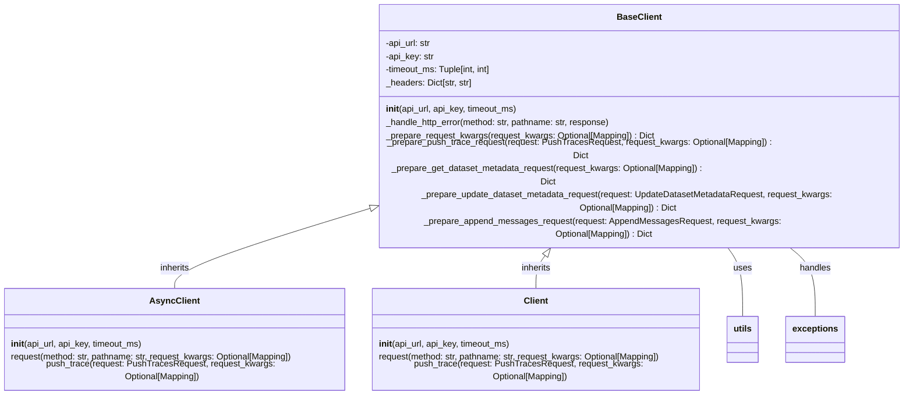

## Component Overview: Base Client

The `BaseClient` component serves as the foundation for interacting with the Invariant APIs. It encapsulates the core logic for handling API requests, including authentication, error handling, and request preparation. It's designed to be inherited by both synchronous and asynchronous client implementations.

### Component Descriptions:

*   **BaseClient**: This is the abstract base class that handles API URL and API Key retrieval from environment variables using the `utils` component. It also defines methods for preparing requests and handling HTTP errors, raising specific exceptions from the `exceptions` component based on the response status code. It is inherited by `AsyncClient` and `Client`.
    *   **Source Files**: `invariant_sdk/base_client.py`
*   **AsyncClient**: Inherits from `BaseClient` and implements asynchronous API requests using the `httpx` library. It overrides the `request` method to perform asynchronous calls. It uses the `BaseClient` methods for request preparation and error handling.
    *   **Source Files**: `invariant_sdk/async_client.py`
*   **Client**: Inherits from `BaseClient` and implements synchronous API requests using the `requests` library. It overrides the `request` method to perform synchronous calls. It uses the `BaseClient` methods for request preparation and error handling.
    *   **Source Files**: `invariant_sdk/client.py`
*   **utils**: Provides utility functions for retrieving the API URL and API Key from environment variables. `BaseClient` uses these utilities during initialization.
    *   **Source Files**: `invariant_sdk/utils.py`
*   **exceptions**: Defines custom exception classes for different API error scenarios. `BaseClient` raises these exceptions in the `_handle_http_error` method.
    *   **Source Files**: `invariant_sdk/types/exceptions.py`
