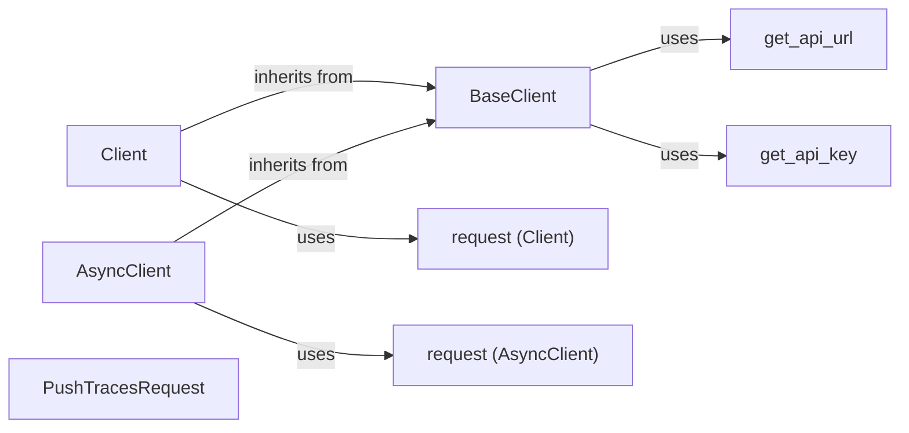

## Component Details

The Invariant SDK provides a way to interact with the Invariant API for pushing traces, managing dataset metadata, and appending messages. The core functionality revolves around the `BaseClient`, which handles API key retrieval, URL construction, request execution, and error handling. Two concrete clients, `Client` (synchronous) and `AsyncClient` (asynchronous), inherit from `BaseClient` and provide methods for interacting with the API using either the `requests` or `httpx` libraries, respectively. The SDK also includes utility functions for retrieving the API URL and key from environment variables.

### BaseClient
The BaseClient class provides the foundation for interacting with the Invariant API. It handles API key management, URL construction, request execution, and error handling. It serves as the parent class for both synchronous and asynchronous clients, ensuring consistent behavior across different client types.
- **Related Classes/Methods**: `invariant-sdk.python.invariant_sdk.base_client.BaseClient`

### Client
The Client class is a synchronous client for interacting with the Invariant API. It inherits from BaseClient and provides methods for sending requests, pushing traces, and managing dataset metadata and messages. It uses the requests library for synchronous HTTP requests.
- **Related Classes/Methods**: `invariant-sdk.python.invariant_sdk.client.Client`

### AsyncClient
The AsyncClient class is an asynchronous client for interacting with the Invariant API. It inherits from BaseClient and provides asynchronous methods for sending requests, pushing traces, and managing dataset metadata and messages. It uses the httpx library for asynchronous HTTP requests.
- **Related Classes/Methods**: `invariant-sdk.python.invariant_sdk.async_client.AsyncClient`

### get_api_url
The get_api_url function retrieves the API URL from the environment or configuration. It checks for the INVARIANT_API_URL environment variable or a default value.
- **Related Classes/Methods**: `invariant-sdk.python.invariant_sdk.utils:get_api_url`

### get_api_key
The get_api_key function retrieves the API key from the environment or configuration. It checks for the INVARIANT_API_KEY environment variable.
- **Related Classes/Methods**: `invariant-sdk.python.invariant_sdk.utils:get_api_key`

### request (Client)
The request method in the Client class sends synchronous HTTP requests to the Invariant API using the requests library. It handles constructing the request, sending it, and handling potential errors.
- **Related Classes/Methods**: `invariant-sdk.python.invariant_sdk.client.Client:request`

### request (AsyncClient)
The request method in the AsyncClient class sends asynchronous HTTP requests to the Invariant API using the httpx library. It handles constructing the request, sending it, and handling potential errors.
- **Related Classes/Methods**: `invariant-sdk.python.invariant_sdk.async_client.AsyncClient:request`

### PushTracesRequest
The PushTracesRequest class represents a request to push traces to the Invariant API. It defines the structure of the request body.
- **Related Classes/Methods**: `python.invariant_sdk.types.push_traces.PushTracesRequest`
