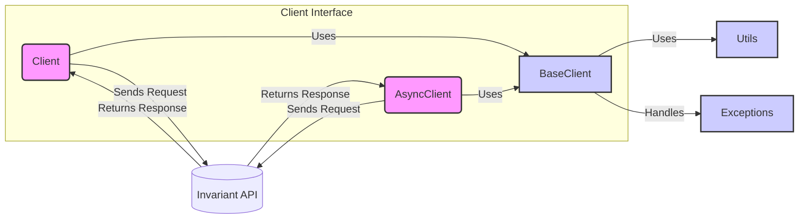

### Component Descriptions:

**Client Interface:**
   - *Description*: Defines the interface for interacting with the Invariant API, providing both synchronous and asynchronous implementations.
   - *Functionality*: Exposes `Client` and `AsyncClient` classes for synchronous and asynchronous API interactions, respectively. These classes inherit from `BaseClient` and provide methods for sending requests and receiving responses from the Invariant API.
   - *Interactions*: Uses `BaseClient` for core functionality. Sends requests to and receives responses from the Invariant API.
   - *Relevant source files*: `invariant_sdk.client`, `invariant_sdk.async_client`

**BaseClient:**
   - *Description*: Handles the base functionality for interacting with the Invariant API, including request preparation and error handling. It serves as the foundation for both synchronous and asynchronous clients.
   - *Functionality*: Provides methods for preparing requests, handling HTTP errors, and constructing API endpoints. It uses `Utils` to retrieve API keys and URLs and `Exceptions` to raise custom exceptions.
   - *Interactions*: Used by `Client` and `AsyncClient`. Uses `Utils` for configuration and `Exceptions` for error handling.
   - *Relevant source files*: `invariant_sdk.base_client`

**Utils:**
   - *Description*: Offers utility functions for the SDK, such as retrieving the API URL and API key from environment variables or configuration files. These utilities are used by the clients to configure their interaction with the API.
   - *Functionality*: Provides functions to fetch API URL and API key from environment variables.
   - *Interactions*: Used by `BaseClient` to configure API interaction.
   - *Relevant source files*: `invariant_sdk.utils`

**Exceptions:**
   - *Description*: Defines custom exception types specific to the Invariant SDK. These exceptions provide more informative error reporting and handling for API interactions.
   - *Functionality*: Defines custom exception classes for API errors, authentication errors, and other SDK-specific errors.
   - *Interactions*: Used by `BaseClient` to handle and raise exceptions.
   - *Relevant source files*: `invariant_sdk.types.exceptions`

**Invariant API:**
   - *Description*: The external API that the SDK interacts with.
   - *Functionality*: Receives requests from the `Client` and `AsyncClient`, processes them, and returns responses.
   - *Interactions*: Receives requests from and sends responses to `Client` and `AsyncClient`.
   - *Relevant source files*: N/A (External API)
