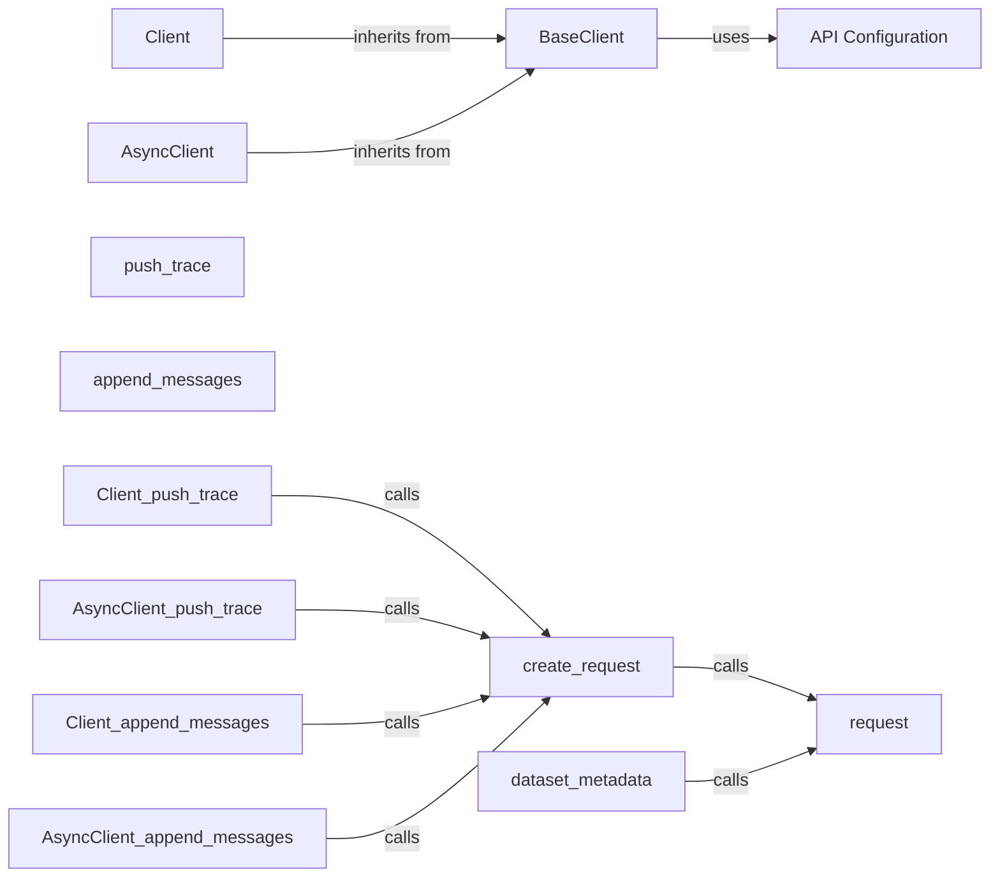

## Component Details

The Invariant SDK provides a client interface for interacting with the Invariant API, offering both synchronous and asynchronous options. The core functionality revolves around sending HTTP requests to the API, handling authentication, and managing data serialization. The client interface abstracts away the underlying complexities, providing a user-friendly way to push traces, manage dataset metadata, and append messages to the Invariant service.

### BaseClient
The BaseClient class serves as the foundation for both synchronous and asynchronous clients. It handles the initialization process, including setting up the API URL and API key, and provides a base implementation for making HTTP requests with error handling.
- **Related Classes/Methods**: `invariant-sdk.python.invariant_sdk.base_client.BaseClient`

### Client
The Client class is a synchronous implementation that inherits from BaseClient. It provides methods for interacting with the Invariant API in a synchronous manner, such as pushing traces, retrieving and updating dataset metadata, and appending messages.
- **Related Classes/Methods**: `invariant-sdk.python.invariant_sdk.client.Client`

### AsyncClient
The AsyncClient class is an asynchronous implementation that inherits from BaseClient. It mirrors the functionality of the synchronous Client but provides asynchronous methods for interacting with the Invariant API, enabling non-blocking operations.
- **Related Classes/Methods**: `invariant-sdk.python.invariant_sdk.async_client.AsyncClient`

### request
The request method is responsible for constructing and sending HTTP requests to the Invariant API. It handles the actual communication with the API, including setting headers, handling authentication, and processing responses. This method is implemented in both the Client and AsyncClient classes.
- **Related Classes/Methods**: `invariant-sdk.python.invariant_sdk.client.Client:request`, `invariant-sdk.python.invariant_sdk.async_client.AsyncClient:request`

### push_trace
The push_trace method allows users to send trace data to the Invariant API. It takes trace data as input, constructs a request object, and then uses the request method to send the data to the API. This method is available in both the Client and AsyncClient classes.
- **Related Classes/Methods**: `invariant-sdk.python.invariant_sdk.client.Client:push_trace`, `invariant-sdk.python.invariant_sdk.async_client.AsyncClient:push_trace`

### create_request
The create_request methods (create_request_and_push_trace, create_request_and_update_dataset_metadata, create_request_and_append_messages) are responsible for creating the request object for each specific API endpoint. They take the necessary data as input and construct the appropriate request object, which is then passed to the request method for sending to the API.
- **Related Classes/Methods**: `invariant-sdk.python.invariant_sdk.client.Client:create_request_and_push_trace`, `invariant-sdk.python.invariant_sdk.async_client.AsyncClient:create_request_and_push_trace`, `invariant-sdk.python.invariant_sdk.client.Client:create_request_and_update_dataset_metadata`, `invariant-sdk.python.invariant_sdk.async_client.AsyncClient:create_request_and_update_dataset_metadata`, `invariant-sdk.python.invariant_sdk.client.Client:create_request_and_append_messages`, `invariant-sdk.python.invariant_sdk.async_client.AsyncClient:create_request_and_append_messages`

### dataset_metadata
The dataset metadata methods (get_dataset_metadata, update_dataset_metadata) allow users to retrieve and update dataset metadata from the Invariant API. They use the request method to send requests to the API and handle the responses. These methods are available in both the Client and AsyncClient classes.
- **Related Classes/Methods**: `invariant-sdk.python.invariant_sdk.client.Client:get_dataset_metadata`, `invariant-sdk.python.invariant_sdk.async_client.AsyncClient:get_dataset_metadata`, `invariant-sdk.python.invariant_sdk.client.Client:update_dataset_metadata`, `invariant-sdk.python.invariant_sdk.async_client.AsyncClient:update_dataset_metadata`

### append_messages
The append_messages method allows users to append messages to the Invariant API. It takes messages as input, constructs a request object, and then uses the request method to send the messages to the API. This method is available in both the Client and AsyncClient classes.
- **Related Classes/Methods**: `invariant-sdk.python.invariant_sdk.client.Client:append_messages`, `invariant-sdk.python.invariant_sdk.async_client.AsyncClient:append_messages`

### API Configuration
The API Configuration methods (get_api_url, get_api_key) are responsible for retrieving the API URL and API key from the environment or configuration. These values are used to authenticate with the Invariant API.
- **Related Classes/Methods**: `invariant-sdk.python.invariant_sdk.utils:get_api_url`, `invariant-sdk.python.invariant_sdk.utils:get_api_key`
