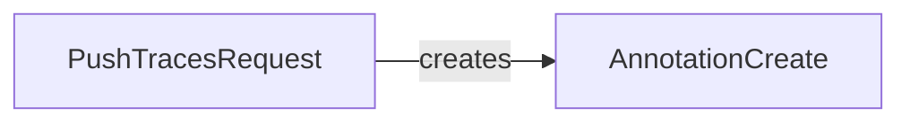

## Component Details

The Data Models component defines the structure of data exchanged with the Invariant API. This includes request and response models for pushing traces, managing dataset metadata, and appending messages. These models ensure data consistency and facilitate serialization/deserialization, enabling seamless communication between the SDK and the API. The main flow involves defining data structures for requests and responses, ensuring that data is properly formatted and validated before being sent to or received from the Invariant API. This component is crucial for maintaining data integrity and facilitating smooth communication between different parts of the system.

### AnnotationCreate
Represents an annotation object to be created. It includes methods for converting dictionaries, both nested and flat, into `AnnotationCreate` instances. This component is responsible for handling the structure of annotation data, ensuring that annotations are properly formatted before being sent to the Invariant API. It likely includes fields for specifying the annotation type, target, and associated metadata.
- **Related Classes/Methods**: `python.invariant_sdk.types.annotations.AnnotationCreate`

### PushTracesRequest
Represents a request to push traces to the Invariant API. The `PushTracesRequest` encapsulates the data required to push traces, including the traces themselves and any associated metadata. It handles the initialization of the request object, potentially including data validation and formatting. This component is responsible for packaging trace data into a format suitable for transmission to the API.
- **Related Classes/Methods**: `python.invariant_sdk.types.push_traces.PushTracesRequest`
