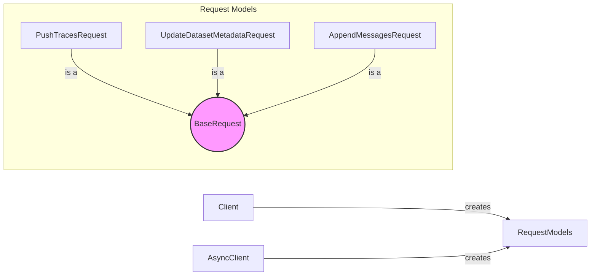

## Request Models Component Overview

This component defines the structure and validation rules for requests sent to the Invariant API. It ensures data integrity and proper formatting for API interactions.

Here's a data flow diagram illustrating the interaction of the Request Models with the Client and AsyncClient:

### Component Descriptions:

*   **BaseRequest**: (Abstract base class) Defines the common interface for all request models. It might include common validation logic or data serialization methods. It's extended by specific request types.
    *   Relevant source files: (Assuming a base class exists, but not explicitly listed in the provided components. If it doesn't exist, this should be removed.)
*   **PushTracesRequest**: Data structure for creating push traces requests. It encapsulates the trace data and provides validation to ensure the data is valid before sending it to the API. It's created by the Client/AsyncClient.
    *   Relevant source files: `invariant_sdk.types.push_traces.PushTracesRequest`
*   **UpdateDatasetMetadataRequest**: Data structure for creating update dataset metadata requests. It encapsulates the metadata updates and provides validation to ensure the data is valid before sending it to the API. It's created by the Client/AsyncClient.
    *   Relevant source files: `invariant_sdk.types.update_dataset_metadata.UpdateDatasetMetadataRequest`
*   **AppendMessagesRequest**: Data structure for creating append messages requests. It encapsulates the messages to be appended and provides validation to ensure the data is valid before sending it to the API. It's created by the Client/AsyncClient.
    *   Relevant source files: `invariant_sdk.types.append_messages.AppendMessagesRequest`
*   **Client**: Synchronous client for interacting with the Invariant API. It creates request models and sends them to the API.
    *   Relevant source files: `invariant_sdk.client.Client`
*   **AsyncClient**: Asynchronous client for interacting with the Invariant API. It creates request models and sends them to the API.
    *   Relevant source files: `invariant_sdk.async_client.AsyncClient`
