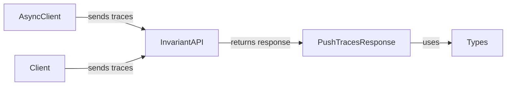

## Response Models Overview

This section describes the structure and flow related to response models, specifically focusing on `PushTracesResponse`.

### Data Flow Diagram

### Component Descriptions

- **AsyncClient**
  - *Description*: Asynchronous client that sends trace data to the Invariant API.
  - *Interaction*: Sends trace data to the InvariantAPI and receives a `PushTracesResponse` upon completion.
  - *Source Files*: `invariant_sdk.async_client.AsyncClient`

- **Client**
  - *Description*: Synchronous client that sends trace data to the Invariant API.
  - *Interaction*: Sends trace data to the InvariantAPI and receives a `PushTracesResponse` upon completion.
  - *Source Files*: `invariant_sdk.client.Client`

- **InvariantAPI**
  - *Description*: Represents the Invariant API endpoint.
  - *Interaction*: Receives trace data from `AsyncClient` or `Client` and returns a `PushTracesResponse`.
  - *Source Files*: N/A (This is a conceptual component representing the API endpoint)

- **PushTracesResponse**
  - *Description*: Data class representing the response from the `push_trace` endpoint. It includes information about the success or failure of the trace submission.
  - *Interaction*: Received from the InvariantAPI, uses `Types` for data validation and structure.
  - *Source Files*: `invariant_sdk.types.push_traces.PushTracesResponse`

- **Types**
  - *Description*: Defines data structures used for requests and responses to the Invariant API.
  - *Interaction*: Used by `PushTracesResponse` to define the structure of the response data.
  - *Source Files*: `invariant_sdk.types`
