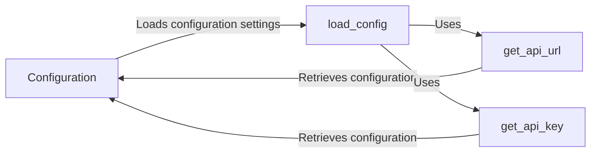

## Component Details

The Utilities component provides helper functions used throughout the SDK. This includes functions for retrieving the API URL and API Key from environment variables or configuration files. These utilities centralize common tasks and improve code maintainability, ensuring consistent configuration and simplifying development. The component focuses on configuration management, providing a consistent way to access API keys and URLs, which are essential for interacting with the Invariant API.

### Configuration
The Configuration class manages the SDK's configuration settings. It encapsulates the API URL and API key, providing methods to load these settings from environment variables or a configuration file. It ensures that the SDK has the necessary information to communicate with the Invariant API.
- **Related Classes/Methods**: `invariant_sdk.utils:Configuration`

### get_api_url
The get_api_url function retrieves the API URL from either environment variables or a configuration file. It is a utility function that ensures the SDK knows where to send API requests. It prioritizes environment variables, falling back to a configuration file if the environment variable is not set.
- **Related Classes/Methods**: `invariant_sdk.utils:get_api_url`

### get_api_key
The get_api_key function retrieves the API key from either environment variables or a configuration file. This key is essential for authenticating with the Invariant API. Similar to get_api_url, it prioritizes environment variables for configuration.
- **Related Classes/Methods**: `invariant_sdk.utils:get_api_key`

### load_config
The load_config function is responsible for loading the configuration settings, including the API URL and API key, from environment variables or a configuration file. It populates the Configuration object with these settings, making them available to the rest of the SDK.
- **Related Classes/Methods**: `invariant_sdk.utils:load_config`
