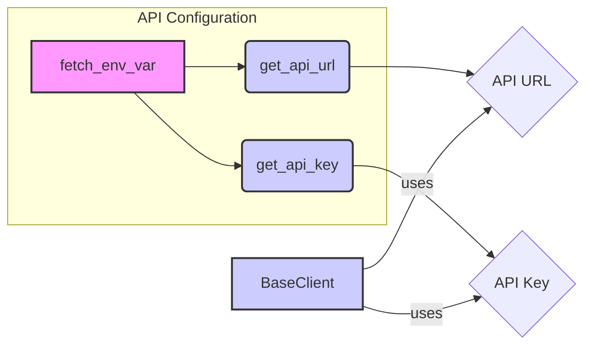

### Component Descriptions:

**1. fetch_env_var**
*   **Description:** This function retrieves the value of an environment variable. It's a foundational utility for fetching configuration values.
*   **Interaction:** It's called by `get_api_url` and `get_api_key` to retrieve the API URL and API key from environment variables.
*   **Source Files:** `invariant_sdk/utils.py`

**2. get_api_url**
*   **Description:** This function determines the API URL. It first checks if an API URL is provided directly; if not, it attempts to retrieve it from an environment variable using `fetch_env_var`.
*   **Interaction:** It uses `fetch_env_var` and provides the API URL to `BaseClient`.
*   **Source Files:** `invariant_sdk/utils.py`

**3. get_api_key**
*   **Description:** This function determines the API key. It first checks if an API key is provided directly; if not, it attempts to retrieve it from an environment variable using `fetch_env_var`.
*   **Interaction:** It uses `fetch_env_var` and provides the API key to `BaseClient`.
*   **Source Files:** `invariant_sdk/utils.py`

**4. API URL**
*   **Description:** Represents the resolved API URL, either provided directly or fetched from the environment.
*   **Interaction:** Used by `BaseClient` to initialize the connection to the Invariant API.
*   **Source Files:** N/A (Represents a value)

**5. API Key**
*   **Description:** Represents the resolved API key, either provided directly or fetched from the environment.
*   **Interaction:** Used by `BaseClient` to authenticate with the Invariant API.
*   **Source Files:** N/A (Represents a value)

**6. BaseClient**
*   **Description:** Initializes the API client with the API URL and key. It handles communication with the Invariant API.
*   **Interaction:** Uses the API URL and API key to establish a connection and authenticate with the API.
*   **Source Files:** `invariant_sdk/base_client.py`
