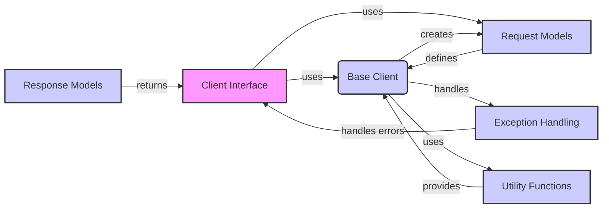

## Invariant SDK Data Flow Overview

The Invariant SDK provides a convenient way to interact with the Invariant API, enabling developers to push traces, manage dataset metadata, and append messages. It offers both synchronous and asynchronous clients, handles request preparation and error handling, and defines data types and exception classes for seamless integration.

### Component Descriptions

**Client Interface:** This component defines the entry point for interacting with the Invariant API. It provides both synchronous and asynchronous implementations (`Client` and `AsyncClient`) for various operations like pushing traces, managing dataset metadata, and appending messages. It uses the `Base Client` for handling the underlying API requests and interacts with `Request Models` and `Response Models` for data serialization and deserialization. It also handles exceptions raised by the `Base Client`.

**Base Client:** This component handles the core logic for making API requests. It prepares requests based on the provided `Request Models`, manages authentication, handles HTTP errors, and utilizes `Utility Functions` to retrieve API URL and key. It creates `Request Models` and sends them to the API, handling any `Exception Handling` that may occur. The `Base Client` is used by the `Client Interface` to perform the actual API calls.

**Request Models:** This component defines the structure and validation rules for requests sent to the Invariant API. It includes models like `PushTracesRequest`, `UpdateDatasetMetadataRequest`, and `AppendMessagesRequest`. These models are used by the `Base Client` to serialize data before sending it to the API. The `Base Client` creates instances of these models based on the input provided by the `Client Interface`.

**Response Models:** This component defines the structure of responses received from the Invariant API. It includes models like `PushTracesResponse`. The `Base Client` uses these models to deserialize the API responses and returns them to the `Client Interface`.

**Utility Functions:** This component provides utility functions for retrieving API URL and key from environment variables or provided arguments. These functions are used by the `Base Client` to configure the API requests. The `Base Client` uses these utilities to get the necessary configuration for interacting with the API.

**Exception Handling:** This component defines custom exception classes for handling API errors, authentication failures, and resource not found errors. These exceptions are raised by the `Base Client` when an error occurs during an API request. The `Client Interface` handles these exceptions and provides appropriate feedback to the user.