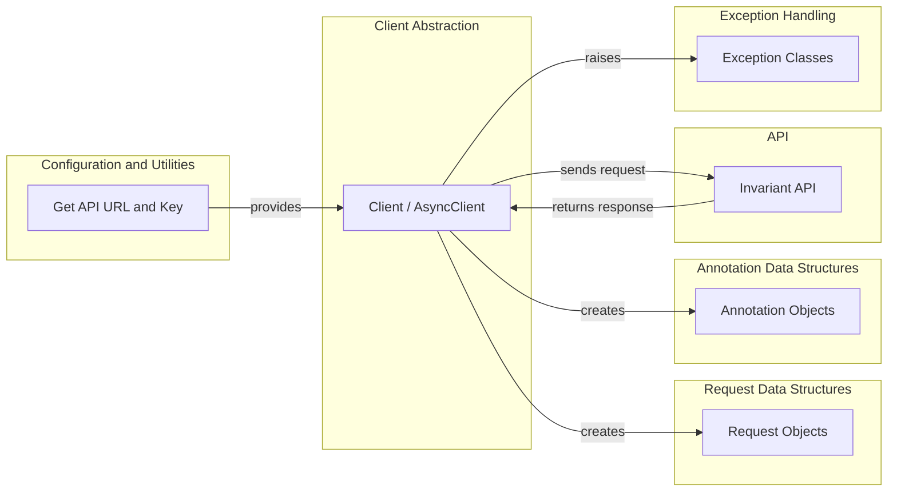

```text
# Invariant SDK Onboarding Document

## Project Description

The `invariant-sdk` is a Python library designed to facilitate seamless interaction with the Invariant API. It provides both synchronous and asynchronous clients for performing various operations such as pushing traces, managing dataset metadata, and handling annotations. The SDK abstracts away the complexities of API communication, offering a user-friendly interface with built-in error handling and data structure definitions.

## Project Flow Diagram



## Component Descriptions

*   **Configuration and Utilities:** This component is responsible for retrieving the API URL and API Key from environment variables, ensuring that the SDK can connect to the Invariant API. It uses utility functions to fetch these configuration values, which are essential for initializing the client.

*   **Client Abstraction:** This component provides the core interface for interacting with the Invariant API. It includes both synchronous (`Client`) and asynchronous (`AsyncClient`) implementations, extending a base client with request preparation and error handling capabilities. The client handles the creation of requests, sending them to the API, and processing the responses.

*   **Request Data Structures:** This component defines the structure of the requests sent to the Invariant API. It includes data classes for various request types, such as `PushTracesRequest` and `UpdateDatasetMetadataRequest`, ensuring that the data is consistent and validated before being sent to the API.

*   **Annotation Data Structures:** This component defines the structure of annotations used within the Invariant API. It includes data classes like `AnnotationCreate`, which facilitates standardized annotation handling and ensures that annotations are properly formatted when interacting with the API.

*   **Exception Handling:** This component provides custom exception classes for handling API errors. These exceptions, such as `InvariantAPIError` and `InvariantAuthError`, offer specific error context and improved error management, allowing developers to handle API errors more effectively.