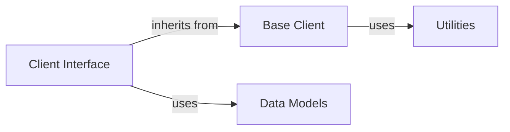

## Component Details

The invariant-sdk provides a Python interface for interacting with the Invariant API. It offers both synchronous and asynchronous clients for pushing traces, managing dataset metadata, and appending messages. The SDK handles API key retrieval, URL construction, request execution, and error handling, providing a convenient and reliable way to integrate with the Invariant platform.

### Client Interface
The Client Interface provides the entry point for interacting with the Invariant API. It encompasses both synchronous and asynchronous clients, offering methods for pushing traces, managing dataset metadata, and appending messages. This component abstracts away the complexities of HTTP communication and data serialization, providing a high-level API for developers.
- **Related Classes/Methods**: `invariant-sdk.python.invariant_sdk.client.Client`, `invariant-sdk.python.invariant_sdk.async_client.AsyncClient`

### Base Client
The Base Client handles the underlying HTTP communication with the Invariant API. It manages API key retrieval, URL construction, request execution, and error handling. It serves as the foundation for both the synchronous and asynchronous clients, providing common functionality and ensuring consistent behavior across different client types.
- **Related Classes/Methods**: `invariant-sdk.python.invariant_sdk.base_client.BaseClient`

### Data Models
The Data Models component defines the structure of data exchanged with the Invariant API. This includes request and response models for pushing traces, managing dataset metadata, and appending messages. These models ensure data consistency and facilitate serialization/deserialization, enabling seamless communication between the SDK and the API.
- **Related Classes/Methods**: `python.invariant_sdk.types.annotations.AnnotationCreate`, `python.invariant_sdk.types.push_traces.PushTracesRequest`

### Utilities
The Utilities component provides helper functions used throughout the SDK. This includes functions for retrieving the API URL and API Key from environment variables or configuration files. These utilities centralize common tasks and improve code maintainability, ensuring consistent configuration and simplifying development.
- **Related Classes/Methods**: `invariant-sdk.python.invariant_sdk.utils`