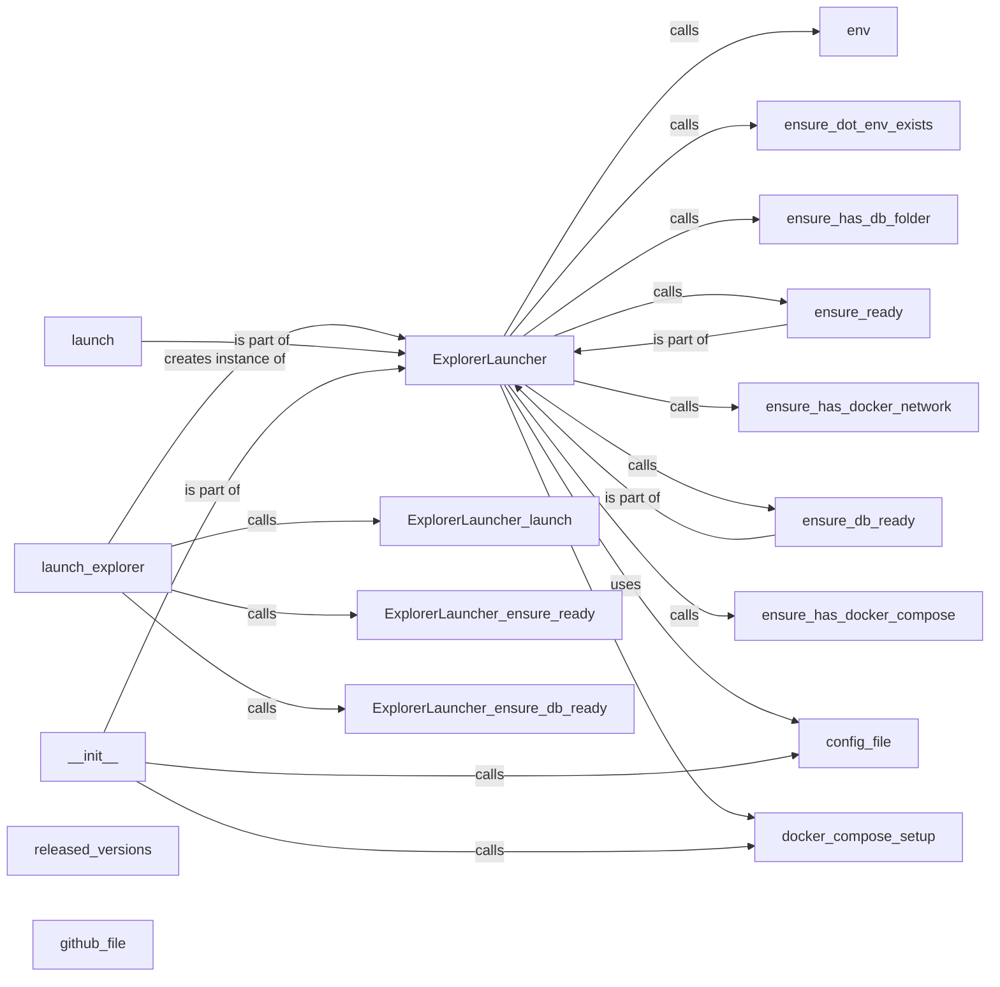

## Component Details

The Invariant Explorer provides a user interface to visualize and interact with system policies and runtime data. The `launch_explorer` function serves as the entry point, parsing arguments and initiating the `ExplorerLauncher`. The `ExplorerLauncher` automates the setup and launch process, including downloading configuration files, setting up the Docker environment, ensuring database readiness, and launching the Explorer process using Docker Compose. It ensures all dependencies are met before launching the explorer.

### launch_explorer
The `launch_explorer` function is the entry point for launching the Invariant Explorer. It parses command-line arguments, creates an `ExplorerLauncher` instance, and calls its methods to set up and launch the Explorer.
- **Related Classes/Methods**: `invariant.explorer.launch:launch_explorer`

### ExplorerLauncher
The `ExplorerLauncher` class orchestrates the launch of the Invariant Explorer. It downloads configuration files, sets up the Docker environment, ensures the database is ready, and launches the Explorer process.
- **Related Classes/Methods**: `invariant.explorer.launch.ExplorerLauncher`

### docker_compose_setup
The `docker_compose_setup` function downloads the Docker Compose configuration file from a remote repository and saves it to a temporary file. This file is then used by Docker Compose to define and manage the application's containers.
- **Related Classes/Methods**: `invariant.explorer.launch:docker_compose_setup`

### config_file
The `config_file` function downloads the Invariant Explorer's configuration file from a remote repository and saves it to a temporary file. This file contains settings that configure the Explorer application's behavior.
- **Related Classes/Methods**: `invariant.explorer.launch:config_file`

### ensure_db_ready
The `ensure_db_ready` method within the `ExplorerLauncher` class ensures that the database required by the Invariant Explorer is running and ready to accept connections. It uses `pexpect` to monitor the database container's output and waits for a specific message indicating that the database is ready.
- **Related Classes/Methods**: `invariant.explorer.launch.ExplorerLauncher:ensure_db_ready`

### ensure_ready
The `ensure_ready` method within the `ExplorerLauncher` class performs several checks to ensure that all dependencies and prerequisites for launching the Invariant Explorer are met. This includes checking for Docker Compose, creating a Docker network, creating a database folder, and creating a `.env` file.
- **Related Classes/Methods**: `invariant.explorer.launch.ExplorerLauncher:ensure_ready`

### launch
The `launch` method within the `ExplorerLauncher` class launches the Invariant Explorer application using Docker Compose. It constructs a command-line command to start the containers defined in the Docker Compose file and executes it using `subprocess.Popen`.
- **Related Classes/Methods**: `invariant.explorer.launch.ExplorerLauncher:launch`

### __init__
The `__init__` method is the constructor for the `ExplorerLauncher` class. It initializes the `ExplorerLauncher` instance by parsing arguments, determining the version of the explorer to use, and downloading the docker-compose and config files.
- **Related Classes/Methods**: `invariant.explorer.launch.ExplorerLauncher:__init__`

### released_versions
The `released_versions` function retrieves a list of released versions (tags) from a GitHub repository. It fetches the tags from the GitHub API, filters for tags starting with 'v', sorts them by version number, and returns the sorted list.
- **Related Classes/Methods**: `invariant.explorer.launch:released_versions`

### github_file
The `github_file` function downloads a file from a public GitHub repository. It constructs the URL for the file based on the repository, tag (version or branch), and file path, and then uses `requests` to download the file content.
- **Related Classes/Methods**: `invariant.explorer.launch:github_file`
