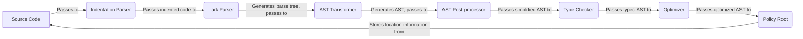

```mermaid
graph LR
    A[Source Code] -- Passes to --> B(Indentation Parser)
    B -- Passes indented code to --> C(Lark Parser)
    C -- Generates parse tree, passes to --> D(AST Transformer)
    D -- Generates AST, passes to --> E(AST Post-processor)
    E -- Passes simplified AST to --> F(Type Checker)
    F -- Passes typed AST to --> G(Optimizer)
    G -- Passes optimized AST to --> H(Policy Root)
    H -- Stores location information from --> A


```

