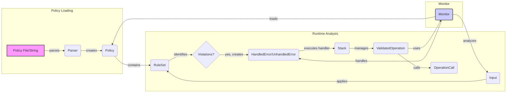

### Component Descriptions:

*   **Policy File/String**: Represents the source of the policy, either a file or a string. It is parsed by the Parser to create a Policy object.
    *   Relevant source files: N/A

*   **Parser**: Parses the Policy File/String into a Policy object. It transforms the policy definition into a structured format that can be processed by the system.
    *   Relevant source files: `invariant.analyzer.language.parser`

*   **Policy**: Represents a policy loaded from a file or string. It contains the rules and logic for invariant checking. It uses a RuleSet to apply the policy.
    *   Relevant source files: `invariant.analyzer.policy.LocalPolicy`, `invariant.analyzer.policy.Policy`

*   **Input**: Represents the input to the invariant analysis. It encapsulates the application state and provides methods for accessing and manipulating the data. It is analyzed against the Policy.
    *   Relevant source files: `invariant.analyzer.runtime.input.Input`

*   **RuleSet**: A set of rules loaded from a Policy, responsible for applying these rules to the Input data and identifying violations. It uses an Interpreter to evaluate conditions and execute actions defined in the rules.
    *   Relevant source files: `invariant.analyzer.runtime.rule.RuleSet`

*   **Violations?**: A decision point where the system checks if any violations were found during the RuleSet application.
    *   Relevant source files: N/A

*   **HandledError/UnhandledError**: Represents an error that has been handled or not handled by the system. If handled, it encapsulates the handler function and the error itself, allowing for the execution of the handler to resolve the error. If unhandled, it indicates a policy violation for which no handler is defined.
    *   Relevant source files: `invariant.analyzer.stdlib.invariant.errors.UnhandledError`, `repos.invariant.invariant.analyzer.monitor.HandledError`

*   **Stack**: Manages the stack of operations and handlers to be executed. It ensures that wrapping handlers are executed in the correct order.
    *   Relevant source files: `repos.invariant.invariant.analyzer.monitor.stack`

*   **ValidatedOperation**: Wraps operations to validate them before execution. It prepares the operation, runs it, and finalizes it, collecting potential errors along the way. It interacts with the Monitor to analyze the application state before and after the operation.
    *   Relevant source files: `repos.invariant.invariant.analyzer.monitor.ValidatedOperation`

*   **OperationCall**: Represents a call to an operation, storing the arguments and keyword arguments. It is used by ValidatedOperation to encapsulate the operation call.
    *   Relevant source files: `repos.invariant.invariant.analyzer.monitor.OperationCall`

*   **Monitor**: The central component for managing and executing invariant checks. It loads policies, analyzes application states against these policies, and handles any violations by executing handlers. It uses the Parser to load policies, the Input to represent the application state, and the RuleSet to apply the policies. It also manages the HandledError and UnhandledError.
    *   Relevant source files: `repos.invariant.invariant.analyzer.monitor.Monitor`